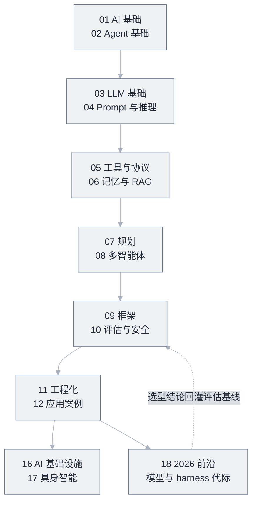

# 学习路线


**一句话**：按「基础 → Agent 核心 → 工程与安全 → 应用与平台 → 具身 / 前沿」分阶段走，每阶段都有明确的目标、前置知识与自检标准。


## 先看结论

- 零基础：01 → 02 → 03 → 04，约 2–4 周
- 有开发经验：直取 02 → 05 → 06 → 09 → 11，边读边写代码
- 目标是做产品：09 → 11 → 12 优先，案例驱动
- 目标是搭平台：03 → 11 → 16，重点在推理服务、缓存与成本
- **要对齐 2026 选型：02 → 18 → 10 → 12**（前沿模型、托管 harness、评估代际）
- **要去面试：01–12 走完再进 [20 面试真题](../20-interview/README.md)**，按岗位挑页，不要八页全刷
- **每读完一个阶段，用「自检」确认真的会了，再往下走**

## 路线图

*《图：同一张路线图的站内版——四个阶段各带周数与检验项，①② 走完才谈 ③ 的生产化》*

*《图：主干按 01→12 逐级解锁不能跳，末尾 18 前沿的选型结论用虚线回灌进 10 的评估基线——学习闭环靠这条反向边收口》*


**提示**：13、14、21 是资料/模板/术语篇（随时查，术语表在第 21 章即最后一章），16 是「把 Agent 跑起来并跑稳」的平台层，17 是把同一套循环搬进物理世界，18 是对齐 2026-09 模型/harness/评估代际的快车道，19 是动手实验，**20 是面试真题（冲刺用，不是学习主线）**。


## 分阶段目标与自检

### 阶段一：基础（01 → 04）

| 项 | 内容 |
|---|---|
| 目标 | 理解 LLM 是什么、Agent 与 Chatbot/Workflow 的边界、注意力与上下文的硬约束 |
| 前置 | 会写任意一门语言的代码 |
| 时间 | 2–4 周（每天 1–2 小时） |
| 自检 | 能讲清「为什么普通 LLM 做不了多步骤任务」；能解释上下文窗口为何是成本核心；能写出一个 CoT prompt 并说明它为什么有效 |

### 阶段二：Agent 核心（05 → 08）

| 项 | 内容 |
|---|---|
| 目标 | 掌握工具调用、记忆与 RAG、规划、多智能体的原理与取舍 |
| 前置 | 阶段一；能读懂 Python/TypeScript |
| 时间 | 4–6 周（含动手写代码） |
| 自检 | 能实现一个 50 行的工具循环；能说清「什么时候该拆多 Agent」；能定位一次 RAG 失败是检索问题还是生成问题 |

### 阶段三：工程、评估与安全（09 → 12）

| 项 | 内容 |
|---|---|
| 目标 | 把 Agent 做成可上线系统：评估、可观测、权限、成本、容错 |
| 前置 | 阶段二；有一个能跑通的小 Agent |
| 时间 | 4–8 周 |
| 自检 | 能给出评估集与回归流程；能解释纵深防御为什么是乘法；能为长任务设计断点恢复与幂等 |

### 阶段四：平台与应用（13 → 16）

| 项 | 内容 |
|---|---|
| 目标 | 选型与落地：框架、推理服务化、缓存、模型网关、成本优化 |
| 前置 | 阶段三 |
| 时间 | 按需 |
| 自检 | 能给出 TTFT/TPOT/缓存命中率/成本的基线与告警；能对一次线上故障做定位 |

### 分支：具身智能（17）

| 项 | 内容 |
|---|---|
| 目标 | 理解 VLA、动作表示、数据引擎、仿真与 sim-to-real |
| 前置 | 阶段二（Agent 循环）|
| 自检 | 能在仿真里跑通「感知→技能→执行」闭环，并说清 sim-to-real 差距来自哪 |

### 分支：追前沿与选型（18 → 10 → 12）

| 项 | 内容 |
|---|---|
| 目标 | 对齐 2026-09 产品现实：前沿模型、托管 harness、评估代际、应用选型 |
| 前置 | 阶段一或阶段二（至少读过 [什么是 AI Agent](../02-agent-basics/what-is-agent.md)） |
| 顺序 | 02 → 18 → 10 → 12 |
| 自检 | 能说清 Astra / Fable 5.1 怎么比、Agents API 与 Agent SDK 差在哪；能用 [模型原生 vs 自建 Harness](../18-frontier-2026/model-native-vs-harness.md) 对一个真实场景做出选型并写出理由 |

### 分支：动手实验（19，随学随做）

| 项 | 内容 |
|---|---|
| 目标 | 亲手实现 ReAct / RAG / MCP / 多 Agent / 评测 / 护栏 六个最小系统 |
| 前置 | 无硬前置——每个实验标注了对应章节，读到哪做到哪；建议至少会基础 Python |
| 顺序 | 阶段二结束时做 Lab 1–4，阶段三结束时补 Lab 5–6 |
| 自检 | 六个脚本都能零依赖跑通，且能回答各页「动手改」第 2 题 |

### 分支：面试冲刺（20，面试前 1–2 周）

| 项 | 内容 |
|---|---|
| 目标 | 把已学知识换成面试语言：答得出机制、给得出取舍、讲得清自己的项目 |
| 前置 | 阶段一至三（缺哪页回补哪页），并有一个能深挖的真实项目 |
| 顺序 | 20 导读 → 按岗位挑 2–3 页 → 手撕/行为面各留一晚模拟 → 回原章节补漏 |
| 自检 | 随机抽一题能在 3 分钟内说出要点与一个反例；手撕题能先写形状再写算子 |

## 八条路线

| 路线 | 适合谁 | 顺序 | 检验标准 |
|---|---|---|---|
| 入门 | 只会用 ChatGPT 的新手 | 01 → 02 → 03 → 04 | 能向别人讲清「Agent 和 Chatbot 的区别」 |
| 开发者 | 会 Python/TS 的工程师 | 02 → 05 → 06 → 09 → 11 | 能用框架写出一个会调工具、能恢复错误的 Agent |
| 研究者 | 关注前沿与论文 | 04 → 08 → 10 + [13 资源库论文区](../13-resources/papers/README.md) | 能读懂 ReAct 并复现其核心循环 |
| 平台 / Infra | 要为团队搭 LLM 与 Agent 底座 | 03 → 11 → 16 | 能给出 TTFT/TPOT/缓存命中率/成本的基线与告警 |
| 具身方向 | 做机器人或想转具身 | 02 → 04 → 17 → 16 | 能在仿真里跑通「感知→技能→执行」闭环并说清 sim-to-real 差距来自哪 |
| 追前沿与选型 | 要跟 2026 产品面、做 harness 采购决策 | 02 → 18 → 10 → 12 | 能读懂 Astra / Agents API / Fable 5.1 对比，并对一个真实场景给出托管 vs 自建选型 |
| 动手派 | 书读太厚坐不住、想边做边学 | 02 → 19(Lab1) → 06 → 19(Lab2) → 05 → 19(Lab3) → 19(Lab4–6) | 六个实验全部跑通并各自完成一道「动手改」 |
| 求职冲刺 | 一两周内要面 LLM/AI 岗 | 20 导读 → 按岗位两页 → 20(手撕) → 19 任一 Lab | 每页随机抽一题能在 3 分钟内答出要点与一个反例 |

## 怎么用这本手册学

1. 每篇先看「先看结论」，有需要再细读
2. 遇到术语卡住，查 [术语表](../21-glossary/README.md)
3. 每读完一章，做章内「小练习」——不做练习等于没读
4. 读核心章节时对照真实源码：[Pi Agent](https://github.com/earendil-works/pi)、[DeepSeek Harness](https://github.com/deepseek-ai/deepseek-harness)、[Claude Code 案例拆解](../12-applications/coding-agent.md)
5. 学完一章就往 [开源项目索引](../13-resources/projects/README.md) 里挑一个项目读源码，理论要靠代码落地

## 常见误区

- ❌ 从第 1 页顺序精读到最后一页：手册是用来「扫」的，先建立地图再深入
- ❌ 不写代码只收藏：Agent 是动手学科，跑通一个 50 行的循环胜过读十篇文章
- ❌ 一开始就钻研框架源码：先懂 [Agent 基础](../02-agent-basics/README.md) 的原理，框架只是这些原理的工程化
- ❌ 跳过评估与安全：不评估等于裸奔上线，代价通常在上线后才显现
- ❌ 只看不记：每阶段末尾写一段自己的总结，是检验真懂的最快方式

## 参考资料

- [Anthropic 工程博客：什么时候该用工作流、什么时候才用 Agent](https://www.anthropic.com/engineering/building-effective-agents)
- [12-Factor Agents（逐条对照的 Agent 工程原则）](https://github.com/humanlayer/12-factor-agents)
- [MCP 规范官网（工具与上下文协议的权威入口）](https://modelcontextprotocol.io)
- [LangGraph 文档（阶段二读控制流时的对照实现）](https://langchain-ai.github.io/langgraph/)
- [AI Engineering 面试题库（按公司标注的候选人转述）](https://github.com/pallavi-shekhar/ai-engineering-interview-questions-company-wise)
- [AIGC-Interview-Book 大厂高频面试题](https://github.com/WeThinkIn/AIGC-Interview-Book)

## 相关知识点

- [总导航](README.md)
- [资源总表](resources-index.md)
- [开源项目索引](../13-resources/projects/README.md)
- [18 2026 前沿](../18-frontier-2026/README.md)
- [19 动手实验](../19-labs/README.md)
- [20 面试真题](../20-interview/README.md)

