```mermaid
flowchart LR
  A[01 AI 基础] --> B[02 Agent 基础]
  B --> C[03 LLM 基础]
  C --> D[04 Prompt 与推理]
  D --> E[05 工具与协议]
  E --> F[06 记忆与 RAG]
  F --> G[07 规划]
  G --> H[08 多智能体]
  H --> I[09 框架]
  I --> J[10 评估与安全]
  J --> K[11 工程化]
  K --> L[12 应用案例]
  L --> M[16 AI 基础设施]
  M --> N[17 具身智能]
```

# 🧭 学习路线

> **一句话**：按「基础 → Agent 核心 → 工程实践 → 应用」四阶段走，每阶段都有明确的目标和检验标准。

## 📌 先看结论

- 零基础：01 → 02 → 03，约 2–4 周
- 有开发经验：直取 02 → 05 → 09，边读边写代码
- 目标是做产品：09 → 11 → 12 优先，案例驱动

## 🗺️ 路线图

> 💡 **提示**：13–15 是资料/模板/术语篇（随时查），16 是「把 Agent 跑起来并跑稳」的平台层，17 是把同一套循环搬进物理世界。

## 三条路线

| 路线 | 适合谁 | 顺序 | 检验标准 |
|---|---|---|---|
| 🌱 入门 | 只会用 ChatGPT 的新手 | 01 → 02 → 03 → 04 | 能向别人讲清「Agent 和 Chatbot 的区别」 |
| 🛠️ 开发者 | 会 Python/TS 的工程师 | 02 → 05 → 06 → 09 → 11 | 能用框架写出一个会调工具、能恢复错误的 Agent |
| 🔬 研究者 | 关注前沿与论文 | 04 → 08 → 10 + [13 资源库论文区](../13-resources/papers/README.md) | 能读懂 ReAct 并复现其核心循环 |
| 🚢 平台 / Infra | 要为团队搭 LLM 与 Agent 底座 | 03 → 11 → 16（重点 1→3→5→7） | 能给出 TTFT/TPOT/缓存命中率/成本的基线与告警 |
| 🦾 具身方向 | 做机器人或想转具身 | 02 → 04 → 17 → 16 | 能在仿真里跑通「感知→技能→执行」闭环并说清 sim-to-real 差距来自哪 |

## 💡 怎么用这本手册学

1. 每篇先看「📌 先看结论」，有需要再细读
2. 遇到术语卡住，查 [术语表](../15-glossary/README.md)
3. 每读完一章，做章内「🧪 小练习」
4. 读核心章节时对照真实源码：[Pi Agent](../13-resources/projects/README.md)、[DeepSeek Harness](https://github.com/deepseek-ai/deepseek-harness)、[Claude Code 案例拆解](../12-applications/coding-agent.md)

## ⚠️ 常见误区

- ❌ 从第 1 页顺序精读到最后一页：手册是用来「扫」的，先建立地图再深入
- ❌ 不写代码只收藏：Agent 是动手学科，跑通一个 50 行的循环胜过读十篇文章
- ❌ 一开始就钻研框架源码：先懂 [02 Agent 基础](../02-agent-basics/README.md) 的原理，框架只是这些原理的工程化

## 📚 相关知识点

- [总导航](README.md)
- [资源总表](resources-index.md)
