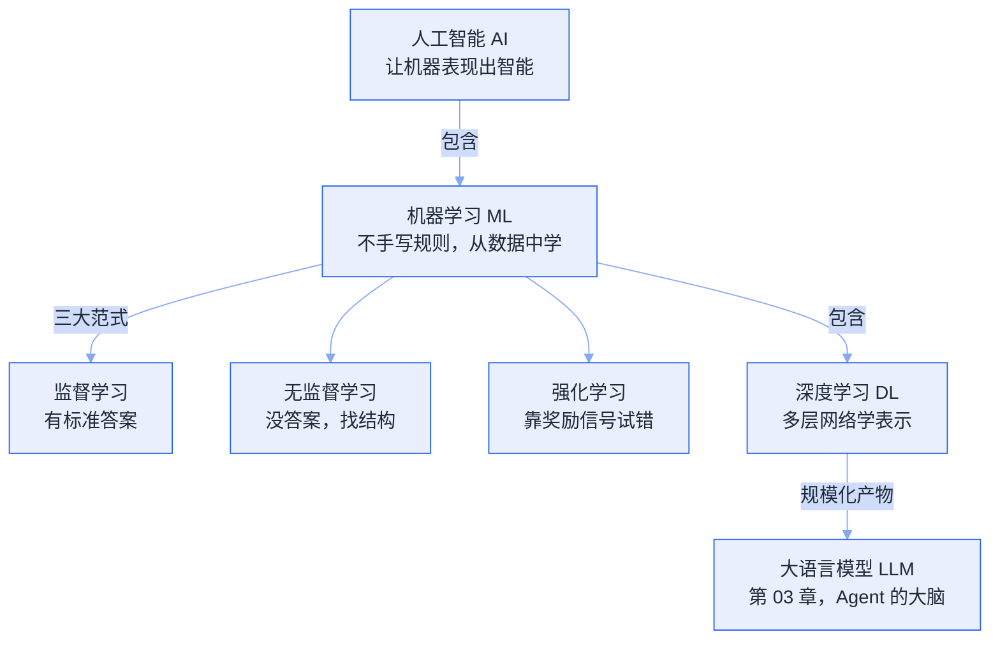

# 01 AI 基础


**一句话**：本章用最少的数学，讲清 AI、机器学习、深度学习和 LLM 的关系，为理解 Agent 打地基。


## 你将学到

- AI / ML / DL 三者的包含关系，不再混用概念
- 人工智能七十年的关键节点，理解「为什么是现在」Agent 爆发
- 机器学习的基本范式：监督、无监督、强化学习
- 深度学习为什么有效：表示学习与算力

## 本章知识地图

本章四页是一条「包含链」：每一层解决上一层解决不了的问题，最终走到 LLM——Agent 的大脑。

## 前置要求

- 无需数学和编程基础，类比为主
- 学完本章可进入 [02 Agent 基础](../02-agent-basics/README.md)

## 本站页面

- [AI、ML、DL 的关系](ai-ml-dl.md)
- [人工智能发展简史](ai-history.md)
- [机器学习基础](machine-learning-basics.md)
- [深度学习基础](deep-learning-basics.md)

## 学习建议

本章是「地图页」，读完后不必纠结公式细节——后续章节用到时会回头解释。已经熟悉 ML 的读者可直接跳到 [LLM 是什么](../03-llm/what-is-llm.md)。

## 读完能做到

- [ ] 画出 AI ⊃ ML ⊃ DL 的包含链，说清 LLM 长在 DL 上、Agent 是 LLM 之上的系统设计，并举一个「属于 AI 但不属于 ML」的系统
- [ ] 把「预测明天用电量」和「用超支惩罚自学调度策略」分别归到监督/强化学习，并写出后者回报 G_t 大致由哪些项构成
- [ ] 用偏差—方差分解解释过拟合为什么像「背题库」，说清加正则、加数据、早停各降哪一项
- [ ] 用一次矩阵复合说明「没有非线性激活的一百层网络」为什么等价于一层线性网络
- [ ] 串起关键节点（1950 图灵、2012 AlexNet、2017 Transformer、2020 规模律、2022 ChatGPT、2024+ Agent），回答「为什么偏偏是现在爆发」

## 章末自测

1. **回忆**：判别式和生成式模型分别学什么概率？为什么这决定了 LLM「强在产出、弱在判断」，Agent 才需要外部工具与验证器？（提示：见 ai-ml-dl.md）
2. **应用**：反向传播 1986 年就成熟了，为什么深度学习要到 2012 年才真正发力？用「算力 + 数据 + 算法」三要素回答。（提示：见 ai-history.md、deep-learning-basics.md）
3. **判断**：「深度学习一定会取代机器学习」——用表格数据上随机森林/XGBoost 往往更强这个事实评价这句话。（提示：见 ai-ml-dl.md、machine-learning-basics.md）

## 本章术语速查

按出场顺序排，白话解释只求帮你秒懂，精确定义点进各页正文。

| 英文术语 | 中文 | 白话一句话 |
|---|---|---|
| Artificial Intelligence (AI) | 人工智能 | 只要机器表现得有智能就算，下棋程序、扫地机器人避障都算数，不一定非得有神经网络 |
| Machine Learning (ML) | 机器学习 | 不手写规则，扔一堆数据让模型自己找规律，垃圾邮件过滤器是祖师爷级案例 |
| Deep Learning (DL) | 深度学习 | 多层神经网络自己学特征，不用人手工设计「该看什么信号」，从像素一路拼出抽象概念 |
| Large Language Model (LLM) | 大语言模型 | 用 Transformer 架构、在海量文本上训出来的超大 DL 模型，Agent 的大脑 |
| Scaling Laws | 缩放律（规模律） | 「模型更大、数据更多就更强」从玄学变成可计算的经验公式，2020 年后全行业的底气 |
| Supervised Learning | 监督学习 | 带着标准答案刷题：给输入、贴标签，模型学着把两者对上 |
| Reinforcement Learning | 强化学习 | 没有答案只靠奖惩试错，「电费超支就罚、罚到学会调度」就是这一口 |
| Overfitting | 过拟合 | 背题库学生：模拟卷分数漂亮，换新题就懵——训练集好、测试集崩 |
| Representation Learning | 表示学习 | 模型自己发明「怎么编码世界」：从原始数据逐层搭出好用的中间表示，特征工程被它接管了 |
| Backpropagation | 反向传播 | 把误差从输出端一层层倒推回去，告诉每个参数该往哪拧，像考后逐题复盘归因 |
| Activation Function | 激活函数 | 给网络加拐点的调料，没有它一百层网络也约等于一次矩阵乘法 |
| Mixture of Experts (MoE) | 混合专家 | 每个 token 只叫醒少数专家网络，像去医院只挂相关科室，容量大而计算省 |

