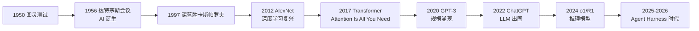

# 🌱 人工智能发展简史

> **一句话**：AI 走过「规则 → 学习 → 深度学习 → 大模型」四步，2024 年后进入 Agent 时代——模型开始「做事」而不只是「说话」。
> **难度**：⭐️ 入门
> **标签**：`#basics` `#beginner`

## 📌 先看结论

- AI 经历两次寒冬：承诺过高、算力和数据跟不上
- 2012 年深度学习复兴、2017 年 Transformer 出世，是两次关键转折
- 2022 年 ChatGPT 让 LLM 出圈；2024–2026 年 Coding Agent 与 Agent Harness 成为主战场
- 开源力量（DeepSeek、Qwen、pi-mono 等）把 Agent 技术拉平到所有人可用

## 🖼️ 时间线

## 🧩 Agent 时代的关键事件（2024–2026）

| 时间 | 事件 | 意义 |
|---|---|---|
| 2024.12 | Anthropic 发布《Building Effective Agents》 | 界定工作流 vs Agent 的工程共识 |
| 2024.11 | Anthropic 开放 MCP 协议 | 工具接入有了「USB-C」 |
| 2025 | Claude Code、Codex CLI、Gemini CLI 相继发布 | Coding Agent 成为 LLM 第一落地场景 |
| 2025–2026 | 开源 Coding Agent 井喷：[OpenHands](https://github.com/All-Hands-AI/OpenHands)、Aider、[pi-mono](https://github.com/badlogic/pi-mono) | Agent 不再是大厂专属 |
| 2026.04 | pi-mono 破 4 万 Star | 极简 harness 路线得到社区认可 |
| 2026.08 | [DeepSeek 开源 DeepSeek Harness](https://github.com/deepseek-ai/deepseek-harness)（MIT） | 模型厂商亲自下场定义 harness：一切皆插件 |

## 🍜 生活类比

AI 七十年像烧一壶水：规则时代是小火慢炖不见响；深度学习是水温上到 80 度开始冒泡；GPT 时代水开了；Agent 时代是——水终于可以拿来做饭了。

## ⚠️ 常见误区

- ❌ AI 是突然爆发的：背后是算力、数据、算法三十年的积累
- ❌ Agent 也是新概念：Agent 思想可追溯到 1950 年代的「符号主义智能体」，只是 LLM 让它第一次真正可用
- ❌ 开源只是跟随大厂：DeepSeek 的 MoE/推理训练、pi-mono 的 harness 设计都有原创性贡献

## 🧪 小练习

为什么 Transformer 论文（2017）被认为是 Agent 时代最远的远因？提示：没有它会少什么？

## 🔗 相关资源

- [Attention Is All You Need](https://arxiv.org/abs/1706.03762)
- [DeepSeek-R1 论文](https://arxiv.org/abs/2501.12948)

## 📚 相关知识点

- [Transformer 与 Attention](../03-llm/transformer-attention.md)
- [什么是 AI Agent](../02-agent-basics/what-is-agent.md)
