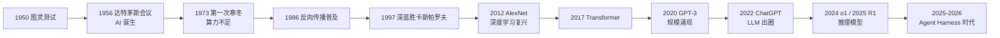

# 人工智能发展简史

> **一句话**：AI 走过「符号规则 → 统计学习 → 深度学习 → 大模型」四步，2024 年后进入 Agent 时代——模型开始「做事」而不只是「说话」。

## 先看结论

- AI 的主体思想经历过三次更替：符号主义（写规则）、连接主义（学参数）、以及两者融合的现代深度学习
- 两次「AI 寒冬」的共同原因：承诺远超当时的算力与数据供给
- 2012 年 AlexNet 证明深度学习有效、2017 年 Transformer 解决序列建模的并行化，是两次关键转折
- 2020 年前后的「规模化」发现（Scaling Laws）把路线统一成「更大的模型 + 更多的数据」
- 2022 年 ChatGPT 让 LLM 出圈；2024–2026 年 Coding Agent 与 Agent Harness 成为主战场

## 三次范式更替：AI 到底在换什么

理解 AI 史的关键，不是记年份，而是看清「知识从哪里来」这个问题上，主流答案换了三次：

| 范式 | 知识来源 | 代表 | 为什么失效/转向 |
|---|---|---|---|
| 符号主义（1956–1980s） | 人把知识写成规则 | 逻辑推理机、专家系统 | 规则爆炸：现实世界的例外无穷多，写不完 |
| 连接主义/统计学习（1980s–2010s） | 从数据里估参数 | 神经网络、SVM、随机森林 | 数据与算力不足时，浅层模型表达力有限 |
| 现代深度学习（2012–） | 多层网络自动学表示 | CNN、RNN、Transformer | 算力+数据+算法三者同时到位，终于跑通 |

这条主线也解释了为什么「AI 总是差五年」：不是想法不够，而是**工程条件没到**。神经网络的核心算法（反向传播）在 1986 年就已成体系，却要等到 GPU 和互联网规模的数据出现才真正发力。

## 时间线

## 几个必须知道的节点（附出处）

| 年份 | 事件 | 为什么重要 |
|---|---|---|
| 1950 | 图灵发表《计算机器与智能》，提出「图灵测试」 | 第一次把「机器能否思考」变成可操作的问题 |
| 1956 | 达特茅斯会议召开，「人工智能」一词诞生 | 学科起点 |
| 1973 | 英国《Lighthill 报告》质疑 AI 进展，引发第一次寒冬 | 承诺与交付的落差首次反噬 |
| 1986 | Rumelhart、Hinton、Williams 推广反向传播 | 多层网络的训练方法就位 |
| 1989 | LeCun 提出 LeNet，卷积网络用于手写数字识别 | 表示学习在视觉上首次落地 |
| 1997 | IBM 深蓝战胜国际象棋世界冠军卡斯帕罗夫 | 搜索 + 算力路线的标志性胜利（还不是学习路线） |
| 2012 | AlexNet 以显著优势夺得 ImageNet 冠军 | 深度学习复兴的直接证据，`错误率` 大幅下降 |
| 2017 | 《Attention Is All You Need》提出 Transformer | 并行化序列建模，之后所有主流 LLM 的底座 |
| 2020 | GPT-3（1750 亿参数）展示少样本学习能力；Kaplan 等提出缩放律 | 「大模型」路线被系统化 |
| 2022 | InstructGPT 用 RLHF 让模型学会遵循指令；ChatGPT 发布 | 从「会续写」到「能对话」 |
| 2024 | OpenAI o1 展示「推理时计算」路线 | 让模型在回答前做长思考 |
| 2025 | DeepSeek-R1 以开源方式复现推理能力 | 推理模型不再是闭源专属 |
| 2026 | DeepSeek Harness 等开源 harness 出现 | 竞争焦点从「模型」转向「模型 + 工具 + 循环」的工程系统 |

## Agent 时代的关键事件（2024–2026）

| 时间 | 事件 | 意义 |
|---|---|---|
| 2024.12 | Anthropic 发布《Building Effective Agents》 | 界定工作流 vs Agent 的工程共识 |
| 2024.11 | Anthropic 开放 MCP 协议 | 工具接入有了「USB-C」 |
| 2025 | Claude Code、Codex CLI、Gemini CLI 相继发布 | Coding Agent 成为 LLM 第一落地场景 |
| 2025–2026 | 开源 Coding Agent 井喷：[OpenHands](https://github.com/All-Hands-AI/OpenHands)、Aider、[Pi](https://github.com/earendil-works/pi) | Agent 不再是大厂专属 |
| 2026.08 | [DeepSeek 开源 DeepSeek Harness](https://github.com/deepseek-ai/deepseek-harness)（MIT） | 模型厂商亲自下场定义 harness：一切皆插件 |

## 直觉解释

AI 七十年像烧一壶水：规则时代是小火慢炖不见响；深度学习是水温上到 80 度开始冒泡；GPT 时代水开了；Agent 时代是——水终于可以拿来做饭了。

## 工程含义

- **别把「模型能力」和「工程条件」混为一谈**：很多当年失败的想法，今天可行只是因为算力与数据变了；反过来，今天模型做不到的事，可能只是缺一层工程（工具、记忆、循环）。
- **看清竞争焦点的迁移**：2017–2023 竞争在模型，2024 之后竞争在「模型 + harness + 工具治理」的系统。这解释了为什么本手册把大量篇幅给了工具调用、上下文工程与可观测性。

## 常见误区

- ❌ AI 是突然爆发的：背后是算力、数据、算法三十年的积累
- ❌ Agent 是新概念：Agent 思想可追溯到 1950 年代的「符号主义智能体」，只是 LLM 让它第一次真正可用
- ❌ 开源只是跟随大厂：DeepSeek 的 MoE 与推理训练、Pi 的 harness 设计都有原创性贡献
- ❌ 把「深蓝」当成学习路线的胜利：它是搜索 + 专家评估函数的胜利，与今天的数据驱动范式不同源

## 参考资料

- [Computing Machinery and Intelligence](https://academic.oup.com/mind/article/LIX/236/433/986238)（Turing, 1950）
- [Attention Is All You Need](https://arxiv.org/abs/1706.03762)（Vaswani et al., 2017）
- [Language Models are Few-Shot Learners](https://arxiv.org/abs/2005.14165)（Brown et al., 2020，GPT-3）
- [Scaling Laws for Neural Language Models](https://arxiv.org/abs/2001.08361)（Kaplan et al., 2020）
- [Training language models to follow instructions with human feedback](https://arxiv.org/abs/2203.02155)（Ouyang et al., 2022，InstructGPT）
- [DeepSeek-R1](https://arxiv.org/abs/2501.12948)（DeepSeek-AI, 2025）
- [Anthropic: Building Effective Agents](https://www.anthropic.com/engineering/building-effective-agents)

## 相关知识点

- [Transformer 与 Attention](../03-llm/transformer-attention.md)
- [什么是 AI Agent](../02-agent-basics/what-is-agent.md)
