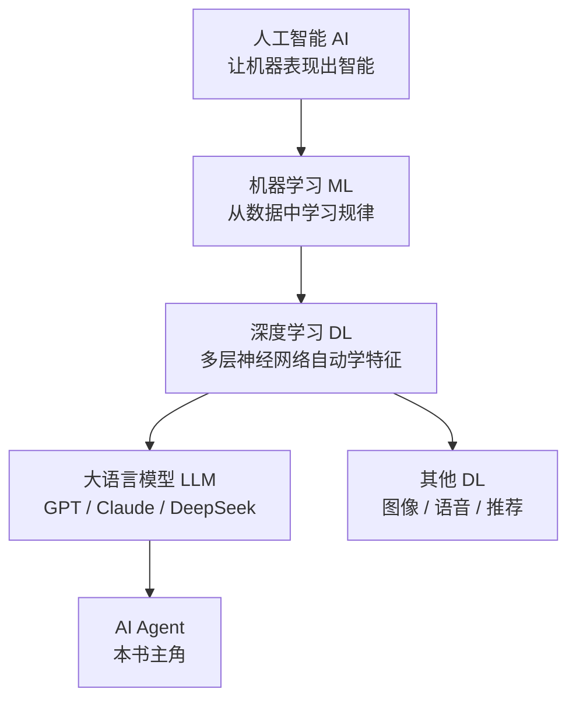

# AI、ML、DL 的关系

> **一句话**：人工智能是最大的圈，机器学习是实现它的一种方法，深度学习是机器学习中的一种技术，LLM 是深度学习的一种产物。
> **难度**：入门
> **标签**：`#basics` `#beginner`

## 先看结论

- 三层嵌套：AI ⊃ ML ⊃ DL；LLM 和 Agent 都长在 DL 这一层上
- 机器学习的核心：不写规则，从数据中学规则
- 深度学习的核心：自动学「特征」，而不是人工设计特征
- Agent ≠ AI 的全部，Agent 是建立在 LLM 之上的一种系统形态

## 图示

## 生活类比

- **AI**：让机器「像人一样聪明」这个大目标
- **ML**：不给孩子背菜谱，而是让他尝一万道菜自己总结出咸淡规律
- **DL**：孩子自己学会了「闻香味、看颜色」这些判断特征，不用你教
- **LLM**：读遍全世界文字的学生
- **Agent**：不只答题、还能跑腿办事的学生

## 核心概念对比

| 概念 | 解决什么 | 典型方法 | 例子 |
|---|---|---|---|
| AI | 广义的智能行为 | 规则系统、搜索、ML | 下棋程序、扫地机器人避障 |
| ML | 从数据预测 | 回归、决策树、SVM | 垃圾邮件过滤 |
| DL | 复杂模式（图像/语言） | CNN、RNN、Transformer | 人脸识别、ChatGPT |

## 常见误区

- ❌ AI = 机器人：机器人是载体，AI 是能力；ChatGPT 没有身体也是 AI
- ❌ 深度学习一定会替代机器学习：表格数据上，随机森林/XGBoost 往往更强
- ❌ Agent 是和 LLM 并列的技术：Agent 是 LLM 之上的系统设计，离不开 LLM
- ❌ LLM = AI 的终点：LLM 会「说」不等于会「做事」，这正是 [Agent 存在的意义](../02-agent-basics/what-is-agent.md)

## 小练习

自动驾驶公司用摄像头数据训练识别行人的模型——这个过程属于 AI、ML、DL 中的哪个（些）圈？为什么？

## 相关资源

- [DeepSeek-V3 技术报告](https://arxiv.org/abs/2412.19437)（看一个工业级 DL 产物长什么样）

## 相关知识点

- [机器学习基础](machine-learning-basics.md)
- [深度学习基础](deep-learning-basics.md)
- [什么是 AI Agent](../02-agent-basics/what-is-agent.md)
