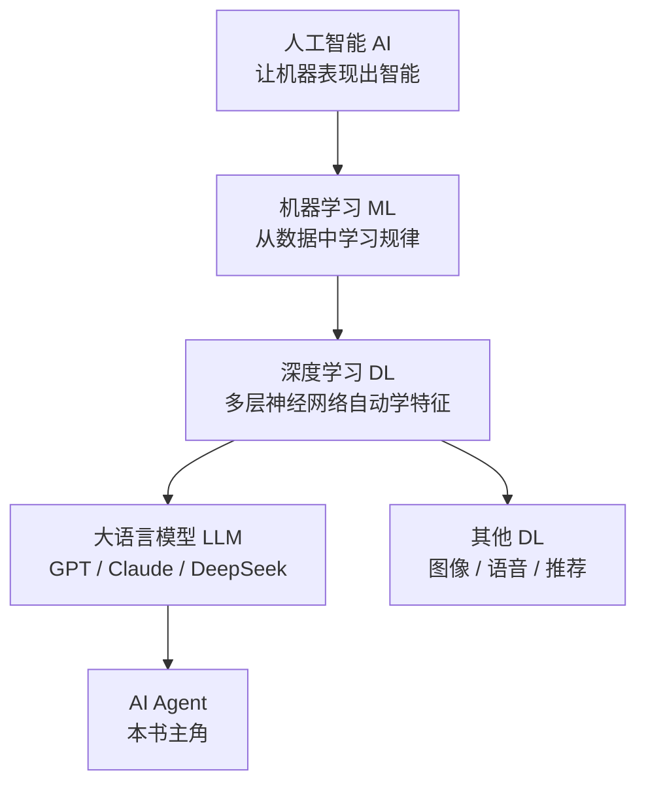

# AI、ML、DL 的关系

> **一句话**：人工智能是最大的圈，机器学习是实现它的一种方法，深度学习是机器学习中的一种技术，LLM 是深度学习的一种产物。

## 先看结论

- 三层嵌套：AI ⊃ ML ⊃ DL；LLM 和 Agent 都长在 DL 这一层上
- 机器学习的核心：不写规则，从数据中学规则
- 深度学习的核心：自动学「特征表示」，而不是人工设计特征
- Agent 不是与 LLM 并列的技术，而是 LLM 之上的系统设计

## 三者的边界：什么算，什么不算

把这几个概念讲清楚，关键是划清边界，而不是背定义。

**人工智能（AI）**：一切让机器表现出「需要智能才能完成」的行为的技术。它是一个**目标**，不是一种方法。因此搜索算法（深蓝）、逻辑推理（专家系统）、机器学习都属于 AI。判定边界：如果任务不需要任何智能（如按固定公式换算单位），就不算 AI 问题。

**机器学习（ML）**：一类**方法**——不显式编写规则，而是从数据中估计出规律。与传统编程的区别可以写成：

$$
\text{传统编程}:\; \text{数据}+\text{规则}\;\to\;\text{答案}
\qquad
\text{机器学习}:\; \text{数据}+\text{答案}\;\to\;\text{规则}
$$

注意右边：机器学习要的是「输入-输出样本」，学出来的是模型参数（即隐式规则）。

**深度学习（DL）**：机器学习中**用多层神经网络做表示学习**的一支。「深度」指的是层数多，意义在于它能从原始数据（像素、字符）逐层组合出抽象概念，把过去必须人工设计的特征工程自动化。**LLM** 是用 Transformer 架构、在海量文本上训练出的超大 DL 模型。

## 图示

## 生活类比

- **AI**：让机器「像人一样聪明」这个大目标
- **ML**：不给孩子背菜谱，而是让他尝一万道菜自己总结出咸淡规律
- **DL**：孩子自己学会了「闻香味、看颜色」这些判断特征，不用你教
- **LLM**：读遍全世界文字的学生
- **Agent**：不只答题、还能跑腿办事的学生

## 核心概念对比

| 概念 | 解决什么 | 典型方法 | 例子 |
|---|---|---|---|
| AI | 广义的智能行为 | 规则系统、搜索、ML | 下棋程序、扫地机器人避障 |
| ML | 从数据预测 | 回归、决策树、SVM | 垃圾邮件过滤 |
| DL | 复杂模式（图像/语言） | CNN、RNN、Transformer | 人脸识别、ChatGPT |

## 为什么 DL 没在所有场景取代传统 ML

一个常见直觉错误是「新的、更深的模型一定更好」。实际上，模型效果取决于**归纳偏置是否匹配数据**：图像/语音/文本这类具有强局部相关结构的高维数据，正是「多层网络自动学表示」最擅长的形态；而结构化表格数据（几百个字段、几千到几十万行）维度低、样本少，树模型（随机森林、XGBoost）内置的「按特征阈值切分」偏置反而更契合，训练也更省资源。工程结论：**先跑一个树模型基线，再判断是否需要深度学习**。

另一个维度是生成式与判别式：

- **判别式**模型学 $$P(y\mid x)$$，用于分类/回归（「这封邮件是不是垃圾邮件」）
- **生成式**模型学 $$P(x)$$ 或 $$P(x\mid y)$$，用于创造内容（LLM 学的就是 $$P(x_t\mid x_{<t})$$）

LLM 属于生成式，这决定了它的强项是「产出」、弱项是「判断」——这也是 Agent 需要外部工具与验证器的深层原因。

## 常见误区

- ❌ AI = 机器人：机器人是载体，AI 是能力；ChatGPT 没有身体也是 AI
- ❌ 深度学习一定会替代机器学习：表格数据上，随机森林/XGBoost 往往更强
- ❌ Agent 是和 LLM 并列的技术：Agent 是 LLM 之上的系统设计，离不开 LLM
- ❌ LLM = AI 的终点：LLM 会「说」不等于会「做事」，这正是 [Agent 存在的意义](../02-agent-basics/what-is-agent.md)

## 小练习

自动驾驶公司用摄像头数据训练识别行人的模型——这个过程属于 AI、ML、DL 中的哪个（些）圈？再想一个「属于 AI 但不属于 ML」的系统。

## 参考资料

- [Deep Learning](https://www.deeplearningbook.org/)（Goodfellow, Bengio & Courville, 2016，第 1 章对三者关系有清晰界定）
- [DeepSeek-V3 Technical Report](https://arxiv.org/abs/2412.19437)（看一个工业级 DL 产物长什么样）
- [Random Forests](https://link.springer.com/article/10.1023/A:1010933404324)（Breiman, 2001，表格数据上的强基线）

## 相关知识点

- [机器学习基础](machine-learning-basics.md)
- [深度学习基础](deep-learning-basics.md)
- [什么是 AI Agent](../02-agent-basics/what-is-agent.md)
