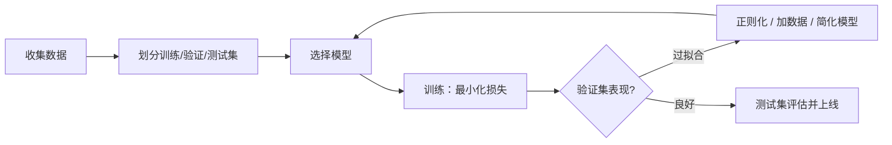

# 机器学习基础

> **一句话**：机器学习就是「从数据里学规律」，三大范式是监督学习、无监督学习和强化学习。

## 先看结论

- 三大范式按「有没有标准答案、有没有反馈」区分
- 训练 = 在数据上最小化损失函数；泛化 = 在没见过的数据上也对
- 过拟合是头号敌人：模型把「刷过的题」背下来了，而不是学会了
- Agent 领域最重要的 ML 分支是**强化学习**（RLHF、推理模型都靠它）

## 核心机制

### 1. 监督学习：把「学」写成优化问题

给定 $N$ 个带标签样本 $\{(x_i,y_i)\}$，模型 $f_\theta$ 的学习目标是最小化**经验风险**（训练集上的平均损失），通常再加一个正则项 $R(\theta)$ 抑制过拟合：

$$
\hat\theta
=\operatorname*{arg\,min}_{\theta}\;
\underbrace{\frac{1}{N}\sum_{i=1}^{N}\mathcal{L}\big(y_i,\,f_\theta(x_i)\big)}_{\text{经验风险}}
\;+\;\underbrace{\lambda\,R(\theta)}_{\text{正则化}}
$$

- $\mathcal{L}$ 是损失函数：回归常用均方误差 $(y-\hat y)^2$，分类常用交叉熵 $-\sum_c y_c\log \hat p_c$
- $\lambda$ 控制正则强度；$R$ 常用 L2（$\|\theta\|_2^2$）或 L1（$\|\theta\|_1$）
- 「训练」就是用优化算法在参数空间里找这个最小值

最基础的优化方法是**梯度下降**，沿损失下降最快的方向更新：

$$
\theta \leftarrow \theta-\eta\,\nabla_\theta \mathcal{L}(\theta)
$$

$\eta$ 是学习率。实践中的 Adam、SGD with momentum 都是它的改良版（用动量/自适应步长加速收敛）。

### 2. 泛化与偏差-方差分解

模型真正要的不是训练集分数，而是**测试集（没见过的数据）**表现。期望泛化误差可以分解为：

$$
\mathbb{E}\big[(y-\hat f(x))^2\big]
=\underbrace{\text{Bias}^2}_{\text{模型假设与真值的偏差}}
+\underbrace{\text{Var}}_{\text{对训练集扰动的敏感度}}
+\underbrace{\sigma^2}_{\text{数据本身噪声}}
$$

- **欠拟合**：偏差大（模型太简单，规律没学到）
- **过拟合**：方差大（模型太复杂，把噪声也学进去了）
- 二者的平衡就是「模型复杂度」的选择问题，$\lambda$ 是调节旋钮

这也解释了为什么「用验证集早停」「加数据」「加正则」都是有效的：它们都在降方差。

### 3. 强化学习：没有标准答案，只有奖励

监督学习需要「正确答案」，但很多任务没有——下棋每一步没有唯一正解，只有最终输赢。强化学习把问题建模为马尔可夫决策过程（MDP）：智能体在状态 $s_t$ 采取动作 $a_t$，获得奖励 $r_t$、转移到 $s_{t+1}$，目标是最大化**折扣累计回报**：

$$
G_t=\sum_{k=0}^{\infty}\gamma^{k}\,r_{t+k},\qquad \gamma\in[0,1)
$$

$\gamma$ 是折扣因子，越接近 1 越看重长远收益。策略 $\pi_\theta(a\mid s)$ 的优化方向是提高「高回报动作」的概率——这就是策略梯度类方法（PPO、GRPO 等）的核心思想。

**为什么 Agent 工程师要懂 RL**：RLHF（用人类偏好做奖励）与推理模型（用答案对错/测试通过做奖励）都建立在这套框架上。对 Agent 的启发是——**工具调用的成败本身就是天然的奖励信号**。

## 三大范式

| 范式 | 数据形态 | 类比 | 例子 |
|---|---|---|---|
| 监督学习 | 有输入 + 标准答案 | 刷带答案的题库 | 垃圾邮件分类、房价预测 |
| 无监督学习 | 只有输入，没有答案 | 自己把衣柜分类整理 | 用户聚类、异常检测 |
| 强化学习 | 试错 + 奖励信号 | 训练小狗：做对给零食 | AlphaGo、RLHF、推理模型 |

## 监督学习的流程

## 核心概念速查

| 概念 | 一句话解释 | 类比 |
|---|---|---|
| 特征 | 描述样本的属性 | 判断西瓜生熟看的纹路、敲声 |
| 损失函数 | 衡量「错得有多离谱」 | 考卷扣的分 |
| 梯度下降 | 沿「下坡方向」一点点调参数 | 蒙眼下山，每步走最陡的下坡 |
| 过拟合 | 训练集很好、测试集很差 | 背题库的学生遇到新题就懵 |
| 正则化 | 给模型加约束防过拟合 | 要求学生「说出解题思路」而不许背答案 |
| 学习率 $\eta$ | 每步走多远 | 步长太大跳过谷底，太小走不到 |

## 源码案例

强化学习怎么把 LLM 训成 Agent 的大脑？两个必看实例：

- **DeepSeek-R1**（[论文](https://arxiv.org/abs/2501.12948)）：用大规模 RL 直接激励模型学会「长推理链」，开源了训练配方，是「推理模型」的代表作
- **InstructGPT / RLHF**（[论文](https://arxiv.org/abs/2203.02155)）：人类偏好反馈 → 奖励模型 → PPO 微调，ChatGPT 对话能力的来源，详见 [RLHF、DPO 与对齐](../03-llm/rlhf-dpo-alignment.md)

## 常见误区

- ❌ 数据越多一定越好：脏数据比少数据更糟；且验证/测试集的划分必须干净，否则指标虚高
- ❌ 模型越复杂越好：先跑通基线，再逐步加复杂度——从偏差-方差分解看，加复杂度降偏差但升方差
- ❌ 强化学习 = Q-learning：DeepSeek-R1 用的 GRPO 等策略优化方法更新颖，思想内核仍是「试错 + 奖励」
- ❌ 训练集分高就代表模型好：那只说明拟合能力强，泛化要看验证/测试集

## 小练习

「根据历史用电量预测明天用电量」属于哪种范式？如果把「电费超支」作为惩罚信号让系统自己学调度策略呢？写出后者的回报 $G_t$ 大致由哪些项构成。

## 参考资料

- [The Elements of Statistical Learning](https://hastie.su.domains/ElemStatLearn/)（Hastie, Tibshirani & Friedman，偏差-方差分解与正则化）
- [Reinforcement Learning: An Introduction](http://incompleteideas.net/book/the-book-2nd.html)（Sutton & Barto，第 3 章 MDP 与回报）
- [DeepSeek-R1](https://arxiv.org/abs/2501.12948)（DeepSeek-AI, 2025）
- [Training language models to follow instructions with human feedback](https://arxiv.org/abs/2203.02155)（Ouyang et al., 2022）

## 相关知识点

- [深度学习基础](deep-learning-basics.md)
- [RLHF、DPO 与对齐](../03-llm/rlhf-dpo-alignment.md)
