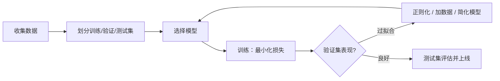

# 机器学习基础

> **一句话**：机器学习就是「从数据里学规律」，三大范式是监督学习、无监督学习和强化学习。
> **难度**：入门
> **标签**：`#basics` `#beginner`

## 先看结论

- 三大范式按「有没有标准答案、有没有反馈」区分
- 训练 = 在数据上最小化损失函数；泛化 = 在没见过的数据上也对
- 过拟合是头号敌人：模型把「刷过的题」背下来了，而不是学会了
- Agent 领域最重要的 ML 分支是**强化学习**（RLHF、推理模型都靠它）

## 三大范式

| 范式 | 数据形态 | 类比 | 例子 |
|---|---|---|---|
| 监督学习 | 有输入 + 标准答案 | 刷带答案的题库 | 垃圾邮件分类、房价预测 |
| 无监督学习 | 只有输入，没有答案 | 自己把衣柜分类整理 | 用户聚类、异常检测 |
| 强化学习 | 试错 + 奖励信号 | 训练小狗：做对给零食 | AlphaGo、RLHF、推理模型 |

## 监督学习的流程

## 核心概念速查

| 概念 | 一句话解释 | 类比 |
|---|---|---|
| 特征 | 描述样本的属性 | 判断西瓜生熟看的纹路、敲声 |
| 损失函数 | 衡量「错得有多离谱」 | 考卷扣的分 |
| 梯度下降 | 沿「下坡方向」一点点调参数 | 蒙眼下山，每步走最陡的下坡 |
| 过拟合 | 训练集很好、测试集很差 | 背题库的学生遇到新题就懵 |
| 正则化 | 给模型加约束防过拟合 | 要求学生「说出解题思路」而不许背答案 |

## 源码案例

强化学习怎么把 LLM 训成 Agent 的大脑？两个必看实例：

- **DeepSeek-R1**（[论文](https://arxiv.org/abs/2501.12948)）：用大规模 RL 直接激励模型学会「长推理链」，开源了训练配方，是「推理模型」的代表作
- **InstructGPT / RLHF**（[论文](https://arxiv.org/abs/2203.02155)）：人类偏好反馈 → 奖励模型 → PPO 微调，ChatGPT 对话能力的来源，详见 [RLHF、DPO 与对齐](../03-llm/rlhf-dpo-alignment.md)

## 常见误区

- ❌ 数据越多一定越好：脏数据比少数据更糟
- ❌ 模型越复杂越好：先跑通基线，再逐步加复杂度
- ❌ 强化学习 = Q-learning：DeepSeek-R1 用的 GRPO 等策略优化方法更新颖，思想内核仍是「试错 + 奖励」

## 小练习

「根据历史用电量预测明天用电量」属于哪种范式？如果把「电费超支」作为惩罚信号让系统自己学调度策略呢？

## 相关知识点

- [深度学习基础](deep-learning-basics.md)
- [RLHF、DPO 与对齐](../03-llm/rlhf-dpo-alignment.md)
