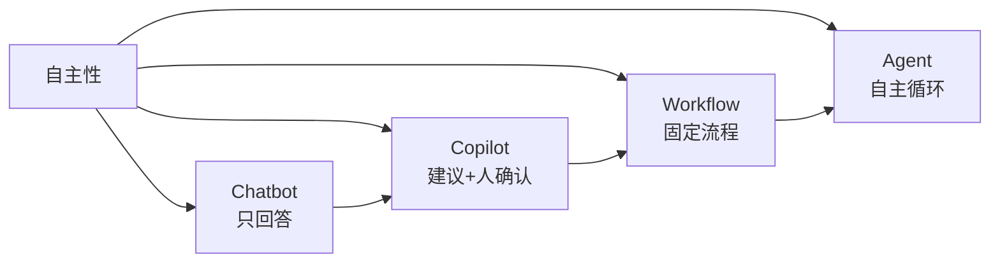

# 🤖 Agent 与 Workflow、Chatbot、Copilot 的区别

> **一句话**：区别就在「谁决定流程」——Chatbot 听用户的、Workflow 听开发者的、Copilot 听用户的半程、Agent 自己全程决定。
> **难度**：⭐️ 入门
> **标签**：`#agent` `#basics`

## 📌 先看结论

- 四者不是互斥的产品分类，而是「自主性光谱」上的四个刻度
- Anthropic 的工程共识：能用 Workflow 解决的不要上 Agent——可预测性优先
- 判断标准：控制流（谁来决定下一步）+ 工具权（谁来选工具）

## 🧩 对比表

| 形态 | 控制流 | 是否调工具 | 自主规划 | 典型例子 |
|---|---|---|---|---|
| Chatbot | 用户主导，一问一答 | ❌ | ❌ | 客服问答、ChatGPT 网页版基础对话 |
| Copilot | 用户发起，AI 建议，用户确认 | 部分（补全、内联修改） | ❌ | GitHub Copilot 补全 |
| Workflow | 开发者写死流程，LLM 填空 | ✅（固定节点） | ❌ | 审批流、固定 RAG 问答管线 |
| Agent | LLM 自己规划循环 | ✅（动态选择） | ✅ | Claude Code、OpenHands |

## 🖼️ 图示

## 📦 源码案例

- **Claude Code 的边界感**：它是 Agent，但内置了 Workflow 成分——`/init` 生成 CLAUDE.md、TodoWrite 任务清单都是「半固定流程」；社区逆向的 [系统提示词全集](https://github.com/Piebald-AI/claude-code-system-prompts) 显示它用大量规则约束「什么时候必须问人」（如破坏性命令先确认），是在自主与可控之间做工程平衡
- **DeepSeek Harness 的四种模式**（[仓库](https://github.com/deepseek-ai/deepseek-harness)）：标准模式（完整 Agent）、极简模式（只留 shell + 文件编辑两个工具）、PTC 模式（模型写代码组合工具调用，接近 Workflow 的确定性）、创造模式——同一个 harness 可以在这四点之间滑动
- **Pi 的态度**：默认「YOLO」（无权限弹窗），把安全交给用户自建的扩展——极端自主派，适合可信环境

## 🍜 生活类比

- Chatbot = 电话客服：问什么答什么
- Copilot = 副驾：你开车，他提醒路线
- Workflow = 流水线工人：班次动作写死在 SOP 里
- Agent = 实习生：给目标，自己想办法，做完汇报

## ⚠️ 常见误区

- ❌ 「越自主越先进」：错。报销审批这种确定性流程用 Workflow 又便宜又稳
- ❌ 产品名片上写 Agent 就是 Agent：看控制流——下一步谁决定？
- ❌ 三者互斥：真实系统常是混合体，如 Claude Code 的 Plan 模式（先出计划等人批准，再自主执行）

## 🧪 小练习

「自动回复邮件的助手：读邮件 → 分类 → 起草回复 → 用户点发送」——这是哪种形态？如果去掉「用户点发送」呢？

## 🔗 相关资源

- [Anthropic: Building Effective Agents](https://www.anthropic.com/engineering/building-effective-agents)
- [Piebald-AI/claude-code-system-prompts](https://github.com/Piebald-AI/claude-code-system-prompts)

## 📚 相关知识点

- [什么是 AI Agent](what-is-agent.md)
- [自主性等级](autonomy-levels.md)
- [Human-in-the-loop](human-in-the-loop.md)
