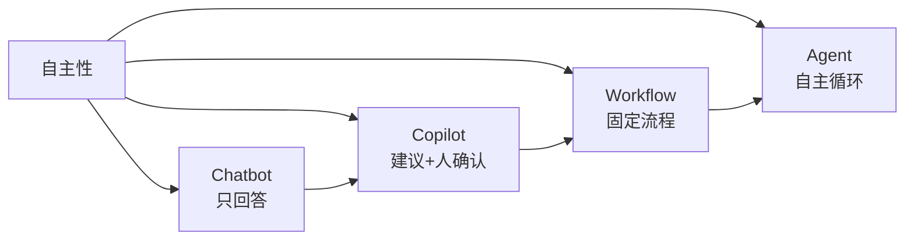

# Agent 与 Workflow、Chatbot、Copilot 的区别

> **一句话**：区别就在「谁决定流程」——Chatbot 听用户的、Workflow 听开发者的、Copilot 听用户的半程、Agent 自己全程决定。

## 先看结论

- 四者不是互斥的产品分类，而是「自主性光谱」上的四个刻度
- 判断标准：控制流（谁来决定下一步）+ 工具权（谁来选工具）
- Anthropic 的工程共识：能用 Workflow 解决的不要上 Agent——可预测性优先
- 真实系统几乎都是混合体，关键是知道每一段该用哪种形态

## 核心机制：用控制流区分四者

一个系统由若干「步骤」组成，区分四者的唯一变量是：**下一步做什么，由谁决定？** 用 $s_{t+1}=F(s_t)$ 表示状态转移：

| 形态 | 控制流函数 $F$ | 谁写 $F$ | 是否调工具 | 自主规划 | 典型例子 |
|---|---|---|---|---|---|
| Chatbot | 用户消息驱动，单轮生成 | —— | 否 | 否 | 客服问答 |
| Copilot | 用户发起点，模型补全，用户采纳 | 用户 | 部分（补全/内联修改） | 否 | GitHub Copilot 补全 |
| Workflow | 代码里写死的图/链 | 开发者 | 固定节点 | 否 | 审批流、固定 RAG 管线 |
| Agent | 模型在运行时决定 | 模型 | 动态选择 | 是 | Claude Code、OpenHands |

**推论**：把「谁决定下一步」写成等式——Chatbot 的 $F$ 由用户每次输入提供；Workflow 的 $F$ 是开发者编译期固化的；Agent 的 $F$ 是模型在运行时的输出。这就是为什么「产品名叫 Agent」不算数：要看 $F$ 是谁产生的。

## 成本与可靠性的权衡

自主性不是免费的，它交换的是**可预测性**：

$$
\text{Agent 的收益}=\text{处理未知情况的能力}
\qquad
\text{Agent 的代价}=\text{路径不可预测}+\text{token 成本上升}+\text{调试复杂}
$$

Workflow 的每一步都确定、可测试、成本可估；Agent 能处理「开发者没预设到的情况」，但你无法在运行前知道它要花多少步、多少钱。因此工程判据是：

- 任务**步骤固定 → 用 Workflow**（更便宜、更稳）
- 任务**步骤依赖运行时信息 → 用 Agent**（否则没法做）

Anthropic 在《Building Effective Agents》里给出的正是这条建议：**从最简单的方案开始，只在确有必要时引入自主性**。

## 图示

## 生活类比

- Chatbot = 电话客服：问什么答什么
- Copilot = 副驾：你开车，他提醒路线
- Workflow = 流水线工人：班次动作写死在 SOP 里
- Agent = 实习生：给目标，自己想办法，做完汇报

## 源码案例

- **Claude Code 的边界感**：它是 Agent，但内置了 Workflow 成分——`/init` 生成 CLAUDE.md、TodoWrite 任务清单都是「半固定流程」；社区逆向的 [系统提示词全集](https://github.com/Piebald-AI/claude-code-system-prompts) 显示它用大量规则约束「什么时候必须问人」（如破坏性命令先确认），是在自主与可控之间做工程平衡
- **DeepSeek Harness 的四种模式**（[仓库](https://github.com/deepseek-ai/deepseek-harness)）：标准模式（完整 Agent）、极简模式（收敛工具面）、PTC 模式（模型写代码组合工具调用，接近 Workflow 的确定性）、创造模式——同一个 harness 可以在这几点之间滑动，说明「自主性」是可配置的运行时参数，而不是产品品类
- **Pi 的默认姿态**（[仓库](https://github.com/earendil-works/pi)）：默认不做逐动作确认，把安全责任前置到环境隔离——属于「高自主 + 环境兜底」路线，适合可信环境，不适合生产

## 常见误区

- ❌ 「越自主越先进」：错。报销审批这种确定性流程用 Workflow 又便宜又稳
- ❌ 产品名片上写 Agent 就是 Agent：看控制流——下一步谁决定？
- ❌ 三者互斥：真实系统常是混合体，如 Claude Code 的 Plan 模式（先出计划等人批准，再自主执行）
- ❌ 用了 LLM 就叫 Agent：Workflow 里也可以每个节点都调 LLM，但流程是人定的，仍是 Workflow

## 小练习

「自动回复邮件的助手：读邮件 → 分类 → 起草回复 → 用户点发送」——这是哪种形态？如果去掉「用户点发送」呢？再把「分类」改成由固定规则实现，形态变了吗？

## 参考资料

- [Anthropic: Building Effective Agents](https://www.anthropic.com/engineering/building-effective-agents)
- [ReAct: Synergizing Reasoning and Acting in Language Models](https://arxiv.org/abs/2210.03629)（Yao et al., 2022）
- [Piebald-AI/claude-code-system-prompts](https://github.com/Piebald-AI/claude-code-system-prompts)

## 相关知识点

- [什么是 AI Agent](what-is-agent.md)
- [自主性等级](autonomy-levels.md)
- [Human-in-the-loop](human-in-the-loop.md)
