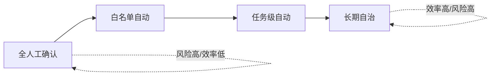

# 自主性等级

> **一句话**：Agent 的自主性不是有或无，而是一条从「建议」到「全自动」的滑杆；工程上要按风险逐级放权。
> **难度**：入门
> **标签**：`#agent` `#basics`

## 分级表

| 等级 | 名称 | 行为 | 例 |
|---|---|---|---|
| L0 | 建议 | 只输出方案，人执行 | 普通聊天机器人 |
| L1 | 人批准每个动作 | AI 出手，人点确认 | Claude Code 默认模式（危险命令先确认） |
| L2 | 域内自动 | 白名单内自动、域外请示 | 只读工具自动跑，写操作要批 |
| L3 | 任务级自动 | 给目标后全自动，完成验收 | OpenHands 全自动修 issue + CI 验证 |
| L4 | 目标级自治 | 长期运行，自我拆解多目标 | 无人值守运维 Agent（前沿，尚不成熟） |

## 权限滑杆

## 源码案例

- **Claude Code 的权限管道**：社区逆向分析显示每个工具调用经过多层检查——允许列表（allowlist）、危险命令确认策略（如安装/删除类命令必须解释并确认）、沙箱模式。这是「L1 → L2 可配置」的工业实现
- **DeepSeek Harness**：把审批做成工具执行流水线上的一个 Hook 环节（请求前：Hook → 审批 → 权限检查 → 沙箱 → 超时控制），放权策略可以整体替换成插件
- **Pi**：默认 L3（YOLO，无弹窗），依赖 Linux 沙箱（如 landlock 类机制）兜底——「用环境隔离换审批开销」的激进路线

## 最佳实践

- 按操作「可逆性」分级：只读自动放行；写文件进版本控制可回滚；删库、转账、发邮件必须人批
- 自动化的前提是「可验证」：有测试、有验收标准，才敢放手（见 [持续评估](../11-engineering/continuous-evaluation.md)）
- 记录每一次自动动作，可审计可回放（DeepSeek Harness 的 append-only 事件流就是为此设计）

## 常见误区

- ❌ 一步到位上 L4：现实是 L1/L2 + 好的验收机制最实用
- ❌ 自主性 = 智能水平：两者无关，L1 的 Agent 也可能用很强的模型
- ❌ 弹窗越少体验越好：误操作成本高的域里，审批是功能不是负担

## 小练习

给一个「自动整理相册」的 Agent 设计分级：哪些动作可以全自动？哪些必须确认？

## 相关知识点

- [Human-in-the-loop](human-in-the-loop.md)
- [工具权限与沙箱](../05-tool-protocol/tool-permission-sandbox.md)
