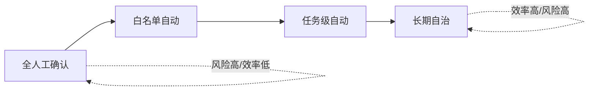

# 自主性等级

> **一句话**：Agent 的自主性不是有或无，而是一条从「建议」到「全自动」的滑杆；工程上要按风险逐级放权。

## 先看结论

- 自主性的本质是「控制流交给谁」的程度，可用 L0–L4 分级
- 放权的判据不是「模型多强」，而是「这个动作错了的代价有多大、能不能验证」
- 分级不是越高级越好：**最合适的等级取决于任务的可逆性与可验证性**
- 与自动驾驶的分级（SAE J3016）是同构问题，可以借鉴其经验

## 分级表

| 等级 | 名称 | 行为 | 例 |
|---|---|---|---|
| L0 | 建议 | 只输出方案，人执行 | 普通聊天机器人 |
| L1 | 人批准每个动作 | AI 出手，人点确认 | Claude Code 默认模式（危险命令先确认） |
| L2 | 域内自动 | 白名单内自动、域外请示 | 只读工具自动跑，写操作要批 |
| L3 | 任务级自动 | 给目标后全自动，完成验收 | OpenHands 全自动修 issue + CI 验证 |
| L4 | 目标级自治 | 长期运行，自我拆解多目标 | 无人值守运维 Agent（前沿，尚不成熟） |

## 核心机制：放权判据

不要按「模型是否够聪明」决定自主等级，而要按动作的属性。对一个动作集合 $$\mathcal{A}$$，允许自动执行的条件是：

$$
\text{Auto}(a)=\mathbb{1}\Big[\;\underbrace{\text{Reversible}(a)}_{\text{可撤销}}\;\wedge\;
\underbrace{\text{Verifiable}(a)}_{\text{可验证}}\;\wedge\;
\underbrace{\mathbb{E}[\text{Loss}(a)]<\tau}_{\text{期望损失可控}}\;\Big]
$$

三个条件缺一不可，而且各自对应一种工程手段：

| 条件 | 不满足时怎么办 | 手段 |
|---|---|---|
| 可撤销 | 让它变得可撤销 | 版本控制、软删除、草稿箱 |
| 可验证 | 补上验证器 | 测试、schema 校验、断言 |
| 期望损失可控 | 缩小影响面或改为人批 | 权限最小化、限额、白名单 |

**关键推论**：提高自主性最快的路径往往不是换更强的模型，而是**把动作改成可撤销、可验证**。一个「能自动回滚、有测试兜底」的写操作，比一个「模型很强但删了就没」的写操作更适合放开。

## 与自动驾驶分级的同构

这个分级思路并非 Agent 独有。SAE J3016 对驾驶自动化也是按「谁负责控制」分级（L0 无自动化 → L5 完全自动化），并强调一个关键经验：**高等级不自动意味着更安全，责任边界必须清晰**。Agent 领域可以照搬两条教训：

1. 每一级都必须明确「出问题时谁负责、如何接管」
2. 等级跃迁不应跨越验证能力——L3 的前提是有可靠的验收机制（对应自动驾驶的接管时间预算）

## 权限滑杆

## 源码案例

- **Claude Code 的权限管道**（社区逆向分析，[提示词全集](https://github.com/Piebald-AI/claude-code-system-prompts)）：每个工具调用经过多层检查——允许列表、危险命令确认策略、沙箱模式。这是「L1 → L2 可配置」的工业实现：用户可通过规则把可信操作提升为自动、把高危操作保持人工
- **DeepSeek Harness**（[仓库](https://github.com/deepseek-ai/deepseek-harness)）：把审批做成工具执行流水线上的一个 Hook 环节（Hook → 审批 → 权限检查 → 沙箱 → 超时控制），放权策略可以整体替换成插件——同一套 Agent 换一套策略即从 L1 切到 L3
- **Pi**（[仓库](https://github.com/earendil-works/pi)）：默认高自主、把安全责任前置到环境隔离——「用环境隔离换审批开销」的路线，适合可信的个人环境

## 工程含义

- **按动作分级，而不是按 Agent 分级**：同一个 Agent 里，读文件可以是 L3、发邮件必须是 L1。
- **自动化的前提是可验证**：有测试、有验收标准，才敢放手（见 [持续评估](../11-engineering/continuous-evaluation.md)）。
- **可审计是放权的基础**：记录每一次自动动作，才能事后追责与回放（事件日志的作用，见 [状态机与事件驱动](../11-engineering/state-machine-event-driven.md)）。
- **留好接管通道**：任何等级都要能被人随时中断（kill switch），这是 L3+ 的硬要求。

## 常见误区

- ❌ 一步到位上 L4：现实是 L1/L2 + 好的验收机制最实用
- ❌ 自主性 = 智能水平：两者无关，L1 的 Agent 也可能用很强的模型
- ❌ 弹窗越少体验越好：误操作成本高的域里，审批是功能不是负担
- ❌ 等级只能整体切换：正确的做法是按动作类型分别设定等级

## 小练习

给一个「自动整理相册」的 Agent 设计分级：用放权判据判断哪些动作（读取、分类打标、删除重复、上传云盘）可以全自动、哪些必须确认？对必须确认的动作，设计一种降低其风险的改造方案。

## 参考资料

- [SAE J3016: Taxonomy and Definitions for Terms Related to Driving Automation Systems](https://www.sae.org/standards/content/j3016_202104/)（分级框架的现实参照）
- [Anthropic: Building Effective Agents](https://www.anthropic.com/engineering/building-effective-agents)
- [Piebald-AI/claude-code-system-prompts](https://github.com/Piebald-AI/claude-code-system-prompts)

## 相关知识点

- [Human-in-the-loop](human-in-the-loop.md)
- [工具权限与沙箱](../05-tool-protocol/tool-permission-sandbox.md)
