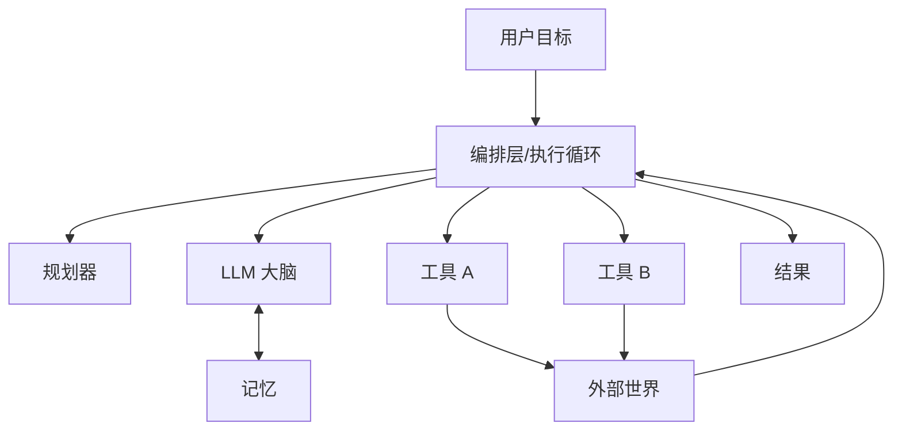

# Agent 核心组件

> **一句话**：Agent = 大脑（LLM）+ 记忆 + 工具 + 规划 + 执行循环，五个组件任何一项缺失都会让系统退化。

## 先看结论

- 最小可用 Agent 只需要三样：LLM、一组工具、一个 while 循环；其余组件都是在这个内核上加「治理」
- 每个组件都有明确的**失效模式**：知道缺了它会怎样，才知道该不该加
- 组件之间靠「上下文」连接：谁能看到什么，决定了行为
- 组件的边界应当是**可替换的**——这是判断一个 harness 是否工程化的标准

## 核心机制：五个组件各自负责什么

把 Agent 写成一个元组，每个位置对应一类职责：

$$
\text{Agent}=\big(\underbrace{\pi_\theta}_{\text{LLM 策略}},\;
\underbrace{M}_{\text{记忆}},\;
\underbrace{T}_{\text{工具集}},\;
\underbrace{P}_{\text{规划}},\;
\underbrace{\text{Loop}}_{\text{执行循环}}\big)
$$

| 组件 | 作用 | 类比 | 缺了它会怎样 | 深入阅读 |
|---|---|---|---|---|
| LLM | 推理、决策、生成 | 大脑 | 无法决策，退化为脚本 | [LLM 是什么](../03-llm/what-is-llm.md) |
| 记忆 | 保存对话历史、事实、经验 | 笔记本 | 每轮都「失忆」，无法多轮协作 | [记忆类型](../06-memory-rag/memory-types.md) |
| 工具 | 与外部世界交互 | 手脚 | 只能空谈，不能做事 | [Function Calling](../05-tool-protocol/function-calling.md) |
| 规划 | 拆解目标为步骤 | 待办清单 | 长任务中途跑偏、漏步骤 | [任务分解](../07-planning/task-decomposition.md) |
| 执行循环 | 观察→思考→行动的引擎 | 心跳 | 只执行一步就停 | [感知—规划—行动循环](perception-planning-action.md) |

**最小内核**：理论上只要「LLM + 工具 + 循环」就能叫 Agent（例如一个能查天气、能算数的循环程序）。但要处理**真实任务**，很快就会缺三样东西：记忆（跨轮次保持状态）、规划（长任务不跑偏）、治理（权限与审批）。所以工程上的顺序是「先跑通最小内核，再按失效模式补组件」，而不是一上来就搭全套。

## 架构图

## 组件边界应当可替换

判断一个 harness 是否「工程化」，看它的组件边界是否清晰到可以整体替换。最容易观察的三个位置：

- **循环**：能否换一套调度/编排策略而不改工具代码
- **记忆/存储**：能否换存储后端（内存 / 数据库 / 事件日志）而不改循环
- **工具执行**：能否在「模型输出」与「真正执行」之间插入治理层（审批、权限、沙箱）

## 源码案例

**DeepSeek Harness 的完整拼图**（[仓库](https://github.com/deepseek-ai/deepseek-harness)）：每个组件都是一个可替换插件——`packages/core/agent-loop`（循环）、`packages/core/tools`（工具注册与执行管道）、`packages/core/session`（事件日志即记忆）、`packages/core/system-prompt`（提示词组装）、`packages/sandbox`（沙箱）、`packages/llm`（模型适配器）。组件之间通过事件与服务协作——「一切皆插件」就是把五大组件的边界做到可插拔。

**Pi 的极简内核**（[仓库](https://github.com/earendil-works/pi)）：把运行时拆成几个小包——`pi-ai`（统一多 provider LLM API）、`pi-agent-core`（Agent 运行时与状态管理）、`pi-coding-agent`（编码 Agent CLI）、`pi-tui`（终端 UI）。设计取向是「提供原语而非成品」：核心只保留循环、工具执行与状态管理，其余能力由使用方组合。具体的工具集与循环实现细节请以 pi.dev 文档为准。

> **注意**：Pi 项目在 2026 年由 `badlogic/pi-mono` 更名为 `earendil-works/pi` 并重构了包结构。早期二手资料里的包名（如 `@mariozechner/...`）已过期，请以仓库 README 与官网为准。

**Claude Code 的治理层**（社区逆向分析，[提示词全集](https://github.com/Piebald-AI/claude-code-system-prompts)）：在同样五组件之上叠加权限管道（每个工具调用过审批）、生命周期 Hooks、子 Agent 隔离（独立上下文与转写文件）——这是「内核之上加治理」的成熟形态。

## 工程含义

- **按失效模式补组件，而不是按清单搭**：先跑最小内核，观察它「在哪一类任务上失败」，再针对性补记忆/规划/治理。
- **上下文是组件的公共接口**：记忆决定「历史能看到多少」、工具结果决定「环境能看到多少」、规划决定「目标能看到多细」——组件冲突往往表现为上下文冲突。
- **工具面要克制**：工具越多，模型选择准确率越低，且每个工具的 schema 都占上下文预算。

## 常见误区

- ❌ 工具越多能力越强：工具过多稀释选择准确率，Claude Code 甚至用「先列工具名、按需加载 schema」来控制工具面（详见 [工具选择与路由](../07-planning/tool-selection-routing.md)）
- ❌ 记忆 = 对话历史全量塞上下文：会爆窗口且降智，需要压缩与检索（见 [记忆压缩、遗忘与摘要](../06-memory-rag/memory-compression-forgetting.md)）
- ❌ 规划必须独立模块：小任务里 LLM「边想边做」即可，别过度设计
- ❌ 组件越多越先进：每多一个组件就多一处失败点与调试成本

## 小练习

去掉「记忆」组件，Pi 式 Agent 还能跑吗？会退化成什么形态？（提示：想想多轮对话与长任务）再列出「加回记忆」后你需要新增的两项工程工作。

## 参考资料

- [Anthropic: Building Effective Agents](https://www.anthropic.com/engineering/building-effective-agents)
- [ReAct: Synergizing Reasoning and Acting in Language Models](https://arxiv.org/abs/2210.03629)（Yao et al., 2022）
- [DeepSeek Harness](https://github.com/deepseek-ai/deepseek-harness) / [Pi](https://github.com/earendil-works/pi)

## 相关知识点

- [感知—规划—行动循环](perception-planning-action.md)
- [Agent 状态管理](state-management.md)
