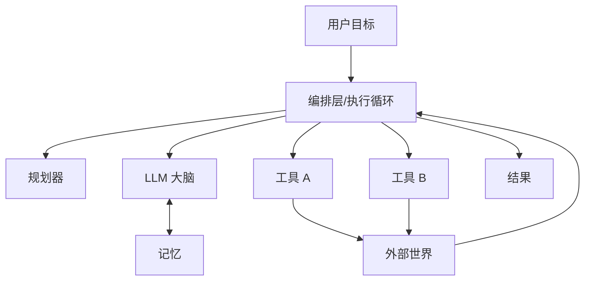

# 🤖 Agent 核心组件

> **一句话**：Agent = 大脑（LLM）+ 记忆 + 工具 + 规划 + 执行循环，五个组件任何一项缺失都会让系统退化。
> **难度**：⭐️ 入门
> **标签**：`#agent` `#basics`

## 📌 先看结论

- 最小可用 Agent 只需要三样：LLM、一组工具、一个 while 循环——Pi 用 ~300 行证明了这点
- 其余组件（记忆系统、规划器、审批层）都是在最小内核上加「治理」
- 组件间靠「上下文」连接：谁能看到什么，决定了行为

## 🧩 五大组件

| 组件 | 作用 | 类比 | 深入阅读 |
|---|---|---|---|
| LLM | 推理、决策、生成 | 大脑 | [LLM 是什么](../03-llm/what-is-llm.md) |
| 记忆 | 保存对话历史、事实、经验 | 笔记本 | [记忆类型](../06-memory-rag/memory-types.md) |
| 工具 | 与外部世界交互 | 手脚 | [Function Calling](../05-tool-protocol/function-calling.md) |
| 规划 | 拆解目标为步骤 | 待办清单 | [任务分解](../07-planning/task-decomposition.md) |
| 执行循环 | 观察→思考→行动的引擎 | 心跳 | [感知—规划—行动循环](perception-planning-action.md) |

## 🖼️ 架构图

## 📦 源码案例

**Pi（pi-mono）的极简内核**（[GitHub](https://github.com/badlogic/pi-mono)）：

- `@mariozechner/pi-agent-core` 只封装 agentLoop + 工具执行 + 状态管理三件事
- 只内置 `read / write / edit / bash` 四个原子工具，其余能力靠组合与扩展（Unix 哲学）
- System Prompt 压到 1000 token 以内——组件越少，模型行为越可预测

**DeepSeek Harness 的完整拼图**（[仓库](https://github.com/deepseek-ai/deepseek-harness)）：

- 每个组件都是一个可替换插件：`core/agent-loop`（循环）、`core/tools`（工具注册与执行管道）、`core/session`（事件日志即记忆）、`core/system-prompt`（提示词组装）、`sandbox`（landlock 沙箱）、`llm`（模型适配器）
- 组件之间通过 Cordis 的服务与事件协作——「一切皆插件」就是把五大组件的边界做到可插拔

**Claude Code 的治理层**（社区逆向分析，[提示词全集](https://github.com/Piebald-AI/claude-code-system-prompts)）：

- 在同样五组件之上叠加：权限管道（每个工具调用过审批）、Hooks（生命周期拦截）、子 Agent 隔离（独立上下文与转写文件）

## ⚠️ 常见误区

- ❌ 工具越多能力越强：工具过多稀释选择准确率，Claude Code 甚至用「先列工具名、按需加载 schema」来控制工具面（详见 [工具选择与路由](../07-planning/tool-selection-routing.md)）
- ❌ 记忆 = 对话历史全量塞上下文：会爆窗口且降智，需要压缩与检索（见 [记忆压缩、遗忘与摘要](../06-memory-rag/memory-compression-forgetting.md)）
- ❌ 规划必须独立模块：小任务里 LLM「边想边做」即可，别过度设计

## 🧪 小练习

去掉「记忆」组件，Pi 式 Agent 还能跑吗？会退化成什么形态？（提示：想想多轮对话）

## 📚 相关知识点

- [感知—规划—行动循环](perception-planning-action.md)
- [Agent 状态管理](state-management.md)
