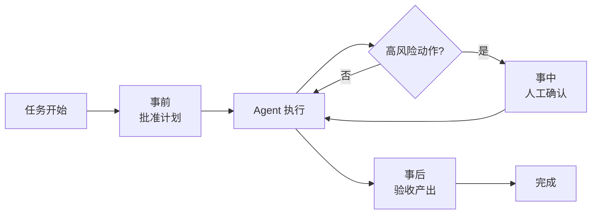

# Human-in-the-loop

> **一句话**：HITL 是在高风险节点主动安排人类介入——批准、否决、纠偏；好的 Agent 设计不是去掉人，而是把人放在最值钱的位置。

## 先看结论

- 三种介入形态：事前审批（批准计划）、事中拦截（否决危险动作）、事后验收（检查产出）
- 介入点选择标准：不可逆性 × 影响面 × 不确定性
- 体验关键：让人类看「计划摘要 / diff」而不是「原始 token 流」
- 人的注意力是稀缺资源：审批必须**少而准**，否则会退化成无脑点确认

## 核心机制：把「该不该问人」写成一个判据

人类介入不是「越多越安全」，而是要在「误操作代价」和「打断成本」之间取舍。对一个候选动作 $$a$$，定义其风险为：

$$
\text{Risk}(a)=\underbrace{\text{Irreversibility}(a)}_{\text{能否撤销}}\times
\underbrace{\text{Blast}(a)}_{\text{影响面}}\times
\underbrace{\big(1-\text{Confidence}(a)\big)}_{\text{不确定程度}}
$$

介入的判据是「期望损失 > 打断成本」：

$$
\text{Risk}(a)\times \text{Cost(error)} \;>\; \text{Cost(interrupt)}
\quad\Longrightarrow\quad \text{需要人介入}
$$

这条式子的三个因子分别对应三种工程手段：

- **降低不可逆性**：能用 git 回滚、能用软删除、能先写草稿——很多「必须审批」其实可以通过「让它可撤销」变成「不必审批」
- **限制影响面**：权限最小化、白名单收件人、限定额度——把 $$\text{Blast}$$ 压小
- **提高置信度**：用外部验证器（测试、schema 校验）替代「模型自称有把握」

**注意最后一项**：模型的自我置信度不可靠（见 [幻觉问题](../10-evaluation-safety/hallucination.md)），所以 Confidence 应尽量由**外部信号**估计，而不是让模型自评。

## 三种介入点

| 介入点 | 何时用 | 人类看到什么 | 典型实现 |
|---|---|---|---|
| 事前审批 | 任务大、路径不确定 | 计划 / Todo 清单 | Claude Code 的 Plan 模式 |
| 事中拦截 | 单步动作不可逆 | 具体命令 / diff / 收件人 | 危险命令确认、权限弹窗 |
| 事后验收 | 产出可回滚、可检查 | 变更摘要 / 测试结果 | PR review、CI 门禁 |

## 打断预算与告警疲劳

人的注意力是有限资源。若每步都弹窗，用户会形成「无脑确认」的习惯，安全机制反而失效——这与运维里的**告警疲劳**是同一现象。工程上应设「打断预算」：

$$
\text{interrupts per task}\;\le\;N\qquad(\text{如 3–5 次})
$$

超出的动作应改为「自动执行但记录 + 事后集中复核」，或通过缩小权限让它们**根本不需要**介入。判断标准：一次打断必须对应一个「用户真的会改变主意」的决策点；如果用户永远点「同意」，这个弹窗就该删掉。

## 源码案例

- **Claude Code 的 Plan 模式**：先进入只读的探索与规划阶段，产出计划交用户批准，批准后才切换到可写工具执行——「事前审批」的典范；同时系统提示词规定破坏性命令必须先说明再确认（「事中拦截」）。完整约束见 [Piebald-AI/claude-code-system-prompts](https://github.com/Piebald-AI/claude-code-system-prompts)
- **DeepSeek Harness 的审批插件**（[仓库](https://github.com/deepseek-ai/deepseek-harness)）：审批是工具执行流水线上的一个环节（Hook → 审批 → 权限检查 → 沙箱 → 超时），意味着 HITL 策略可整体替换：从「全部人批」到「全自动」只是换插件
- **Pi 的反向选择**（[仓库](https://github.com/earendil-works/pi)）：默认不做逐动作确认，把「人的介入」转移到事后——用户检查产出、写测试验收。适合个人开发者的低风险环境，不适合生产

## 最佳实践

| 动作类型 | 建议策略 |
|---|---|
| 只读（搜索、读文件） | 自动，不打扰 |
| 可逆写（改代码、有 git） | 域内自动，事后 review |
| 不可逆（删库、发邮件、付款） | 必须事中确认 |
| 计划本身 | 大任务先批计划再执行 |

- 确认界面展示**决策所需的最小信息**：改动的 diff、收件人列表、金额——而不是模型的完整思考过程。
- 让「否决」同样可用：用户不只能批准，还要能编辑后批准、或直接拒绝并说明原因（拒绝原因可作为反馈回流）。

## 常见误区

- ❌ 弹窗轰炸：每步都问人 = 人肉循环，反而逼用户无脑点「确认」（告警疲劳）
- ❌ 全自动最酷：没有验收机制的全自动是事故制造机
- ❌ 人只当按钮工：让人类做「目标校准和异常判断」，别做「逐字审阅」
- ❌ 靠模型自评置信度来决定是否问人：模型对自己是否出错并不敏感，要用外部验证信号

## 小练习

为一个「自动回复客户邮件」的 Agent 设计 HITL 方案：用上面的 Risk 公式判断哪些步骤需要确认？确认界面展示什么信息？再给出你的「每任务打断预算」和超出预算时的降级策略。

## 参考资料

- [Anthropic: Building Effective Agents](https://www.anthropic.com/engineering/building-effective-agents)
- [Piebald-AI/claude-code-system-prompts](https://github.com/Piebald-AI/claude-code-system-prompts)
- [A Survey of Human-in-the-loop for Machine Learning](https://arxiv.org/abs/2108.00941)（Wu et al., 2021）

## 相关知识点

- [自主性等级](autonomy-levels.md)
- [工具权限与沙箱](../05-tool-protocol/tool-permission-sandbox.md)
- [提示注入](../10-evaluation-safety/prompt-injection.md)
