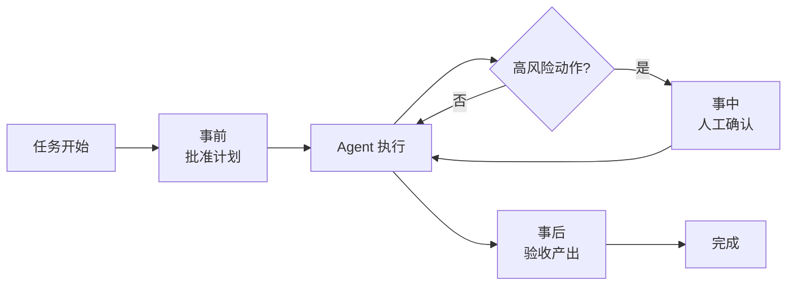

# Human-in-the-loop

> **一句话**：HITL 是在高风险节点主动安排人类介入——批准、否决、纠偏；好的 Agent 设计不是去掉人，而是把人放在最值钱的位置。
> **难度**：入门
> **标签**：`#agent` `#safety`

## 先看结论

- 三种介入形态：事前审批（批准计划）、事中拦截（否决危险动作）、事后验收（检查产出）
- 介入点选择标准：不可逆性 × 影响面 × 置信度
- 体验关键：让人类看「计划摘要」而不是「原始 token 流」

## 三种介入点

## 源码案例

- **Claude Code 的 Plan 模式**：先进入只读的探索与规划阶段，产出计划交用户批准，批准后才切换到可写工具执行——「事前审批」的典范；同时系统提示词规定破坏性命令（安装、删除、git push 等）必须先说明再确认（「事中拦截」）。完整的提示词约束见 [Piebald-AI/claude-code-system-prompts](https://github.com/Piebald-AI/claude-code-system-prompts)
- **DeepSeek Harness 的审批插件**：审批是工具执行流水线上的一个环节（Hook → 审批 → 权限检查 → 沙箱 → 超时），意味着 HITL 策略可整体替换：从「全部人批」到「全自动」只是换插件
- **Pi 的反向选择**：默认零弹窗（YOLO），把「人的介入」转移到事后——用户检查产出、写测试验收。适合个人开发者的低风险环境，不适合生产

## 最佳实践

| 动作类型 | 建议策略 |
|---|---|
| 只读（搜索、读文件） | 自动，不打扰 |
| 可逆写（改代码、有 git） | 域内自动，事后 review |
| 不可逆（删库、发邮件、付款） | 必须事中确认 |
| 计划本身 | 大任务先批计划再执行 |

## 常见误区

- ❌ 弹窗轰炸：每步都问人 = 人肉循环，反而逼用户无脑点「确认」（告警疲劳）
- ❌ 全自动最酷：没有验收机制的全自动是事故制造机
- ❌ 人只当按钮工：让人类做「目标校准和异常判断」，别做「逐字审阅」

## 小练习

为一个「自动回复客户邮件」的 Agent 设计 HITL 方案：哪些步骤给谁确认？确认界面展示什么信息？

## 相关知识点

- [自主性等级](autonomy-levels.md)
- [工具权限与沙箱](../05-tool-protocol/tool-permission-sandbox.md)
- [提示注入](../10-evaluation-safety/prompt-injection.md)
