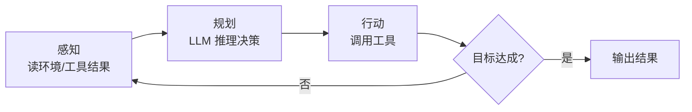

# 🤖 感知—规划—行动循环

> **一句话**：Agent 的心跳是一个「观察 → 思考 → 行动 → 再观察」的循环，术语上叫感知（Perception）— 规划（Planning）— 行动（Action）。
> **难度**：⭐️⭐️ 进阶
> **标签**：`#agent` `#basics`

## 📌 先看结论

- 循环本体极简单：`while 未完成: 思考 → 行动 → 观察`
- 工程难点全在循环之外：何时停、失败怎么办、上下文怎么管理
- ReAct 是这个循环最经典的 prompt 化实现；各家 harness 是它的工程化放大

## 🖼️ 循环图



## 💻 最小实现（Python 伪代码）

```python
messages = [system_prompt, user_goal]
while True:
    resp = llm.chat(messages, tools=TOOLS)     # 思考
    if not resp.tool_calls:                    # 没有工具调用 = 完成
        return resp.text
    for call in resp.tool_calls:               # 行动
        result = execute(call)                 # 执行工具
        messages.append(tool_result(result))   # 感知：结果回填上下文
```

## 📦 源码案例

**1. Pi 的 agentLoop：教科书级实现**（[badlogic/pi-mono](https://github.com/badlogic/pi-mono)）

- 双层嵌套循环：外层控制轮次与停止条件，内层处理一次模型响应里的多个工具调用
- 循环中穿插三条压缩机制（上下文快满时自动摘要/截断）——压缩不是独立模块，而是嵌在循环里
- 25+ Hooks 挂在循环的关键点（工具执行前/后、轮次结束），不改循环代码即可插手行为

**2. DeepSeek Harness 的 turn/step 状态机**（[packages/core/agent-loop/src/agent.ts](https://github.com/deepseek-ai/deepseek-harness)）

- 把「循环」升格为显式状态机：Agent 有 `idle / maintenance / running` 三种相位
- Turn（一段连续工作）与 Step（一次模型请求 + 工具执行）分离；用户输入先进 inbox 队列，`wakeDriver()` 按当前相位决定立即唤醒还是挂起等收敛——避免取消中的 driver 和新输入硬挤
- 每一步的 system prompt、动态上下文、工具 schema 都在 `preStep()` 现场组装

**3. Claude Code 的 query 循环**（社区逆向，[架构深拆](https://gist.github.com/yanchuk/0c47dd351c2805236e44ec3935e9095d)）

- 流式优先：generator 逐事件产出（thinking_delta / text_delta / input_json_delta）
- 模型吐出 tool_use 块 → `runTools()` 执行 → 结果回填 → 回到模型调用，直到 `stop_reason = end_turn`
- 循环里叠加权限管道、auto-compact、token 预算检查

## ⚠️ 常见误区

- ❌ 循环次数不设上限：必须 max_steps（如 20 轮）+ 预算熔断
- ❌ 把「思考」和「行动」合成一步：模型需要看到工具的真实结果才能修正——这正是 ReAct 的洞见（见 [ReAct](../04-prompt-reasoning/react.md)）
- ❌ 观察结果不清洗就塞回上下文：工具输出可能几千 token，要截断/摘要

## 🧪 小练习

在最小实现里加两样东西：最多 20 轮的停止条件；工具输出超过 2000 token 时截断。写出来大约只需 10 行。

## 🔗 相关资源

- [ReAct 论文](../13-resources/papers/react.md)
- [Pi 源码](https://github.com/badlogic/pi-mono)

## 📚 相关知识点

- [Agent 核心组件](core-components.md)
- [Agent 状态管理](state-management.md)
- [错误恢复与重试](../07-planning/error-recovery-retry.md)
