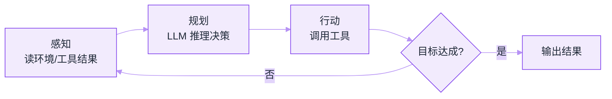
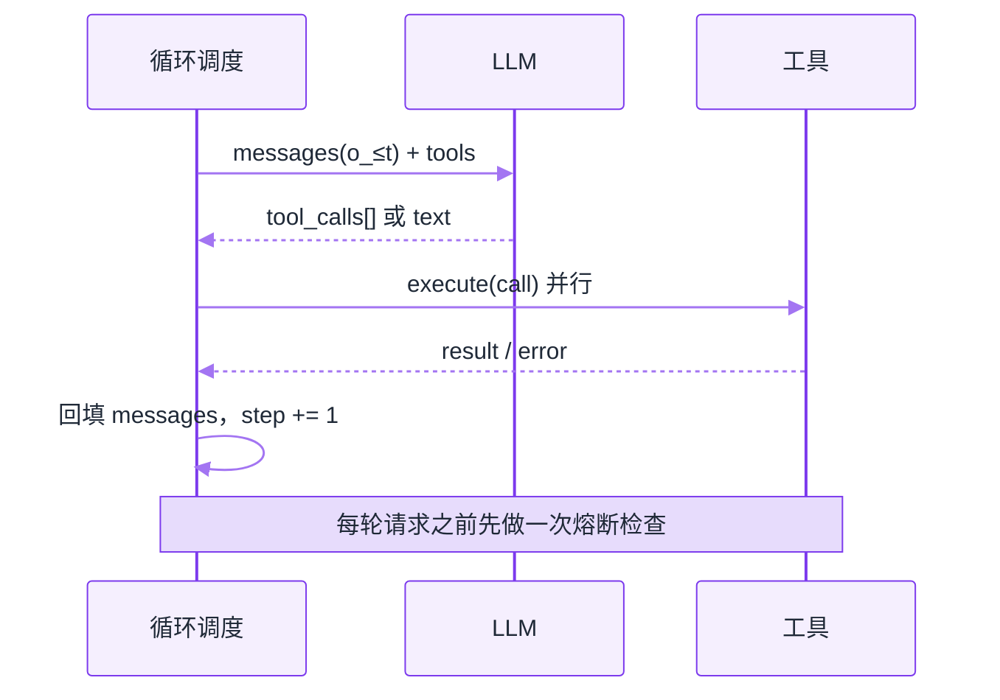

# 感知—规划—行动循环


**一句话**：Agent 的心跳是一个「观察 → 思考 → 行动 → 再观察」的循环，术语上叫感知（Perception）— 规划（Planning）— 行动（Action）。


## 先看结论

- 循环本体极简单：`while 未完成: 思考 → 行动 → 观察`
- 工程难点全在循环之外：何时停、失败怎么办、上下文怎么管理
- ReAct 是这个循环最经典的 prompt 化实现；各家 harness 是它的工程化放大
- 循环的每一步都要有**预算**：轮次上限、token 上限、时间上限

## 核心机制：循环在数学上是什么

把 Agent 与环境交替写成序列：

$$
o_0,\; a_0,\; o_1,\; a_1,\; o_2,\;\dots
$$

- $$o_t$$：第 $$t$$ 步的**观察**（初始时是用户目标，之后是工具返回）
- $$a_t$$：第 $$t$$ 步的**动作**（调用某个工具，或给出最终答案）
- 策略（由 LLM 充当）把「到目前为止的全部历史」映射为下一个动作：

$$
a_t \sim \pi_\theta\big(a \mid o_{\le t}\big)
$$

这就是为什么 Agent 天然是**有状态**的：第 $$t$$ 步的决策依赖 $$o_{\le t}$$，而 $$o_{\le t}$$ 就是上下文。上下文管理因此不是「优化项」，而是循环能否持续的前提——一旦 $$\{o_{\le t}\}$$ 超过窗口，循环就必须压缩或截断（见 [记忆压缩、遗忘与摘要](../06-memory-rag/memory-compression-forgetting.md)）。

在 AI 的经典框架里，这是一个**部分可观测**的决策问题：真实世界状态 $$s_t$$ 不能直接看到，只能通过观察 $$o_t$$ 推断。这解释了两条实践准则：一是要尽量让工具返回**结构化、信息密度高**的观察（减少不确定性），二是不要指望模型「猜到」没观察到的状态。

### 循环的终止条件

一个健壮的循环必须有多个出口，缺一就会挂死：

$$
\text{stop}\iff
\underbrace{\text{模型给出最终答案}}_{\text{正常终止}}\;\vee\;
\underbrace{\text{step}>\text{MaxSteps}}_{\text{轮次熔断}}\;\vee\;
\underbrace{\text{tokens}>\text{Budget}}_{\text{成本熔断}}\;\vee\;
\underbrace{\text{time}>\text{Deadline}}_{\text{时间熔断}}
$$

工程上还应有一条「无进展检测」：若连续 $$k$$ 轮的工具调用与观察高度重复，判定为陷入死循环并提前退出。

## 循环图



*《图：感知—规划—行动转一圈后只由「目标达成?」判定放行——判否就退回感知再读一次工具结果，判是才跳出，缺这条边循环就挂死》*

## 一轮循环里流动的三份报文

把上面那个循环拆开，工程上要钉住的只有三样东西：**发出去的请求**、**模型回来的响应**、**回填进上下文的结构化观察**。字段名一旦定了，循环本身没有别的秘密。

```json
{
  "loop_config": {
    "messages_seed": ["system_prompt", "user_goal"],
    "max_steps": 20,
    "tool_registry": "TOOLS",
    "budget_exceeded": "BudgetExceeded(\"达到最大轮次仍未完成\")",
    "observation_truncate_tokens": 2000,
    "no_progress_window_steps": 3
  },
  "request_per_step": {
    "messages": "<到目前为止的全部 o_≤t>",
    "tools": "TOOLS 的名称 + 描述 + 参数 schema"
  },
  "response_per_step": {
    "text": "字符串，无工具调用时即为最终答案",
    "tool_calls": [
      { "id": "call_1", "name": "web_search", "arguments": { "query": "…" } },
      { "id": "call_2", "name": "read_file", "arguments": { "path": "…" } }
    ]
  },
  "observation_backfilled": [
    { "tool_call_id": "call_1", "content": "检索摘要…", "truncated_at_tokens": 2000 },
    { "tool_call_id": "call_2", "error": "FileNotFoundError: /tmp/a.txt" }
  ]
}
```

两个判断规则写在字段形状里，不需要额外代码：**`tool_calls` 为空 → 这一轮的 `text` 就是最终答案，循环结束**；**`tool_calls` 有多个条目 → 一次模型调用派多个工具，全部执行完再统一回填**，这就是「把多个动作合并到一轮」的落点，也是省成本最有效的一刀。`tool_call_id` 必须回带，否则模型分不清哪条观察对应哪次调用。



*《图：一轮 = 一次模型请求 + 一批工具执行 + 一次回填；熔断检查放在发请求之前，所以最坏情况是少跑一轮，而不是跑不完》*



#### 第 1 步：装配上下文

`messages` 从 `[system_prompt, user_goal]` 起步，之后每一轮把新的 assistant 轮和工具观察追加进去。这一步真正的成本在于「历史越长、每轮越贵」：第 10 轮的请求里装着前 9 轮的全部输出，所以观察必须清洗（截断、摘要、只留关键字段），否则窗口先撑不住的是上下文而不是模型能力。


#### 第 2 步：先判熔断，再发请求

进入循环体先看三样东西：`step > max_steps`（契约里是 20）、累计 token 是否越过预算、墙钟是否越过 `deadline`。顺序很重要——**熔断在发请求之前**，否则会多烧一次没人要的回答。三条都不触发才把 `messages + TOOLS` 交给模型。


#### 第 3 步：模型决策——只回两样东西

响应里只有 `tool_calls` 与 `text` 两种有效载荷。有 `tool_calls` 说明它认为还需要外部信息；没有就把 `text` 当最终答案返回。这里最容易埋雷的是第三种情况：模型既不调工具也没得出结论，只回一句「我需要更多信息」——按协议这算正常终止，按业务它是失败。要么在 schema 里强制它二选一，要么在退出前加一道「答案是否含待办」的检查。


#### 第 4 步：行动——一批工具并行执行

拿到 `tool_calls[]` 就逐个 `execute(call)`，彼此独立时可并行。这一步要兜住两件事：单个工具的异常不能炸掉整轮（捕获后转成 `error` 字段），以及每个结果都要带上自己的 `tool_call_id`。超长的 `stdout` 在回填前按 `observation_truncate_tokens`（契约里是 2000）截断，截断本身要写进观察，模型才知道自己在看半截内容。


#### 第 5 步：感知——回填并推进 `step`

`messages.append(tool_result(result))` 之后，这一轮才真正结束。回填的是**结构化观察**而不是人类可读的日志：错误要连类型带路径（`FileNotFoundError: /tmp/a.txt`）一起进去，模型下一轮才有东西可改。回填完回到第 1 步，`step` 加 1；`step` 越过 20 就抛 `BudgetExceeded("达到最大轮次仍未完成")`，并把已经回填的观察一并交出去——那份「跑到哪儿卡住了」的记录，正是人工接管时唯一有用的东西。



## 四种停法，各有各的防区（点标签切换）

「有健壮循环」的准确定义是：四个出口都存在，而且各自防不同的失败。



`tool_calls` 为空时把 `text` 交出去。这是唯一一条「任务真做完了」的路径，但**只有它的系统会在跑偏时无限循环**——模型完全可能自信地宣布完成而什么都没查到，所以要补一道完成度校验（关键产物是否存在、数字是否对得上）。



`max_steps` 防的是「每轮都在动、但永远不收敛」。20 这个数量级来自成本而不是理论：20 轮意味着 20 次完整模型调用加其间所有工具，Agent 的失败大多在前几轮就已注定，多给轮次只是多烧钱。抛 `BudgetExceeded` 时必须带上当前 `messages`，否则人工接手只能从零重问。



`tokens > Budget` 与 `time > deadline` 是同一类：轮次不多但每轮很贵（长上下文、大输出），20 轮用不完、预算先用完。时间熔断还额外保护一件被低估的事——**上下文压缩本身要一次模型调用**，快超时的任务里，压缩窗口可能比压缩收益更贵（→ [Agent 状态管理](state-management.md)）。



前三个出口都数得出来，这一条要看得懂内容：连续 $$k$$ 轮（示例里 3 轮）的工具调用与观察高度重复，就判定陷入死循环并退出。典型形态是「同一个错误原文回填三次、模型三次给出同一份参数」——这时该做的不是再等一轮，而是升级错误处理：换提示、换工具，或按 [错误恢复与重试](../07-planning/error-recovery-retry.md) 上报人工。




**提示**：三个数字值得背下来——最大轮次 20、单次观察截断 2000 token、无进展窗口 3 轮。它们不是调参调出来的，各自对应一种失败模式：不收敛、窗口爆掉、原地打转。**少任何一个出口，剩下两个都会替它背锅**，最后表现成「Agent 很慢」而不是「Agent 卡死了」。


## 源码案例

**1. DeepSeek Harness 的 turn/step 状态机**（[packages/core/agent-loop](https://github.com/deepseek-ai/deepseek-harness)）

- 把「循环」升格为显式状态机：Agent 有 `idle / maintenance / running` 等相位
- Turn（一段连续工作）与 Step（一次模型请求 + 工具执行）分离；用户输入先进队列，按当前相位决定立即唤醒还是挂起等收敛——避免「取消中的执行」和「新输入」硬挤造成的竞态
- 每一步的 system prompt、动态上下文、工具 schema 都在 `preStep()` 现场组装

**2. Claude Code 的 query 循环**（社区逆向，[架构深拆](https://gist.github.com/yanchuk/0c47dd351c2805236e44ec3935e9095d)）

- 流式优先：用 generator 逐事件产出（thinking / text / tool 参数）
- 模型吐出 tool_use 块 → 执行工具 → 结果回填 → 回到模型调用，直到 `stop_reason = end_turn`
- 循环里叠加权限管道、上下文压缩与 token 预算检查

**3. Pi 的 agentLoop**（[仓库](https://github.com/earendil-works/pi)）：把循环、工具执行与状态管理集中在 `pi-agent-core` 一个包里，是「最小循环」的参考实现；压缩与扩展机制以 pi.dev 文档为准。

## 工程含义

- **循环频率取决于成本**：每轮都是一次完整的模型调用，所以「减少轮次」比「优化单轮」对成本影响更大——把多个工具调用合并到一轮、给足上下文，都能显著降本。
- **观察要清洗**：工具输出可能几千 token，直接回填会迅速吃满窗口；应截断、摘要或只保留关键字段。
- **错误也是一种观察**：工具失败时要把**具体错误信息**回填，模型才能自我修正；回填一句 "error" 等于浪费一轮。
- **状态要外置**：循环本身应尽量无状态，历史与进度放在外部存储，这样才能中断恢复与水平扩展（见 [部署与扩缩容](../11-engineering/deployment-scaling.md)）。

## 常见误区

- ❌ 循环次数不设上限：必须设最大轮次（如 20）+ 预算熔断
- ❌ 把「思考」和「行动」合成一步：模型需要看到工具的真实结果才能修正——这正是 ReAct 的洞见（见 [ReAct](../04-prompt-reasoning/react.md)）
- ❌ 观察结果不清洗就塞回上下文：工具输出动辄几千 token，要截断/摘要
- ❌ 只用一个出口：只靠「模型自己说完成」会在跑偏时无限循环

## 小练习

本页的契约里已经写了最大轮次 20、观察截断 2000 token、无进展窗口 3 轮——现在给它们各配一个**反例**：说出哪种任务会在这三个地方分别失败，以及失败时日志上第一条异常是什么。再加两样东西：一个「完成度校验」（模型说完成时你凭什么信它），一个「熔断优先级」（轮次与预算同时到界时该报哪个）。想清楚这两样，循环才算写完。

## 参考资料

- [ReAct: Synergizing Reasoning and Acting in Language Models](https://arxiv.org/abs/2210.03629)（Yao et al., 2022）
- [Artificial Intelligence: A Modern Approach](https://aima.cs.berkeley.edu/)（Russell & Norvig，智能体—环境循环与部分可观测问题）
- [DeepSeek Harness](https://github.com/deepseek-ai/deepseek-harness)

## 相关知识点

- [Agent 核心组件](core-components.md)
- [Agent 状态管理](state-management.md)
- [错误恢复与重试](../07-planning/error-recovery-retry.md)

