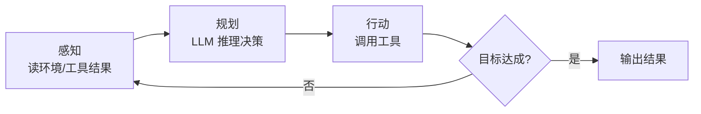

# 感知—规划—行动循环

> **一句话**：Agent 的心跳是一个「观察 → 思考 → 行动 → 再观察」的循环，术语上叫感知（Perception）— 规划（Planning）— 行动（Action）。

## 先看结论

- 循环本体极简单：`while 未完成: 思考 → 行动 → 观察`
- 工程难点全在循环之外：何时停、失败怎么办、上下文怎么管理
- ReAct 是这个循环最经典的 prompt 化实现；各家 harness 是它的工程化放大
- 循环的每一步都要有**预算**：轮次上限、token 上限、时间上限

## 核心机制：循环在数学上是什么

把 Agent 与环境交替写成序列：

$$
o_0,\; a_0,\; o_1,\; a_1,\; o_2,\;\dots
$$

- $o_t$：第 $t$ 步的**观察**（初始时是用户目标，之后是工具返回）
- $a_t$：第 $t$ 步的**动作**（调用某个工具，或给出最终答案）
- 策略（由 LLM 充当）把「到目前为止的全部历史」映射为下一个动作：

$$
a_t \sim \pi_\theta\big(a \mid o_{\le t}\big)
$$

这就是为什么 Agent 天然是**有状态**的：第 $t$ 步的决策依赖 $o_{\le t}$，而 $o_{\le t}$ 就是上下文。上下文管理因此不是「优化项」，而是循环能否持续的前提——一旦 $\{o_{\le t}\}$ 超过窗口，循环就必须压缩或截断（见 [记忆压缩、遗忘与摘要](../06-memory-rag/memory-compression-forgetting.md)）。

在 AI 的经典框架里，这是一个**部分可观测**的决策问题：真实世界状态 $s_t$ 不能直接看到，只能通过观察 $o_t$ 推断。这解释了两条实践准则：一是要尽量让工具返回**结构化、信息密度高**的观察（减少不确定性），二是不要指望模型「猜到」没观察到的状态。

### 循环的终止条件

一个健壮的循环必须有多个出口，缺一就会挂死：

$$
\text{stop}\iff
\underbrace{\text{模型给出最终答案}}_{\text{正常终止}}\;\vee\;
\underbrace{\text{step}>\text{MaxSteps}}_{\text{轮次熔断}}\;\vee\;
\underbrace{\text{tokens}>\text{Budget}}_{\text{成本熔断}}\;\vee\;
\underbrace{\text{time}>\text{Deadline}}_{\text{时间熔断}}
$$

工程上还应有一条「无进展检测」：若连续 $k$ 轮的工具调用与观察高度重复，判定为陷入死循环并提前退出。

## 循环图



## 最小实现（Python 伪代码）

```python
messages = [system_prompt, user_goal]
for step in range(MAX_STEPS):                  # 轮次熔断
    resp = llm.chat(messages, tools=TOOLS)     # 思考
    if not resp.tool_calls:                    # 没有工具调用 = 完成
        return resp.text
    for call in resp.tool_calls:               # 行动（可并行多个）
        result = execute(call)                 # 执行工具
        messages.append(tool_result(result))   # 感知：结果回填上下文
raise BudgetExceeded("达到最大轮次仍未完成")
```

## 源码案例

**1. DeepSeek Harness 的 turn/step 状态机**（[packages/core/agent-loop](https://github.com/deepseek-ai/deepseek-harness)）

- 把「循环」升格为显式状态机：Agent 有 `idle / maintenance / running` 等相位
- Turn（一段连续工作）与 Step（一次模型请求 + 工具执行）分离；用户输入先进队列，按当前相位决定立即唤醒还是挂起等收敛——避免「取消中的执行」和「新输入」硬挤造成的竞态
- 每一步的 system prompt、动态上下文、工具 schema 都在 `preStep()` 现场组装

**2. Claude Code 的 query 循环**（社区逆向，[架构深拆](https://gist.github.com/yanchuk/0c47dd351c2805236e44ec3935e9095d)）

- 流式优先：用 generator 逐事件产出（thinking / text / tool 参数）
- 模型吐出 tool_use 块 → 执行工具 → 结果回填 → 回到模型调用，直到 `stop_reason = end_turn`
- 循环里叠加权限管道、上下文压缩与 token 预算检查

**3. Pi 的 agentLoop**（[仓库](https://github.com/earendil-works/pi)）：把循环、工具执行与状态管理集中在 `pi-agent-core` 一个包里，是「最小循环」的参考实现；压缩与扩展机制以 pi.dev 文档为准。

## 工程含义

- **循环频率取决于成本**：每轮都是一次完整的模型调用，所以「减少轮次」比「优化单轮」对成本影响更大——把多个工具调用合并到一轮、给足上下文，都能显著降本。
- **观察要清洗**：工具输出可能几千 token，直接回填会迅速吃满窗口；应截断、摘要或只保留关键字段。
- **错误也是一种观察**：工具失败时要把**具体错误信息**回填，模型才能自我修正；回填一句 "error" 等于浪费一轮。
- **状态要外置**：循环本身应尽量无状态，历史与进度放在外部存储，这样才能中断恢复与水平扩展（见 [部署与扩缩容](../11-engineering/deployment-scaling.md)）。

## 常见误区

- ❌ 循环次数不设上限：必须设最大轮次（如 20）+ 预算熔断
- ❌ 把「思考」和「行动」合成一步：模型需要看到工具的真实结果才能修正——这正是 ReAct 的洞见（见 [ReAct](../04-prompt-reasoning/react.md)）
- ❌ 观察结果不清洗就塞回上下文：工具输出动辄几千 token，要截断/摘要
- ❌ 只用一个出口：只靠「模型自己说完成」会在跑偏时无限循环

## 小练习

在最小实现里加三样东西：最多 20 轮的停止条件；工具输出超过 2000 token 时截断；连续 3 轮无新信息则退出。写出伪代码，说明每个熔断条件防的是哪种失败。

## 参考资料

- [ReAct: Synergizing Reasoning and Acting in Language Models](https://arxiv.org/abs/2210.03629)（Yao et al., 2022）
- [Artificial Intelligence: A Modern Approach](https://aima.cs.berkeley.edu/)（Russell & Norvig，智能体—环境循环与部分可观测问题）
- [DeepSeek Harness](https://github.com/deepseek-ai/deepseek-harness)

## 相关知识点

- [Agent 核心组件](core-components.md)
- [Agent 状态管理](state-management.md)
- [错误恢复与重试](../07-planning/error-recovery-retry.md)
