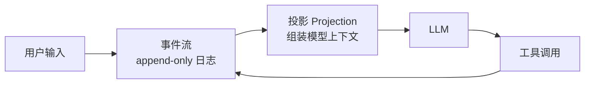

# Agent 状态管理

> **一句话**：Agent 的状态就是「模型上下文里的全部内容」；状态管理的本质是决定什么进入上下文、存在哪里、怎么恢复。
> **难度**：进阶
> **标签**：`#agent` `#engineering`

## 先看结论

- 三类状态：对话状态（消息列表）、任务状态（目标/子任务/进度）、世界状态（文件系统、数据库等外部环境）
- 状态存两处：模型上下文（贵、易溢出）和外部存储（便宜、可恢复）
- 长任务的生死线：**会话可恢复、可分叉、可回放**——这要求状态以事件流形式落盘

## 状态的三个层次

| 层次 | 内容 | 存放处 | 生命周期 |
|---|---|---|---|
| 对话状态 | system prompt + 消息历史 + 工具结果 | 上下文窗口 | 单次会话 |
| 任务状态 | Todo 清单、当前子目标、重试计数 | 结构化存储/文件 | 单个任务 |
| 世界状态 | 代码库、数据库、环境变量 | 外部系统 | 跨会话持久 |

## 图示

## 源码案例

**1. DeepSeek Harness：状态即事件流**（[仓库](https://github.com/deepseek-ai/deepseek-harness)）

- 所有状态进**一条 append-only 会话日志**：系统提示词、推理内容、工具调用与结果、子 Agent 调度、上下文注入，全部是事件
- 会话恢复 = 重放事件流；分叉 = 从某事件处起新流；Trajectory 视图按来源检查每条信息——调试、审计、回放用同一套机制
- 数据面与控制面分离：Session Event Log（存）与 Projection（组装模型可见上下文）是不同模块

**2. Pi：树形 JSONL 会话文件**

- 每次会话写一个 JSONL 文件，消息追加写入；支持分支（同一会话分叉出多条历史）与回滚
- 压缩（compact）也是事件：压缩后的摘要替换旧消息，但原始事件仍在文件里

**3. Claude Code：多层状态拼装**

- CLAUDE.md（跨会话项目记忆）+ 当前对话 + TodoWrite 任务状态 + attachment 动态提醒，每次请求现场拼装
- 子 Agent 拥有独立状态：全新的消息列表、克隆的文件缓存、独立的磁盘转写文件——状态隔离防污染

## 常见误区

- ❌ 状态只存内存：进程一挂全部重来，长任务必须落盘
- ❌ 把所有状态塞进上下文：上下文是稀缺资源（Claude Code 源码处处是「上下文预算」意识），要分层
- ❌ 任务状态用自然语言散落在对话里：Todo 这种结构化状态要用结构化工具管理，可查询可更新

## 小练习

设计一个爬虫 Agent 的状态方案：断点续爬需要哪类状态？用什么存？

## 相关知识点

- [感知—规划—行动循环](perception-planning-action.md)
- [上下文工程](../06-memory-rag/context-engineering.md)
- [记忆压缩、遗忘与摘要](../06-memory-rag/memory-compression-forgetting.md)
