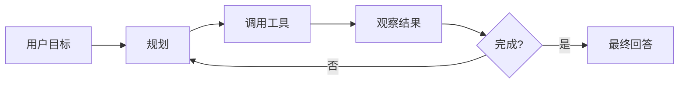
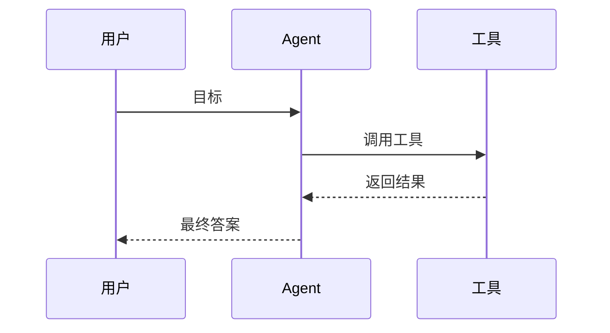

# 🤖 什么是 AI Agent？

> **一句话**：Agent（智能体）是能自己规划、调用工具、根据结果调整行动，最终完成目标的 AI 系统。
> **难度**：⭐️ 入门
> **标签**：`#agent` `#基础` `#LLM`

## 📌 先看结论

- Agent 不只是聊天机器人。
- 它通常有：大脑、记忆、工具、规划、执行循环。
- 核心循环是：观察 → 思考 → 行动 → 再观察。

## 🤔 为什么需要 Agent？

普通 LLM 只能「回答」，不能稳定地「做事」。
问它「帮我整理一份竞品分析」，它只会输出一段文字建议，不会真的去查资料、做表格、反复核对。

Agent 解决的是四个问题：

1. **多步骤任务**：把一个大目标拆成一串可执行的步骤
2. **工具调用**：搜索、写文件、跑代码、查数据库
3. **环境交互**：根据执行结果动态调整下一步
4. **错误恢复**：失败了重试、换路、或者换方法

## 🧩 核心概念

| 组件 | 作用 | 类比 |
|---|---|---|
| LLM | 推理与决策 | 大脑 |
| 记忆 | 保存上下文和历史 | 笔记本 |
| 工具 | 调用外部能力 | 手脚 |
| 规划 | 拆解任务 | 待办清单 |
| 执行器 | 执行动作 | 行动系统 |

## 🖼️ 图示

Agent 的核心是一个循环：



Agent 与环境、工具的交互过程：



## 🍜 生活类比

Agent 像一个**实习生**：

- 你给他目标：「帮我整理一份竞品分析」
- 他会自己拆任务、查资料、做表格、发现问题再补查
- 而不是只回你一句「好的，竞品分析很重要」

> 💡 **提示**：普通 LLM 是「顾问」——只出主意；Agent 是「实习生」——真的去把事做完。

## ⚙️ 工作流程

1. 接收目标
2. 拆解任务
3. 选择工具
4. 执行动作
5. 观察结果
6. 判断是否完成
7. 输出结果

## 💻 伪代码

```python
while not done:
    thought = llm.think(goal, memory, observation)
    action = llm.choose_tool(thought)
    observation = tool.run(action)
    memory.add(observation)
```

> ⚠️ **注意**：实际工程中一定要给循环加上限（如最多 20 轮），否则 Agent 可能陷入死循环，烧掉大量 token。

## ⚠️ 常见误区

- ❌ Agent = Chatbot：Chatbot 只对话，Agent 能行动
- ❌ Agent = Workflow：Workflow 是人写死的固定流程，Agent 自己动态规划
- ❌ 工具越多越好：工具过多会降低选择准确率，按需精简
- ❌ 不需要限制循环次数：没有上限的循环 = 失控的成本

## 🧪 小练习

用自己的话解释：为什么 ReAct 模式适合 Agent？（提示：想想「思考」和「行动」是怎么交替的）

## 🔗 相关资源

- [ReAct 论文](../13-resources/papers/react.md)
- [LangGraph](../09-frameworks/langgraph.md)

## 📚 相关知识点

- [Agent 与 Workflow、Chatbot、Copilot 的区别](agent-vs-workflow-chatbot-copilot.md)
- [Agent 核心组件](core-components.md)
- [Function Calling](../05-tool-protocol/function-calling.md)
- [MCP](../05-tool-protocol/mcp.md)
