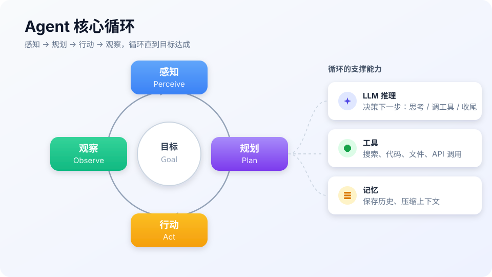

# 什么是 AI Agent？

> **一句话**：Agent（智能体）是能自己规划、调用工具、根据结果调整行动，最终完成目标的 AI 系统。



## 先看结论

- Agent 不只是聊天机器人：它有自己的**控制流**——下一步做什么由它决定，而不是由用户或开发者写死
- 最小可用 Agent 只需要三样：一个 LLM、一组工具、一个循环
- 判别标准只有两条：**谁决定下一步**（控制流）与**谁选工具**（工具权）
- 记忆、规划器、审批层都是在这个最小内核上加的「治理」，不是定义的一部分

## 问题动机

普通 LLM 只能「回答」，不能稳定地「做事」。问它「帮我整理一份竞品分析」，它只会输出一段文字建议，不会真的去查资料、做表格、反复核对——因为它只做一次前向生成，没有「行动」和「看结果」的环节。

Agent 解决的正是四个问题：

1. **多步骤任务**：把一个大目标拆成一串可执行的步骤
2. **工具调用**：搜索、写文件、跑代码、查数据库
3. **环境交互**：根据执行结果动态调整下一步
4. **错误恢复**：失败了重试、换路、或者换方法

## 核心机制

### 1. 把 Agent 写成一个循环

工程上，Agent 就是一个「模型 + 工具 + 循环」的程序：

$$
\text{Agent}: \quad a_t \sim \pi_\theta\big(\cdot \mid \underbrace{g}_{\text{目标}},\; \underbrace{h_{<t}}_{\text{历史}},\; \underbrace{o_{<t}}_{\text{观察}}\big),
\qquad
o_t = \mathrm{Env}(a_t)
$$

- $$g$$：用户给出的目标
- $$h_{<t}$$：之前的对话与思考（上下文）
- $$o_{<t}$$：工具/环境返回的观察
- $$\pi_\theta$$：由 LLM 充当的策略，输出下一个动作 $$a_t$$（「调用工具」或「给出最终答案」）
- $$\mathrm{Env}$$：外部世界（你的工具实现）

对应的伪代码只有几行，这是理解一切 harness 的骨架：

```text
# 伪代码：最小 Agent 循环
memory = [system_prompt, goal]
while not done and steps < MAX_STEPS:
    action = llm(memory, tools)        # 思考：决定下一步
    if action.is_final:
        return action.answer           # 完成
    obs = execute(action.tool_call)    # 行动：执行工具
    memory.append(obs)                 # 感知：把真实结果写回上下文
```

**关键点**：模型本身不执行任何东西，它只输出「调用意图」；真正执行的是你的代码，执行结果再回填给模型。这条「模型出主意、代码动手」的分界，是 Agent 安全与可控的全部基础。

### 2. 为什么 LLM 才让 Agent 第一次真正可用

「智能体」是 AI 的老概念（可追溯到 1950 年代的符号主义智能体）。它长期不可用的原因是：**没有人能把「下一步做什么」的规则写全**。LLM 提供了一个可以读自然语言目标、并输出结构化动作的通用策略，恰好补上了这一环。所以准确的说法是：Agent 不是新概念，LLM 让它第一次落地。

## 与相邻概念的边界

| 形态 | 控制流 | 是否调工具 | 自主规划 |
|---|---|---|---|
| Chatbot | 用户主导，一问一答 | 否 | 否 |
| Copilot | 用户发起，AI 建议，用户确认 | 部分 | 否 |
| Workflow | 开发者写死流程，LLM 填空 | 固定节点 | 否 |
| Agent | LLM 自己规划循环 | 动态选择 | 是 |

详细对比见 [Agent 与 Workflow、Chatbot、Copilot 的区别](agent-vs-workflow-chatbot-copilot.md)。

## 核心概念

| 组件 | 作用 | 类比 |
|---|---|---|
| LLM | 推理与决策 | 大脑 |
| 记忆 | 保存上下文和历史 | 笔记本 |
| 工具 | 调用外部能力 | 手脚 |
| 规划 | 拆解任务 | 待办清单 |
| 执行器 | 执行动作 | 行动系统 |

## 直觉解释

Agent 像一个**实习生**：

- 你给他目标：「帮我整理一份竞品分析」
- 他会自己拆任务、查资料、做表格、发现问题再补查
- 而不是只回你一句「好的，竞品分析很重要」

> **提示**：普通 LLM 是「顾问」——只出主意；Agent 是「实习生」——真的去把事做完。

## 工程含义

- **止损点必须有**：一定要给循环加上限（如最多 20 轮）与 token 预算熔断，否则 Agent 可能陷入死循环、烧掉大量 token。
- **能力来自组件组合**：只给 LLM 工具而不给记忆，它就退化成「无状态的一次性执行器」；只给记忆不给工具，它就退回聊天机器人。
- **可观测性是刚需**：Agent 的行为是一串决策，必须记录每一步的输入/输出，否则出错无从排查（见 [日志、追踪与监控](../11-engineering/logging-tracing-monitoring.md)）。

## 常见误区

- ❌ Agent = Chatbot：Chatbot 只对话，Agent 能行动——区别在控制流，不在界面
- ❌ Agent = Workflow：Workflow 是人写死的固定流程，Agent 自己动态规划
- ❌ 工具越多越好：工具过多会降低选择准确率，按需精简；Claude Code 甚至用「先列工具名、按需加载 schema」来控制工具面
- ❌ 不需要限制循环次数：没有上限的循环 = 失控的成本

## 小练习

用自己的话解释：为什么 ReAct 模式适合 Agent？（提示：想想「思考」和「行动」是怎么交替的）再给上面那段伪代码加两行——一个最大轮次上限。

## 参考资料

- [ReAct: Synergizing Reasoning and Acting in Language Models](https://arxiv.org/abs/2210.03629)（Yao et al., 2022，Agent 循环的思想原型）
- [Anthropic: Building Effective Agents](https://www.anthropic.com/engineering/building-effective-agents)（Agent 与 Workflow 的工程共识）
- [Artificial Intelligence: A Modern Approach](https://aima.cs.berkeley.edu/)（Russell & Norvig，智能体与环境的形式化定义）

## 相关知识点

- [Agent 与 Workflow、Chatbot、Copilot 的区别](agent-vs-workflow-chatbot-copilot.md)
- [Agent 核心组件](core-components.md)
- [Function Calling](../05-tool-protocol/function-calling.md)
- [MCP](../05-tool-protocol/mcp.md)
