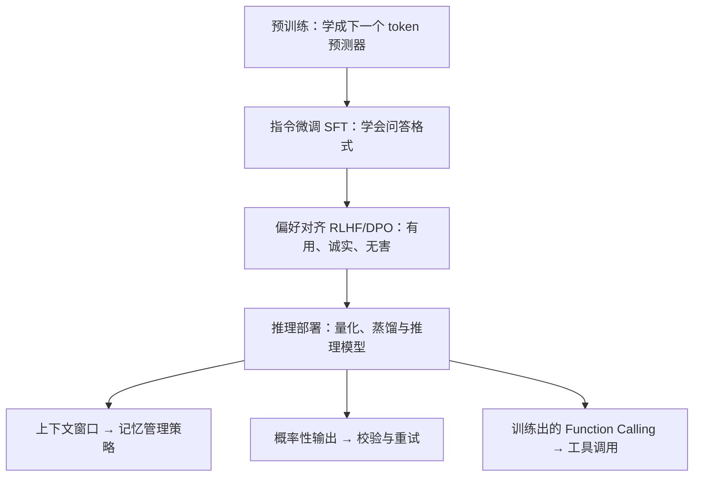

# 03 LLM 基础


**一句话**：LLM 是 Agent 的大脑。本章讲清它是什么、怎么被训练出来、怎么被压缩部署——以及这些特性如何约束 Agent 的设计。


## 你将学到

- LLM 的本质：下一个 token 预测器
- Transformer 与 Attention 的直觉理解（不推公式）
- Token、Embedding、上下文窗口——Agent 工程的三个硬约束
- 预训练 → 指令微调 → 偏好对齐的三段式训练管线
- 推理模型的兴起（DeepSeek-R1 一脉）与量化部署

## 为什么 Agent 工程师必须懂 LLM

- **上下文窗口**决定记忆管理策略（→ [上下文工程](../06-memory-rag/context-engineering.md)）
- **概率性输出**决定必须做校验与重试（→ [错误恢复与重试](../07-planning/error-recovery-retry.md)）
- **工具调用能力**（Function Calling）是模型训练出来的，不同模型差异巨大（→ [Function Calling](../05-tool-protocol/function-calling.md)）

## 本章知识地图

训练管线三段式 + 部署一环，落到 Agent 工程上是三条硬约束：

## 本站页面

- [LLM 是什么](what-is-llm.md)
- [Transformer 与 Attention](transformer-attention.md)
- [Token、Embedding、上下文窗口](token-embedding-context.md)
- [预训练、微调与指令微调](pretraining-finetuning.md)
- [RLHF、DPO 与对齐](rlhf-dpo-alignment.md)
- [多模态模型](multimodal.md)
- [推理、量化、蒸馏与部署](inference-quantization-deployment.md)

## 读完能做到

- [ ] 说出 LLM 的三个先天特性（会忘、会错、会编），并各配一条 Agent 对策（上下文工程/结构化输出+校验/要求引用工具结果）
- [ ] 解释「模型 API 无状态」为什么是设计选择而非缺陷，说清服务端记历史会带来哪两个工程问题
- [ ] 讲清注意力与 KV 缓存的关系：为什么 Agent 的长 system prompt 与工具 schema 直接推高每轮成本，GQA/MLA 为何被广泛采用
- [ ] 按预训练→SFT→RLHF/DPO 三段说清各学什么，并解释「微调改行为、RAG 灌知识」的分工
- [ ] 为「手机拍发票自动报销」设计多模态 Agent：需要的模态能力、单图 token 量级为什么随分辨率平方增长、三个失败点及兜底

## 章末自测

1. **回忆**：温度 τ 到底在调什么？为什么「越高越有创造力、越低越准」是一种误读？（提示：见 what-is-llm.md）
2. **应用**：128K 窗口的模型能「一次读完整个代码库」吗？用 lost-in-the-middle 说明为什么 RAG 与压缩仍然必要。（提示：见 token-embedding-context.md、transformer-attention.md）
3. **判断**：「Agent 不好用就该去微调模型」——用「九成问题靠改 prompt、精简工具、优化上下文」这条判断评价它。（提示：见 pretraining-finetuning.md）

