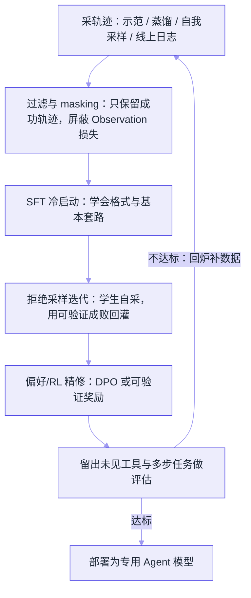

# 用轨迹微调 Agent


**一句话**：通用大模型靠提示词也能调工具，但格式不稳、贵且慢；把「完整的 agent 交互轨迹」当成训练样本微调，才能让中小模型稳定、廉价地具备工具调用与多步规划能力。


## 问题动机

一个未经专门训练的模型，即使能听懂「调用 `search(query)`」这种指令，也常常在**多步**任务里翻车：JSON 括号漏了、工具名拼错、拿到观察结果后忘了自己在第几步、该停不停或过早收尾。提示工程能压住一部分，但有天花板——它不改变模型「默认不会这样想」的事实，且每次请求都要把冗长的示例和 schema 塞进上下文，**又贵又慢**。

轨迹微调（agent trajectory fine-tuning）的思路是：与其每次现场教，不如把「怎么当 agent」这件事**学进权重**。FireAct、AgentTuning 等工作的共同结论是——经过优质轨迹微调的 7B 级模型，在工具调用与多步任务上能逼近甚至追平未微调的 GPT-3.5/大模型。而 LIMA 进一步说明：**数据的质量与多样性远比数量重要**，几千条精选轨迹胜过几十万条噪声样本。

## 核心机制

### 1. 什么是一条「轨迹」

普通问答样本是「问题 → 答案」两段；一条 agent 轨迹是一整段 **episode**，交替出现四种角色：

- **Thought**：模型的中间推理（要不要调工具、调哪个、参数怎么填）
- **Action / Tool-call**：结构化的工具调用（函数名 + JSON 参数）
- **Observation**：工具返回的结果
- **Final answer**：收尾答案

训练时最关键的一点是 **loss masking**：只对「模型该说的话」（Thought、Action、Final answer）计算损失，对「环境塞给它的」（Observation、系统提示、用户输入）**屏蔽损失**。否则模型会学着去「预测工具返回值」，把 API 的抖动也当成自己要生成的内容。

### 2. 轨迹数据从哪来

| 来源 | 做法 | 代价 / 风险 |
|---|---|---|
| 人工示范 | 专家手写完整轨迹 | 质量最高、最贵、难规模化 |
| 大模型蒸馏 | 让 GPT-4 级模型跑任务，收集成功轨迹给小模型学 | 便宜、量大；会继承老师的坏毛病 |
| 自我采样（拒绝采样） | 让学生自己采样多条轨迹，只保留**通过验证**的那几条回灌 | 能自我提升；需要可靠的成败判据 |
| 线上真实日志 | 脱敏后回收用户会话里的成功 episode | 分布最真实；隐私与噪声要清洗 |

Toolformer 展示了一条优雅的低标注路线：模型自己决定「哪里插入一次 API 调用能降低困惑度」，用**自监督**筛出值得学的调用点，几乎不用人标。

### 3. SFT → DPO → RL：三条互补的优化路线

- **SFT 冷启动**：用示范或蒸馏轨迹做监督微调，教会格式和基本套路。这是地基。
- **拒绝采样迭代（STaR 式）**：SFT 后让模型自己解任务，用可验证的成败信号（代码测试通过、答案正确、任务达成）筛出成功轨迹，混进下一轮 SFT。数据越滚越贴合学生自己的分布。
- **偏好 / RL 精修**：对「两个都成功但一个更简洁」的轨迹做 DPO；或在有客观奖励时直接 RL——呼应 DeepSeek-R1「把可验证奖励当能力引擎」。**工具调用的成败本身就是天然可验证奖励**，这让 Agent 比闲聊任务更适合 RL。

### 4. 泛化：别让模型只会背你给过的工具

Gorilla、ToolLLM 解决的正是「换个没见过的 API 还调不调得对」。要点：训练集里**混入大量不同 schema 的工具**、对工具名/参数名做扰动、留出「检索到的未见工具」做测试，逼模型学「读 schema → 生成调用」的通用能力，而不是记住某个函数。

## 轨迹微调流水线

*《图：轨迹微调不是一次训练，而是「采→筛→SFT→自采样回灌→精修→评估」的闭环——评估不达标就把难例回流到采集端》*

## 概念速查

| 概念 | 一句话 | 类比 |
|---|---|---|
| 轨迹 / episode | 一整段 Thought-Action-Observation 序列，不是单轮问答 | 一整盘棋谱而非一步棋 |
| loss masking | 只对模型该说的 token 计损失 | 别让学生背老师的口头禅 |
| 拒绝采样 / STaR | 自采样后只留做对的题回炉再学 | 只把做对的错题本抄进下一轮 |
| 蒸馏 | 用大模型的成功轨迹喂小模型 | 名师批改过的范文当范本 |
| 可验证奖励 | 测试通过/答案对错这类客观信号 | 数学有标准答案，不用主观打分 |
| 工具泛化 | 没见过 schema 也能调对 | 会读说明书，而非背按钮位置 |

## 直觉解释

提示工程像是「每道题都把解题手册复印一份塞给学生」，考场时间（上下文）和复印费（token）都爆炸；轨迹微调是「平时就把解题方法刷进学生的脑子」。而拒绝采样迭代，就是让学生自己刷题库、只对做对的题复盘巩固——错题本越刷越薄，而且刷的全是他自己的薄弱点，不是老师觉得的重点。

## 工程含义

- **先量任务再决定要不要训**：若模型走 API、调用量小、工具少而稳，提示工程 + 好的 function calling schema 常常够用，别过早微调。
- **成败判据决定上限**：拒绝采样和 RL 都依赖「知道一条轨迹到底对不对」。判据不可靠（如开放式任务）时，宁可用人工示范 + DPO，也别用假信号自我强化。
- **防灾难遗忘**：agent 数据要按配比混入通用指令数据，否则工具变强、日常对话变笨。
- **迭代成本可控**：小模型微调后可自托管，边际成本远低于每次都调旗舰 API；但工具集一更新，往往要补轨迹重训，要有数据回流管道。

## 源码案例

- **FireAct**（[论文](https://arxiv.org/abs/2310.05915)）：系统研究「用哪些任务、哪种形式的轨迹去微调」效果最好，是 agent 微调的开山式配方手册
- **AgentTuning**（[论文](https://arxiv.org/abs/2310.12823)）：把 AgentInstruct 数据混合通用语料微调 Llama，让 7B/13B 在未见任务上泛化出 agent 能力
- **ToolLLM**（[论文](https://arxiv.org/abs/2307.16789)）：面向 16000+ 真实 API 构造可泛化的工具调用轨迹，配 ToolEval 评估
- **Gorilla**（[论文](https://arxiv.org/abs/2305.15334)）：专攻「连上没见过的大规模 API」时的调用正确率与幻觉抑制

## 常见误区

- ❌ 微调万能：工具少、调用稀、走托管 API 时，把它当锦上添花而非必需，别为省提示词而背上重训与数据回流的长期负担
- ❌ 用失败轨迹直接做 SFT：SFT 只学「对的怎么做」，把失败轨迹原样喂进去等于教它复制错误——失败信号应走 DPO/RL 或先剔除
- ❌ 忽略 loss masking：连 Observation 一起训，模型会去「背」工具返回值，上线遇到真实 API 抖动就崩
- ❌ 只在自己给过的工具上测：不看未见 schema 的泛化，等于教了个「按钮位置记忆机」

## 参考资料

- [FireAct: Toward Language Agent Fine-tuning](https://arxiv.org/abs/2310.05915)（Chen et al., 2023）
- [AgentTuning: Enabling Generalized Agent Abilities for LLMs](https://arxiv.org/abs/2310.12823)（Zeng et al., 2023）
- [Toolformer: Language Models Can Teach Themselves to Use Tools](https://arxiv.org/abs/2302.04761)（Schick et al., 2023）
- [STaR: Bootstrapping Reasoning With Reasoning](https://arxiv.org/abs/2203.14465)（Zelikman et al., 2022）
- [LIMA: Less Is More for Alignment](https://arxiv.org/abs/2305.11206)（Zhou et al., 2023）
- [ReAct: Synergizing Reasoning and Acting in Language Models](https://arxiv.org/abs/2210.03629)（Yao et al., 2022）

## 相关知识点

- [预训练、微调与指令微调](pretraining-finetuning.md)
- [RLHF、DPO 与对齐](rlhf-dpo-alignment.md)
- [ReAct](../04-prompt-reasoning/react.md)
- [Function Calling](../05-tool-protocol/function-calling.md)
