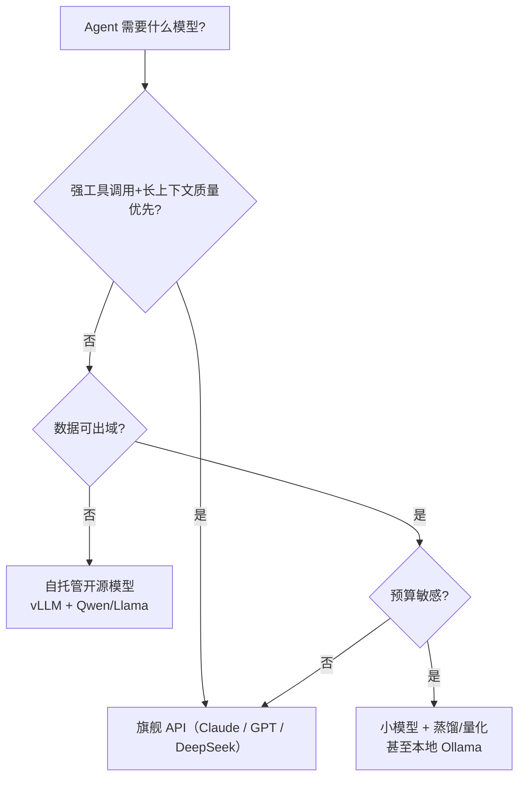

# 推理、量化、蒸馏与部署

> **一句话**：让模型「跑起来且跑得便宜」的全部学问：推理优化、量化压缩、蒸馏小模型、自托管 vs API 的选型。

## 问题动机

同一个模型，部署方式不同，成本能差一个数量级。Agent 又比聊天更吃推理资源——多轮循环、长系统提示、大量工具结果，每一步都要重新过一次模型。要算清「贵在哪、能省多少」，必须知道推理的两个阶段各自的瓶颈，以及量化与缓存的数学。

## 核心机制

### 1. 推理两阶段：prefill 与 decode

- **Prefill**：一次处理整段输入，计算所有位置的注意力；**算力密集**（大量矩阵乘）
- **Decode**：逐个生成 token，每步只算一个新位置；**显存带宽密集**（要反复读全部权重和 KV 缓存）

单步 decode 的耗时近似：

$$
t_{\text{decode}}\approx\frac{\underbrace{P\cdot \tfrac{\text{bits}}{8}}_{\text{权重字节}}+\underbrace{\text{KV bytes}}_{\text{缓存字节}}}{BW}
$$

$P$ 是参数量，$BW$ 是显存带宽。这条式子解释了量化的价值：**decode 阶段读的字节数几乎和权重精度成正比，砍精度就直接砍延迟**。

### 2. KV 缓存有多大

每个 token 在每层都要存一份 K 和 V：

$$
\text{KV bytes}=2\times L\times H_{kv}\times d_{head}\times S\times B\times \frac{\text{bits}}{8}
$$

$L$ 层数、$H_{kv}$ 是 KV 头数、$d_{head}$ 头维度、$S$ 序列长度、$B$ 批大小。注意 $H_{kv}$：GQA/MQA 通过让多个查询头共享 KV 头来缩小这个因子；MLA 则把 KV 压到更低维的潜在空间。**Agent 的长系统提示与工具 schema 会常驻 KV，这一项直接决定每轮成本**。

### 3. 量化：仿射映射

把浮点权重压到 $b$ 位整数，最常用的是仿射（affine）量化：

$$
s=\frac{x_{\max}-x_{\min}}{2^{b}-1},\qquad z=\mathrm{round}\!\left(-\frac{x_{\min}}{s}\right)
$$

$$
q=\mathrm{clamp}\!\left(\mathrm{round}\!\left(\frac{x}{s}\right)+z,\;0,\;2^{b}-1\right),\qquad \hat{x}=s\,(q-z)
$$

$s$ 是缩放因子（scale），$z$ 是零点（zero-point），$\hat{x}$ 是反量化后的近似值。误差来自 $\mathrm{round}$，随 $b$ 减小而增大。

模型体积的直接估算：

$$
\text{model bytes}\approx P\times\frac{b}{8}
$$

7B 模型：FP16（$b=16$）约 14 GB，INT8 约 7 GB，INT4 约 3.5 GB。这就是为什么单卡能跑起量化后的 7B–32B 模型。

### 4. Prompt 缓存能省多少

多轮调用中，若前缀字节级一致，服务端可复用其 prefill 的 KV，不必重算。按输入输出分别计价，一次调用的成本为：

$$
\text{cost}=c_{\text{in}}\cdot T_{\text{in}}+c_{\text{out}}\cdot T_{\text{out}}
$$

开启缓存后，命中的输入部分按更低单价（常见为 $c_{\text{in}}/\alpha$，$\alpha\approx10$）计：

$$
\text{cost}'=c_{\text{in}}\cdot\Big(T_{\text{cached}}/\alpha+T_{\text{uncached}}\Big)+c_{\text{out}}\cdot T_{\text{out}}
$$

**工程含义**：把稳定前缀（工具定义、系统指令）与易变内容（时间戳、文件树）分离，前者务必保持字节一致——这是 Agent 省成本性价比最高的一招。

## 技术速查

| 技术 | 原理 | 代价 |
|---|---|---|
| KV 缓存 | 缓存历史 token 的注意力键值 | 吃显存，长上下文优化核心 |
| Prompt Caching | 复用相同前缀的 prefill 结果 | 前缀必须严格一致（Agent 中极重要） |
| 量化（GPTQ/AWQ/GGUF） | 降低权重数值精度 | 小幅质量损失，个别任务敏感 |
| 连续批处理 | 动态拼批提高吞吐 | 实现复杂，vLLM 已做成标准 |
| 蒸馏 | 小模型学习大模型输出 | 上限受教师模型约束 |

## 选型决策

## 源码案例

- **vLLM**（[GitHub](https://github.com/vllm-project/vllm) / [论文](https://arxiv.org/abs/2309.06180)）：PagedAttention 把 KV 缓存像虚拟内存一样分页管理，消除碎片并支持前缀共享——自托管 Agent 服务的首选后端
- **llama.cpp + Ollama**（[GitHub](https://github.com/ggml-org/llama.cpp) / [GitHub](https://github.com/ollama/ollama)）：GGUF 量化格式 + CPU/GPU 混合推理，笔记本可跑 7B–32B 模型；本地开发 Agent 原型时省 API 费
- **Prompt Caching 在 Claude Code 的应用**（社区逆向分析）：系统提示词做「动静分离」——静态部分保持字节级一致以命中缓存，动态部分放后置 attachment。Agent 多轮调用下缓存命中可显著降本，详见 [缓存与成本优化](../11-engineering/caching-cost-optimization.md)

## 常见误区

- ❌ 榜单高分 = Agent 好用：Agent 看的是多轮工具调用稳定性、指令遵循、长上下文检索，要做自己场景的评估（→ [Agent 评估指标](../10-evaluation-safety/evaluation-metrics.md)）
- ❌ INT4 量化无损：数学/代码任务对量化更敏感，上线前跑回归集
- ❌ 自托管一定省钱：小流量场景 API + 缓存更便宜；自托管的运维成本常被低估
- ❌ 把 prefill 与 decode 的优化手段混用：批处理与量化对 decode 收益大，对 prefill 主要是算力优化

## 参考资料

- [Efficient Memory Management for Large Language Model Serving with PagedAttention](https://arxiv.org/abs/2309.06180)（Kwon et al., 2023，vLLM）
- [GPTQ: Accurate Post-Training Quantization for Generative Pre-trained Transformers](https://arxiv.org/abs/2210.17323)（Frantar et al., 2022）
- [AWQ: Activation-aware Weight Quantization for LLM Compression and Acceleration](https://arxiv.org/abs/2306.00978)（Lin et al., 2023）
- [DeepSeek-R1](https://arxiv.org/abs/2501.12948)（蒸馏小模型的范例）

## 相关知识点

- [缓存与成本优化](../11-engineering/caching-cost-optimization.md)
- [部署与扩缩容](../11-engineering/deployment-scaling.md)
