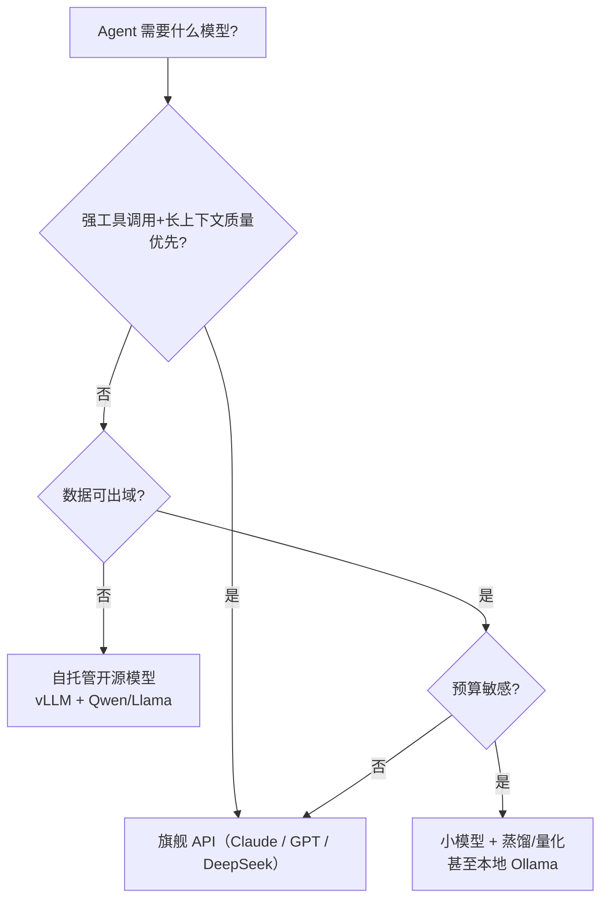

# 🧠 推理、量化、蒸馏与部署

> **一句话**：让模型「跑起来且跑得便宜」的全部学问：推理优化、量化压缩、蒸馏小模型、自托管 vs API 的选型。
> **难度**：⭐️⭐️ 进阶
> **标签**：`#llm` `#engineering`

## 📌 先看结论

- 推理分两阶段：prefill（算力密集）+ decode（带宽密集），优化方向不同
- 量化：FP16 → INT8/INT4，模型体积和显存降 2–8 倍，质量损失通常可接受
- 蒸馏：大模型教小模型（DeepSeek-R1-Distill 是最新范例），延迟成本双降
- 选型口诀：隐私/成本敏感自托管（vLLM/Ollama），能力优先用 API；Agent 场景优先看工具调用可靠性和长上下文质量，不是榜单分

## 🧩 技术速查

| 技术 | 原理 | 代价 |
|---|---|---|
| KV 缓存 | 缓存历史 token 的注意力键值 | 吃显存，长上下文优化核心 |
| Prompt Caching | 复用相同前缀的 prefill 结果 | 前缀必须严格一致（Agent 中极重要） |
| 量化（GPTQ/AWQ/GGUF） | 降低权重数值精度 | 小幅质量损失，个别任务敏感 |
| 连续批处理 | 动态拼批提高吞吐 | 实现复杂，vLLM 已做成标准 |
| 蒸馏 | 小模型学习大模型输出 | 上限受教师模型约束 |

## 📦 源码案例

- **vLLM**（[GitHub](https://github.com/vllm-project/vllm)）：PagedAttention 把 KV 缓存像虚拟内存一样分页管理，吞吐提升数倍——自托管 Agent 服务的首选后端；pi-mono 甚至提供了开箱即用的 vLLM pods 部署清单
- **llama.cpp + Ollama**（[GitHub](https://github.com/ggml-org/llama.cpp) / [GitHub](https://github.com/ollama/ollama)）：GGUF 量化格式 + CPU/GPU 混合推理，笔记本跑 7B–32B 模型；本地开发 Agent 原型时省 API 费
- **Prompt Caching 在 Claude Code 的应用**（社区逆向分析）：系统提示词做「动静分离」——静态部分（工具定义、指令）保持字节级一致以命中缓存，动态部分（时间戳、文件树）放后置 attachment。Agent 多轮调用下缓存命中能省 50%+ 成本，详见 [缓存与成本优化](../11-engineering/caching-cost-optimization.md)

## ⚙️ 选型决策

## ⚠️ 常见误区

- ❌ 榜单高分 = Agent 好用：Agent 看的是多轮工具调用稳定性、指令遵循、长上下文检索，要做自己场景的评估（→ [Agent 评估指标](../10-evaluation-safety/evaluation-metrics.md)）
- ❌ INT4 量化无损：数学/代码任务对量化更敏感，上线前跑回归集
- ❌ 自托管一定省钱：小流量场景 API + 缓存更便宜；自托管的运维成本常被低估

## 🧪 小练习

你的 Agent 每天调用 10 万次、每次 system prompt 固定 8K token。估算：开启 prompt caching（缓存命中价按 1/10）能省多少？这是否比换小模型更划算？

## 📚 相关知识点

- [缓存与成本优化](../11-engineering/caching-cost-optimization.md)
- [部署与扩缩容](../11-engineering/deployment-scaling.md)
