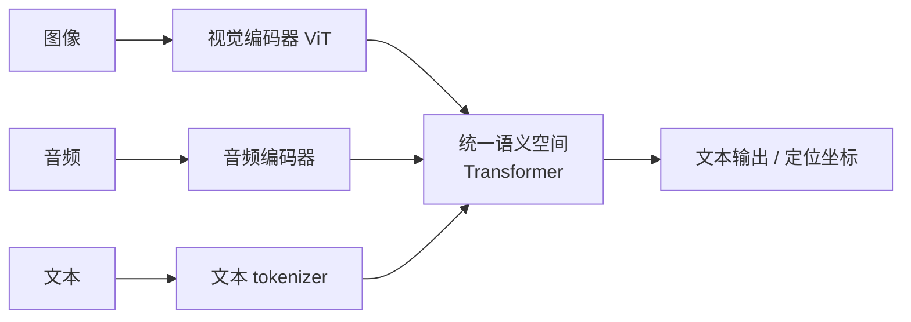

# 多模态模型

> **一句话**：多模态模型把文本、图像、音频、视频统一映射到同一语义空间，让 Agent 长出「眼睛和耳朵」——看懂屏幕截图是 Computer Use 的前提。

## 先看结论

- 核心思路：非文本模态 → 编码器 → 转成「token」进 Transformer，与文本统一处理
- 对 Agent 的三大意义：读截图（GUI 操作）、读图表（数据分析）、读文档（PDF/扫描件）
- 图像 token 数是**成本与窗口的主要变量**，随分辨率平方增长
- 多模态 ≠ 万能：OCR 精度、空间定位、视频时序仍是短板

## 核心机制

### 1. 统一的方式：把图像「变成 token」

文本进模型靠 tokenizer 切词；图像进模型靠**切块（patch）**。以 ViT 为例，把图像切成 $$P\times P$$ 的块，每块拉平后经线性投影得到一个向量：

$$
\mathbf{z}_i = E\,\mathbf{x}_i^{patch},\qquad
N=\frac{H}{P}\times\frac{W}{P}
$$

$$N$$ 就是这张图贡献的 token 数。**这条式子解释了视觉成本**：分辨率翻倍，token 数变成 4 倍。一张 1024×1024、patch=16 的图会产生 $$64\times64=4096$$ 个 token——远超一段同字数的文字。所以「截图循环」很快就会吃满窗口、推高成本。

### 2. 为什么图文能「对齐」：对比学习

要让模型理解「猫」这个图与「猫」这个词是一回事，主流做法是**对比学习**（CLIP）。把一批图文配对，让正确配对的向量靠近、错误配对的远离，损失为：

$$
\mathcal{L}=-\frac{1}{N}\sum_{i=1}^{N}
\log\frac{\exp(\mathbf{v}_i\cdot\mathbf{t}_i/\tau)}
{\sum_{j=1}^{N}\exp(\mathbf{v}_i\cdot\mathbf{t}_j/\tau)}
$$

$$\mathbf{v}_i$$、$$\mathbf{t}_i$$ 分别是第 $$i$$ 张图和对应文本的向量，$$\tau$$ 是温度。训练后图像与文本落在同一向量空间，才谈得上「跨模态检索」与「看图说话」。这也是 [Embedding 与相似度检索](../06-memory-rag/embedding-similarity.md) 的跨模态版本。

### 3. 三种接入方式

| 方式 | 做法 | 特点 |
|---|---|---|
| 编码器 + 投影 | 视觉编码器输出经投影层接到 LLM | 最常见（LLaVA 式），改动小 |
| 原生多模态 | 多模态数据从头混合训练 | 能力上限高、成本高 |
| 工具式视觉 | 用外部 OCR/检测模型先转成文本再给 LLM | 可控、可解释，弱在端到端 |

对 Agent 工程而言，第三种常被低估：如果一个任务是「读发票上的数字」，专用 OCR + 规则校验往往比多模态模型更稳、更便宜——**能用确定性工具解决的部分，不要交给概率模型**。

## 图示

## 能力矩阵

| 模态 | Agent 用途 | 典型任务 |
|---|---|---|
| 图像 | GUI 自动化、票据识别 | 点按钮坐标、提取字段 |
| 音频 | 语音助手、会议纪要 | ASR + 意图理解 |
| 视频 | 流程审查、监控巡检 | 事件定位、摘要 |
| 文档 | 合同处理、报告分析 | 跨页表格问答 |

## 工程含义

- **成本预算要含视觉 token**：一张图动辄几千 token，Computer Use 类 Agent 的核心成本就在截图频率与分辨率。降本手段：降采样、只截变化区域、先用视觉模型定位再做局部高清读取。
- **分辨率是精度与成本的旋钮**：小字与密集表格需要高分辨率，但 token 数平方增长；常见折中是「先低分辨率定位、再对目标区域放大重读」。
- **坐标不稳定是常态**：模型输出的点击坐标会漂移，需要配合元素定位（accessibility 树、DOM 选择器）而非纯靠像素。
- **文档解析优先结构化**：PDF 先做版面分析/表格抽取，再让模型理解，比整页截图喂给模型更可靠、更省。

## 源码案例

- **Claude 的 Computer Use**（[官方文档](https://docs.anthropic.com/en/docs/agents-and-tools/computer-use)）：模型输出「点击坐标 + 键盘输入」的结构化动作，依赖视觉模态对截图的精确理解；配合「截图 → 行动 → 再截图」的循环执行 GUI 任务，见 [Computer Use / Browser Use](../05-tool-protocol/computer-use-browser-use.md)
- **开源多模态模型**：Qwen-VL（[论文](https://arxiv.org/abs/2308.12966)）、Llama 3.2 Vision、MiniCPM-V 等（[Hugging Face](https://huggingface.co/models?pipeline_tag=image-text-to-text)）可本地部署，适合对数据隐私敏感的文档处理 Agent
- **CLIP / ViT**（[CLIP 论文](https://arxiv.org/abs/2103.00020) / [ViT 论文](https://arxiv.org/abs/2010.11929)）：理解「图文如何对齐」「图像如何变成 token」的两篇奠基工作

## 常见误区

- ❌ 多模态 = 一定能精确操作 GUI：小字识别、动态元素、弹窗遮挡仍是高频失败点，需要缩放、区域重试等工程兜底
- ❌ 视觉 token 很便宜：一张图通常折算几百到几千 token，截图循环的成本和窗口压力远超纯文本
- ❌ OCR 问题多模态模型都解决了：低质量扫描件、手写体、表格嵌套仍建议专用 OCR 预处理
- ❌ 模态越多越好：每增加一种模态都增加编码器、对齐数据与失败面；按任务需要引入

## 小练习

设计一个「发票自动报销」Agent：输入是手机拍照的发票。列出它需要的模态能力、估算单张图片的 token 量级，并给出至少三个失败点及兜底策略。

## 参考资料

- [Learning Transferable Visual Models From Natural Language Supervision](https://arxiv.org/abs/2103.00020)（Radford et al., 2021，CLIP）
- [An Image is Worth 16x16 Words: Transformers for Image Recognition at Scale](https://arxiv.org/abs/2010.11929)（Dosovitskiy et al., 2020，ViT）
- [Qwen-VL: A Versatile Vision-Language Model for Understanding, Localization, Text Reading, and Beyond](https://arxiv.org/abs/2308.12966)（Bai et al., 2023）
- [Anthropic: Computer Use](https://docs.anthropic.com/en/docs/agents-and-tools/computer-use)

## 相关知识点

- [Computer Use / Browser Use](../05-tool-protocol/computer-use-browser-use.md)
- [Token、Embedding、上下文窗口](token-embedding-context.md)
