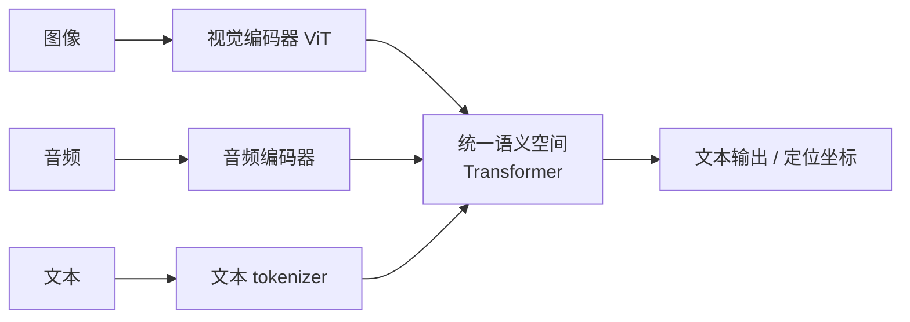

# 多模态模型

> **一句话**：多模态模型把文本、图像、音频、视频统一映射到同一语义空间，让 Agent 长出「眼睛和耳朵」——看懂屏幕截图是 Computer Use 的前提。
> **难度**：入门
> **标签**：`#llm`

## 先看结论

- 核心思路：非文本模态 → 编码器 → 转成「token」进 Transformer，与文本统一处理
- 对 Agent 的三大意义：读截图（GUI 操作）、读图表（数据分析）、读文档（PDF/扫描件）
- 多模态 ≠ 万能：OCR 精度、空间定位、视频时序仍是短板

## 图示

## 能力矩阵

| 模态 | Agent 用途 | 典型任务 |
|---|---|---|
| 图像 | GUI 自动化、票据识别 | 点按钮坐标、提取字段 |
| 音频 | 语音助手、会议纪要 | ASR + 意图理解 |
| 视频 | 流程审查、监控巡检 | 事件定位、摘要 |
| 文档 | 合同处理、报告分析 | 跨页表格问答 |

## 源码案例

- **Claude Code 的 Computer Use**：模型输出「点击坐标 (x, y) + 键盘输入」这样的结构化动作，依赖的是视觉模态对截图的精确理解（元素定位、文字识别）；配合截图 → 行动 → 再截图的循环执行 GUI 任务，见 [Computer Use / Browser Use](../05-tool-protocol/computer-use-browser-use.md)
- **开源多模态模型**：Qwen-VL、Llama 3.2 Vision、MiniCPM-V 等（[Hugging Face](https://huggingface.co/models?pipeline_tag=image-text-to-text)）可本地部署，适合对数据隐私敏感的文档处理 Agent

## 常见误区

- ❌ 多模态 = 一定能精确操作 GUI：小字识别、动态元素、弹窗遮挡仍是高频失败点，需要缩放、区域重试等工程兜底
- ❌ 视觉 token 很便宜：一张图通常折算几百到几千 token，截图循环的成本和窗口压力远超纯文本
- ❌ OCR 问题多模态模型都解决了：低质量扫描件、手写体、表格嵌套仍建议专用 OCR 预处理

## 小练习

设计一个「发票自动报销」Agent：输入是手机拍照的发票。列出它需要的模态能力与至少三个可能的失败点及兜底策略。

## 相关知识点

- [Computer Use / Browser Use](../05-tool-protocol/computer-use-browser-use.md)
- [Token、Embedding、上下文窗口](token-embedding-context.md)
