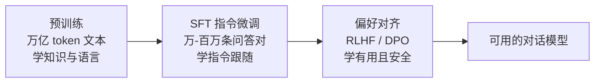

# 🧠 预训练、微调与指令微调

> **一句话**：预训练学「知识」，微调学「行为」；SFT 教模型好好说话，RLHF/DPO 教模型说「对的」话。
> **难度**：⭐️⭐️ 进阶
> **标签**：`#llm`

## 📌 先看结论

- 三段式管线：预训练（海量文本，最贵）→ SFT 指令微调（问答对，教格式）→ 偏好对齐（RLHF/DPO，教价值观）
- Agent 开发者通常**不需要微调**：优先用 prompt、RAG、工具设计解决；微调是最后手段
- 适合微调的场景：稳定输出的格式/风格、垂直领域术语、小模型蒸馏降本

## 🖼️ 训练管线

## 🧩 各阶段对比

| 阶段 | 数据量 | 成本 | 类比 |
|---|---|---|---|
| 预训练 | 10T+ token，数月，百万美元级 | 极高 | 从小读书识字读百科 |
| SFT | 1 万–100 万条高质量对话 | 中 | 岗前培训：学会「听指令办事」 |
| RLHF/DPO | 十万级偏好比较 | 中 | 实习期反馈：哪类回答更好 |
| 领域微调 LoRA | 数千条样本即可 | 低（GPU 单卡可跑） | 岗位轮训：专攻某领域话术 |

## 📦 源码案例

- **DeepSeek-R1 的后训练配方**（[论文](https://arxiv.org/abs/2501.12948)）：核心发现是「纯 RL + 极少 SFT」也能逼出强推理——R1-Zero 直接在基座上做 RL，模型自发涌现出长思考链与自我验证；再蒸馏到 1.5B–70B 小模型（R1-Distill），小模型也能获得强推理。这对 Agent 意义重大：**工具调用与规划能力可以被 RL 强化训练**
- **LoRA / QLoRA**（[论文](https://arxiv.org/abs/2106.09685)）：冻结原模型，只训练低秩增量矩阵，消费级显卡即可微调 7B 模型——个人微调的入门路径，工具链见 Hugging Face `peft` 库

## ⚠️ 常见误区

- ❌ 「我的 Agent 不好用 → 微调模型」：九成问题靠改 prompt、精简工具、优化上下文解决更快更便宜
- ❌ 微调能注入新知识：知识类更新用 RAG（可随时更新、可溯源），微调更适合改变**行为方式**而非灌知识
- ❌ SFT 数据越多越好：1 万条高质量、多样化的样本常常胜过 100 万条爬来的低质数据

## 🧪 小练习

需求：让客服 Agent 永远用公司话术、固定 JSON 格式回复，且每月更新产品知识库。该用微调还是 RAG？还是组合？为什么？

## 📚 相关知识点

- [RLHF、DPO 与对齐](rlhf-dpo-alignment.md)
- [RAG 基础](../06-memory-rag/rag-basics.md)
