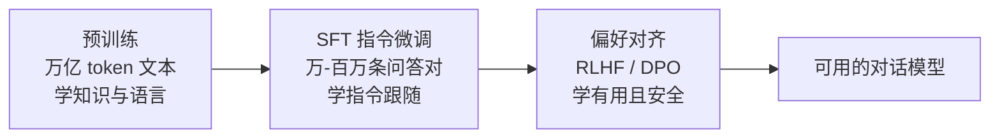

# 预训练、微调与指令微调

> **一句话**：预训练学「知识」，微调学「行为」；SFT 教模型好好说话，RLHF/DPO 教模型说「对的」话。

## 问题动机

一个裸的预训练模型只会续写文本，不会听指令。要把「文本生成器」变成「助手」，需要一整套后训练（post-training）流程；而对 Agent 开发者来说，更重要的问题是**什么时候该微调、什么时候不该**——这取决于「微调改的是知识还是行为」。

## 核心机制

### 1. 预训练目标：下一个 token 的交叉熵

语言模型的训练目标极其简单——给定前文预测下一个 token。对序列 $x_1,\dots,x_N$：

$$
\mathcal{L}_{\mathrm{LM}}(\theta)=-\frac{1}{N}\sum_{i=1}^{N}\log P_\theta\big(x_i\mid x_{<i}\big)
$$

$P_\theta$ 由模型最后一层 logits 经 softmax 得到：

$$
P_\theta(x_i=v\mid x_{<i})=\frac{\exp(z_v/\tau)}{\sum_{v'}\exp(z_{v'}/\tau)}
$$

其中 $\tau$ 是温度（推理时可调，训练时固定）。**这个「预测下一个 token」的目标就是知识压缩的过程**：要压低交叉熵，模型必须在参数里记住语法、事实与推理模式。

### 2. 规模怎么分配：Chinchilla 的经验

给定算力预算，模型参数 $N$ 与训练 token 数 $D$ 存在近似最优配比。Chinchilla 的结论是：

$$
N_{\mathrm{opt}}\propto C^{0.5},\qquad D_{\mathrm{opt}}\propto C^{0.5}
$$

即参数与数据应大致同比例增长；早期的大模型普遍「参数过大、数据不足」。这解释了为什么近年的模型在同参数量下用了远更多的数据。

### 3. LoRA：低成本微调的数学

全量微调要更新 $W\in\mathbb{R}^{d\times k}$ 的全部 $dk$ 个参数。LoRA 假设**微调带来的权重增量是低秩的**，于是冻结原权重 $W_0$，只训练两个小矩阵：

$$
W=W_0+\Delta W=W_0+BA,\qquad B\in\mathbb{R}^{d\times r},\;A\in\mathbb{R}^{r\times k},\;r\ll\min(d,k)
$$

可训练参数量从 $dk$ 降到 $r(d+k)$。例如 $d=k=4096,\;r=8$：

$$
\frac{r(d+k)}{dk}=\frac{8\times 8192}{4096^2}\approx 0.4\%
$$

只需约 0.4% 的参数即可适配下游任务，因此单卡可训。LoRA 通常只加在注意力/FFN 的线性层上，$A$ 用高斯初始化、$B$ 初始化为零（保证训练起始时 $\Delta W=0$，不破坏原模型）。

QLoRA 进一步把冻结的基座量化到 4-bit，再用 LoRA 训练，使消费级显卡也能微调 7B–13B 模型。

## 训练管线

## 各阶段对比

| 阶段 | 数据量 | 成本 | 类比 |
|---|---|---|---|
| 预训练 | 10T+ token，数月，百万美元级 | 极高 | 从小读书识字读百科 |
| SFT | 1 万–100 万条高质量对话 | 中 | 岗前培训：学会「听指令办事」 |
| RLHF/DPO | 十万级偏好比较 | 中 | 实习期反馈：哪类回答更好 |
| 领域微调 LoRA | 数千条样本即可 | 低（GPU 单卡可跑） | 岗位轮训：专攻某领域话术 |

## 工程含义

对做 Agent 的团队，决策顺序应该是：

1. 先改 prompt、精简工具、优化上下文——绝大多数「模型不行」其实是「上下文/工具没设计好」
2. 需要注入**可更新的知识**时用 RAG（可溯源、可随时更新）
3. 只有在需要**稳定改变行为**（固定输出格式、领域话术、压缩小模型降本）时才微调
4. Agent 能力本身（工具调用、规划）可以通过 RL 强化，但这是模型厂商/有算力团队的工作，应用层通常不需要

## 源码案例

- **DeepSeek-R1 的后训练配方**（[论文](https://arxiv.org/abs/2501.12948)）：核心发现是「纯 RL + 极少 SFT」也能逼出强推理——R1-Zero 直接在基座上做 RL，模型自发涌现出长思考链与自我验证；再蒸馏到 1.5B–70B 小模型（R1-Distill）。对 Agent 意义重大：**工具调用与规划能力可以被 RL 强化训练**
- **LoRA / QLoRA**（[LoRA 论文](https://arxiv.org/abs/2106.09685) / [QLoRA 论文](https://arxiv.org/abs/2305.14314)）：冻结原模型、只训练低秩增量矩阵，消费级显卡即可微调 7B 模型——个人微调的入门路径，工具链见 Hugging Face `peft` 库

## 常见误区

- ❌ 「我的 Agent 不好用 → 微调模型」：九成问题靠改 prompt、精简工具、优化上下文解决更快更便宜
- ❌ 微调能注入新知识：知识类更新用 RAG（可随时更新、可溯源），微调更适合改变**行为方式**而非灌知识
- ❌ SFT 数据越多越好：1 万条高质量、多样化的样本常常胜过 100 万条爬来的低质数据
- ❌ LoRA 秩越大越好：秩决定容量，但也更容易过拟合、更贵；多数对齐/风格任务 $r=8\sim64$ 足够

## 参考资料

- [LoRA: Low-Rank Adaptation of Large Language Models](https://arxiv.org/abs/2106.09685)（Hu et al., 2021）
- [QLoRA: Efficient Finetuning of Quantized LLMs](https://arxiv.org/abs/2305.14314)（Dettmers et al., 2023）
- [Training Compute-Optimal Large Language Models](https://arxiv.org/abs/2203.15556)（Hoffmann et al., 2022，Chinchilla）
- [DeepSeek-R1](https://arxiv.org/abs/2501.12948)（DeepSeek-AI, 2025）

## 相关知识点

- [RLHF、DPO 与对齐](rlhf-dpo-alignment.md)
- [RAG 基础](../06-memory-rag/rag-basics.md)
