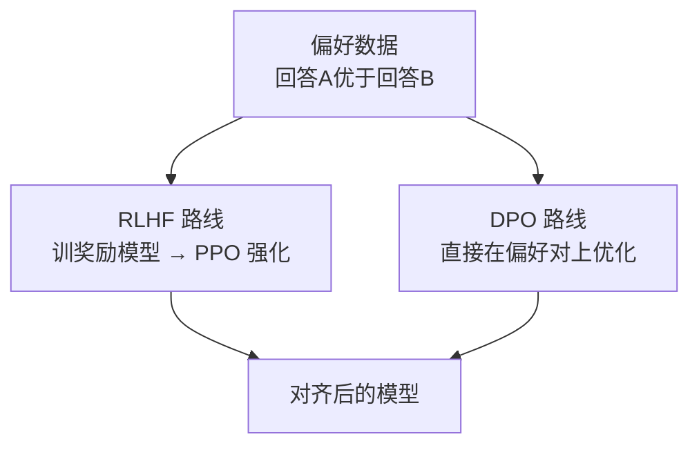

# 🧠 RLHF、DPO 与对齐

> **一句话**：对齐（Alignment）让模型输出「有用、诚实、无害」；主流路线是用人类偏好数据做 RLHF 或它的简化版 DPO。
> **难度**：⭐️⭐️⭐️ 高级
> **标签**：`#llm` `#safety`

## 📌 先看结论

- RLHF 三步：SFT 起步 → 训练奖励模型（学人类偏好）→ PPO 强化学习优化
- DPO 是 RLHF 的「免 RL」替代：直接从偏好对学习，更简单稳定，已被广泛采用
- 对齐税：过度对齐会让模型变得啰嗦、拒绝过多——工程上要平衡
- Agent 场景的新对齐目标：工具使用是否规范、何时该问人、拒绝越权操作

## 🖼️ 两条路线

## 🧩 概念速查

| 概念 | 一句话 | 类比 |
|---|---|---|
| 奖励模型 | 学出「人类会给这个回答打几分」的代理评委 | 学会猜考官口味 |
| PPO | 用奖励信号微调策略的 RL 算法 | 按评委口味反复练习 |
| KL 约束 | 别偏原图太远，防止模型跑飞 | 改革要稳，不许翻天 |
| DPO | 把奖励模型和 RL 合并成一步分类式损失 | 直接从好/坏例子里学，免请评委 |

## 📦 源码案例

- **InstructGPT**（[论文](https://arxiv.org/abs/2203.02155)）：RLHF 开山之作，1.3B 对齐后的模型在人类偏好测试中胜过 175B 未对齐模型——「对齐的价值超过规模」的最早实证
- **DeepSeek-R1**（[论文](https://arxiv.org/abs/2501.12948)）：把 RL 从「对齐工具」升级为「能力引擎」——用可验证奖励（数学答案对错、代码测试通过）做 RL，涌现出推理能力。对 Agent 的启示：**工具调用的成败本身就是可验证奖励**，这是训练 Agent 专用模型的思路（各家「Computer Use」「Tool Use」专用模型都循此路）
- **trl 库**（[GitHub](https://github.com/huggingface/trl)）：Hugging Face 的 RLHF/DPO/GRPO 训练工具箱，想动手跑通 DPO 从这里开始

## ⚠️ 常见误区

- ❌ 对齐 = 内容审查：核心是「按人类意图行事」，包括听懂模糊指令、及时承认不确定
- ❌ DPO 全面取代 RLHF：偏好强度有连续差异、需要在线探索的场景 RLHF/PPO 仍占优；DeepSeek-R1 用的 GRPO 是 PPO 的变体
- ❌ 对齐是一次性工程：新能力（如工具调用）带来新对齐面，需要持续评估（→ [对齐与安全](../10-evaluation-safety/alignment-safety.md)）

## 🧪 小练习

为什么「代码是否通过测试」比「人类觉得代码好不好」更适合做 Agent 训练的奖励信号？

## 🔗 相关资源

- [DPO 论文](https://arxiv.org/abs/2305.18290)

## 📚 相关知识点

- [预训练、微调与指令微调](pretraining-finetuning.md)
- [对齐与安全](../10-evaluation-safety/alignment-safety.md)
