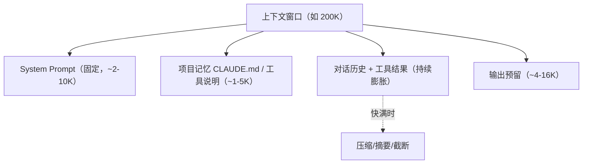

# 🧠 Token、Embedding、上下文窗口

> **一句话**：Token 是模型的眼界单位，Embedding 是词的「语义坐标」，上下文窗口是它的工作记忆容量——三者是 Agent 工程最常打交道的硬约束。
> **难度**：⭐️ 入门
> **标签**：`#llm` `#basics`

## 📌 先看结论

- Token ≠ 词：中文约 1 字 ≈ 0.6–1 token，英文约 0.75 词/token；计费、限流、窗口都按 token 算
- Embedding：把 token 映射成高维向量，「意思相近 → 向量距离近」，是 RAG 的地基
- 上下文窗口 = 输入 + 输出的总预算；Agent 的记忆、工具结果、历史全挤这一个窗口
- 窗口大不是免费的：注意力计算量随长度平方增长，KV 缓存吃显存

## 🧩 三个概念

| 概念 | 是什么 | Agent 视角 |
|---|---|---|
| Token | 文本切分的最小单位（BPE 等算法切出） | 成本单位：prompt 和补全分开计费 |
| Embedding | 语义向量（如 1536/4096 维） | 检索的基础：语义搜索就是向量近邻搜索 |
| 上下文窗口 | 一次调用可见的最大 token 数 | Agent 的工作记忆，如 128K/200K/1M |

## 🖼️ 上下文窗口预算

## 📦 源码案例

- **Claude Code 的上下文预算意识**（社区逆向分析，[架构深拆](https://gist.github.com/yanchuk/0c47dd351c2805236e44ec3935e9095d)）：系统提示词做「动静分离」便于 prompt caching；子 Agent 的工具列表从描述挪到 attachment 省 token；工具延迟加载——先只列工具名（约 50 token），需要时再加载完整 schema（约 5000 token）；上下文将满触发 auto-compact
- **DeepSeek Harness 的 preStep 组装**（[agent-loop 源码](https://github.com/deepseek-ai/deepseek-harness)）：每一步现场组装 system prompt、动态上下文与工具 schema——上下文不是一次性给定的，而是每步计算出来的
- **Pi**：三条压缩机制（截断、摘要、微压缩）守在窗口临界点，压缩策略本身就是上下文管理

## ⚠️ 常见误区

- ❌ 按字符估算 token：中英混合、代码、JSON 的切分差异很大，用 tokenizer 工具精确计算
- ❌ Embedding 能替代全文检索：向量召回召回「语义相关」，精确标识符（函数名、错误码）仍要关键词/BM25 补充，最佳实践是混合检索（见 [Embedding 与相似度检索](../06-memory-rag/embedding-similarity.md)）
- ❌ 窗口 1M = 可以无脑塞：成本、延迟、lost-in-the-middle 三座山，检索和压缩永远有价值

## 🧪 小练习

一个 Agent 的窗口 128K：system prompt 8K，每轮工具结果平均 3K。不压缩的话大约能跑多少轮？如果加了「每轮摘要成 200 token」的机制呢？

## 📚 相关知识点

- [上下文工程](../06-memory-rag/context-engineering.md)
- [向量数据库](../06-memory-rag/vector-database.md)
