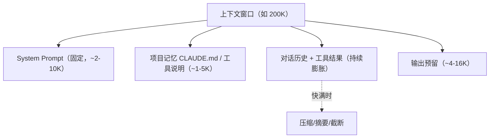

# Token、Embedding、上下文窗口

> **一句话**：Token 是模型的眼界单位，Embedding 是词的「语义坐标」，上下文窗口是它的工作记忆容量——三者是 Agent 工程最常打交道的硬约束。

## 问题动机

Agent 的每一次决策、每一笔成本、每一个「记不住」的故障，最终都落在三个量上：这次调用花了多少 token、检索用了哪个向量空间、上下文还装得下多少。理解它们的定义与换算关系，是控制成本与设计记忆系统的前提。

## 核心机制

### 1. Token：文本如何被切分

模型不直接处理字符，而是先把文本切成子词单元（subword）。主流做法是 **BPE（Byte-Pair Encoding）**：从字符起步，反复把语料中最高频的相邻符号对合并成一个新符号，直到词表达到目标大小。因此常见词是一个 token，生僻词会被拆成多个。

推论：**token 数与字符数不成比例**。中文常接近 1 字 ≈ 0.6–1 token，英文约 0.75 词/token，而代码、JSON、URL 的切分更碎。计费、限流、窗口都按 token 算，所以估算必须用真实 tokenizer，不能数汉字。

### 2. Embedding：查表得到向量

模型有一个嵌入矩阵 $$E\in\mathbb{R}^{|V|\times d}$$（$$|V|$$ 是词表大小，$$d$$ 是隐藏维度）。第 $$i$$ 个 token 的向量就是查表：

$$
h_i = E[t_i]\in\mathbb{R}^{d}
$$

位置信息再叠加（相加或 RoPE 旋转）后进入 Transformer。**注意区分两种「Embedding」**：模型内部的 token 嵌入（用于前向计算），和 RAG 用的句向量（把整段文本编码成一个向量用于检索）——后者才是 [Embedding 与相似度检索](../06-memory-rag/embedding-similarity.md) 讨论的对象。

### 3. 上下文窗口是一个预算约束

一次调用可见的 token 总数有上限，且必须同时容纳所有部分：

$$
\underbrace{T_{\text{sys}}}_{\text{系统提示}}
+\underbrace{T_{\text{mem}}}_{\text{项目记忆}}
+\underbrace{T_{\text{hist}}}_{\text{历史对话}}
+\underbrace{T_{\text{tool}}}_{\text{工具结果}}
+\underbrace{T_{\text{out}}}_{\text{输出预留}}
\;\le\; T_{\max}
$$

任一项膨胀都会挤压其他项；$$T_{\text{hist}}$$ 与 $$T_{\text{tool}}$$ 是随轮数单调增长的，所以长会话必然触发压缩。

### 4. 窗口越大越贵：平方复杂度与 KV 缓存

自注意力要计算所有位置对的交互，时间与显存随序列长度平方增长：

$$
\text{Time}\sim O(n^2 d),\qquad \text{Attn memory}\sim O(n^2)
$$

此外 KV 缓存随长度线性增长（每 token 每层都要存 K/V）：

$$
\text{KV bytes}=2\times L\times H_{kv}\times d_{head}\times S\times B\times\frac{\text{bits}}{8}
$$

这两条式子合起来说明：**窗口从 128K 扩到 1M，不是简单地「能装更多」，而是成本与延迟显著上升**，且长上下文中部信息的利用率会衰减（lost in the middle）。因此检索与压缩不是「窗口小才需要」的权宜之计，而是长期有效的架构手段。

### 5. 成本公式

$$
\text{cost}=c_{\text{in}}\cdot T_{\text{in}}+c_{\text{out}}\cdot T_{\text{out}}
$$

输入与输出单价不同（输出通常更贵）。若能命中 prompt 缓存，命中的输入部分单价更低——这是把稳定前缀与动态内容分离的动机，详见 [推理、量化与部署](inference-quantization-deployment.md)。

## 三个概念

| 概念 | 是什么 | Agent 视角 |
|---|---|---|
| Token | 文本切分的最小单位（BPE 等算法切出） | 成本单位：prompt 和补全分开计费 |
| Embedding | 语义向量（如 1536/4096 维） | 检索的基础：语义搜索就是向量近邻搜索 |
| 上下文窗口 | 一次调用可见的最大 token 数 | Agent 的工作记忆，如 128K/200K/1M |

## 上下文窗口预算

## 源码案例

- **Claude Code 的上下文预算意识**（社区逆向分析，[架构深拆](https://gist.github.com/yanchuk/0c47dd351c2805236e44ec3935e9095d)）：系统提示词做「动静分离」便于 prompt caching；子 Agent 的工具列表从描述挪到 attachment 省 token；工具延迟加载——先只列工具名，需要时再加载完整 schema；上下文将满触发 auto-compact
- **DeepSeek Harness 的 preStep 组装**（[仓库](https://github.com/deepseek-ai/deepseek-harness)）：每一步现场组装 system prompt、动态上下文与工具 schema——上下文不是一次性给定的，而是每步计算出来的
- **Pi**：三条压缩机制（截断、摘要、微压缩）守在窗口临界点，压缩策略本身就是上下文管理

## 常见误区

- ❌ 按字符估算 token：中英混合、代码、JSON 的切分差异很大，用 tokenizer 工具精确计算
- ❌ Embedding 能替代全文检索：向量召回「语义相关」，精确标识符（函数名、错误码）仍要关键词/BM25 补充，最佳实践是混合检索（见 [Embedding 与相似度检索](../06-memory-rag/embedding-similarity.md)）
- ❌ 窗口 1M = 可以无脑塞：成本、延迟、lost-in-the-middle 三座山，检索和压缩永远有价值
- ❌ 把「模型内部 token 嵌入」和「RAG 句向量」混为一谈：两者用途、维度、训练目标都不同

## 参考资料

- [Neural Machine Translation of Rare Words with Subword Units](https://arxiv.org/abs/1508.07909)（Sennrich et al., 2015，BPE）
- [Attention Is All You Need](https://arxiv.org/abs/1706.03762)（Vaswani et al., 2017，嵌入与位置编码）
- [Lost in the Middle: How Language Models Use Long Contexts](https://arxiv.org/abs/2307.03172)（Liu et al., 2023）

## 相关知识点

- [上下文工程](../06-memory-rag/context-engineering.md)
- [向量数据库](../06-memory-rag/vector-database.md)
