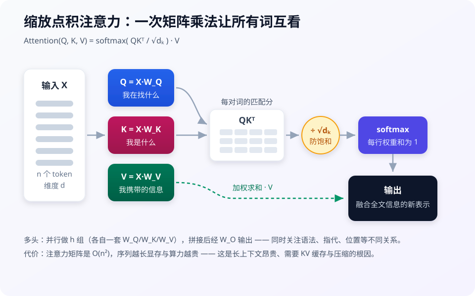

# Transformer 与 Attention

> **一句话**：Transformer 用「注意力机制」让每个词直接看到所有其他词，可完全并行训练——这是 LLM 时代的架构基石。

## 问题动机

RNN 按顺序逐词处理：第 $$t$$ 步必须等第 $$t-1$$ 步算完，无法并行；而且相隔很远的两个词之间的信息要经过几十上百步传递，容易衰减。2017 年的 Transformer 用一次矩阵乘法就让任意两个位置直接交互，把「长程依赖」和「并行训练」同时解决——今天所有主流 LLM 都是它的变体。

## 核心机制

### 1. 缩放点积注意力

把输入序列 $$X\in\mathbb{R}^{n\times d}$$ 分别投影成三组向量：

$$
Q=XW_Q,\quad K=XW_K,\quad V=XW_V
$$

其中 $$W_Q,W_K\in\mathbb{R}^{d\times d_k}$$，$$W_V\in\mathbb{R}^{d\times d_v}$$。注意力输出为：

$$
\mathrm{Attention}(Q,K,V)=\mathrm{softmax}\!\left(\frac{QK^\top}{\sqrt{d_k}}\right)V
$$

逐项看它在做什么：

- $$QK^\top\in\mathbb{R}^{n\times m}$$：第 $$(i,j)$$ 项是「第 $$i$$ 个词的查询」与「第 $$j$$ 个词的键」的点积，即两者的相关程度
- $$\sqrt{d_k}$$：缩放因子。若 $$q,k$$ 各维独立、均值 0 方差 1，则点积方差为 $$d_k$$，维度一大点积绝对值就大，softmax 会被推向饱和区（几乎 one-hot），梯度趋近 0，训练不稳。除以 $$\sqrt{d_k}$$ 把方差拉回 1
- $$\mathrm{softmax}(\cdot)$$：按行归一化成权重，每行和为 1，表示「这个词把多少注意力分给每个位置」
- 右乘 $$V$$：按权重对所有位置的 $$V$$ 加权求和，得到该位置的新表示

对 Agent 的直接含义：**注意力是 $$O(n^2)$$ 的**（$$n$$ 为序列长度），注意力矩阵占显存、也决定上下文成本——这正是长上下文昂贵、需要 KV 缓存与压缩的根因。

### 2. 多头注意力

单组 $$Q/K/V$$ 只能学到一种「关注方式」。多头并行做 $$h$$ 组，各自投影到低维再拼接：

$$
\mathrm{head}_i=\mathrm{Attention}(XW_i^Q,\;XW_i^K,\;XW_i^V)
$$

$$
\mathrm{MultiHead}(X)=\mathrm{Concat}(\mathrm{head}_1,\dots,\mathrm{head}_h)\,W_O
$$

每个头维度为 $$d_k=d/h$$，总计算量与单头相当，但模型可以同时关注语法、指代、位置等不同关系。

### 3. 位置编码

注意力本身对顺序无感（打乱输入，输出只是跟着换位置）。因此需要注入位置信息。原始论文用正弦编码：

$$
PE_{(pos,\,2i)}=\sin\!\left(\frac{pos}{10000^{2i/d}}\right),\qquad
PE_{(pos,\,2i+1)}=\cos\!\left(\frac{pos}{10000^{2i/d}}\right)
$$

现代 LLM 多用旋转位置编码（RoPE）等变体，但目的相同：让模型区分「谁在前、谁在后、隔多远」。

## 一层 Transformer 的组成

| 组件 | 作用 | 一句话理解 |
|---|---|---|
| 多头注意力 | token 间交换信息 | 多组 Q/K/V 从不同角度「看全文」 |
| 前馈网络 FFN | token 内独立加工 | 每个词自己「消化」刚收到的信息，参数大头在这 |
| 残差连接 | 保留原始信息通路 | 高速公路，信息不丢 |
| LayerNorm | 稳定数值 | 防止训练时数值爆炸 |

## 直觉解释

读「小明把书给了小红，因为她想预习」——「她」指谁？注意力就是把「指代消解」变成可计算的加权平均：$$Q$$ 是「她」发出的查询，$$K$$ 是每个候选词的标签，两者的点积决定匹配度，$$V$$ 是词的内容，匹配度决定提取多少信息。多个头则相当于同时检查「性别一致」「最近出现」等不同线索。

## 工程含义

- 注意力与 KV 缓存是推理成本的核心：Agent 的长系统提示、工具 schema、历史轨迹都会常驻，**KV 缓存大小直接影响每轮成本**。这就是 GQA/MQA（多查询共享 KV，省显存）、MLA（潜在注意力，进一步压缩 KV）被广泛采用的原因。
- 上下文长 ≠ 用得上：长上下文中部信息利用率下降（lost in the middle），所以 RAG 与上下文压缩仍然是必要的架构手段，而不是「窗口够大就不需要了」。

## 源码案例

- **DeepSeek-V3 的架构创新**（[论文](https://arxiv.org/abs/2412.19437)）：用 **MLA**（Multi-head Latent Attention）把 KV 缓存压到极小——对 Agent 意义重大，因为 Agent 的上下文又长又常驻，KV 缓存直接决定推理成本；FFN 层用 **MoE**，256 个专家每 token 只激活 8 个
- **vLLM 的 PagedAttention**（[GitHub](https://github.com/vllm-project/vllm) / [论文](https://arxiv.org/abs/2309.06180)）：把 KV 缓存像操作系统虚拟内存一样分页管理，消除碎片、支持前缀共享——想看注意力在生产中如何被高效实现，读它比读原始论文更贴近工程

## 常见误区

- ❌ 上下文窗口 128K 就能「读完整个代码库」：窗口大 ≠ 有效注意力均匀，长上下文中部信息利用率会衰减（「lost in the middle」），这正是 RAG 与压缩仍然必要的架构原因
- ❌ MoE = 多个模型投票：是每个 token 动态选少量专家模块，不是 ensemble
- ❌ 注意力权重可视化就能解释模型：权重只是信息通路的一环，后续 FFN 与残差同样在起作用，可解释性有限

## 参考资料

- [Attention Is All You Need](https://arxiv.org/abs/1706.03762)（Vaswani et al., 2017）
- [The Illustrated Transformer](https://jalammar.github.io/illustrated-transformer/)（Jay Alammar）
- [DeepSeek-V3 Technical Report](https://arxiv.org/abs/2412.19437)
- [Efficient Memory Management for Large Language Model Serving with PagedAttention](https://arxiv.org/abs/2309.06180)（vLLM）

## 相关知识点

- [Token、Embedding、上下文窗口](token-embedding-context.md)
- [推理、量化、蒸馏与部署](inference-quantization-deployment.md)
