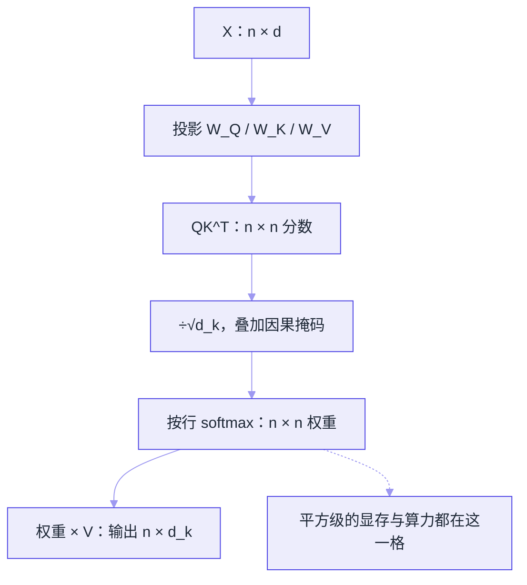

# Transformer 与 Attention


**一句话**：Transformer 用「注意力机制」让每个词直接看到所有其他词，可完全并行训练——这是 LLM 时代的架构基石。



*《图：Q/K/V 三个投影之后只剩一次矩阵乘法——÷√dₖ 不是装饰，不除分数会挤进 softmax 饱和区》*
## 问题动机

RNN 按顺序逐词处理：第 $$t$$ 步必须等第 $$t-1$$ 步算完，无法并行；而且相隔很远的两个词之间的信息要经过几十上百步传递，容易衰减。2017 年的 Transformer 用一次矩阵乘法就让任意两个位置直接交互，把「长程依赖」和「并行训练」同时解决——今天所有主流 LLM 都是它的变体。

## 核心机制

### 1. 缩放点积注意力

把输入序列 $$X\in\mathbb{R}^{n\times d}$$ 分别投影成三组向量：

$$
Q=XW_Q,\quad K=XW_K,\quad V=XW_V
$$

其中 $$W_Q,W_K\in\mathbb{R}^{d\times d_k}$$，$$W_V\in\mathbb{R}^{d\times d_v}$$。注意力输出为：

$$
\mathrm{Attention}(Q,K,V)=\mathrm{softmax}\!\left(\frac{QK^\top}{\sqrt{d_k}}\right)V
$$

逐项看它在做什么：

- $$QK^\top\in\mathbb{R}^{n\times m}$$：第 $$(i,j)$$ 项是「第 $$i$$ 个词的查询」与「第 $$j$$ 个词的键」的点积，即两者的相关程度
- $$\sqrt{d_k}$$：缩放因子。若 $$q,k$$ 各维独立、均值 0 方差 1，则点积方差为 $$d_k$$，维度一大点积绝对值就大，softmax 会被推向饱和区（几乎 one-hot），梯度趋近 0，训练不稳。除以 $$\sqrt{d_k}$$ 把方差拉回 1
- $$\mathrm{softmax}(\cdot)$$：按行归一化成权重，每行和为 1，表示「这个词把多少注意力分给每个位置」
- 右乘 $$V$$：按权重对所有位置的 $$V$$ 加权求和，得到该位置的新表示

对 Agent 的直接含义：**注意力是 $$O(n^2)$$ 的**（$$n$$ 为序列长度），注意力矩阵占显存、也决定上下文成本——这正是长上下文昂贵、需要 KV 缓存与压缩的根因。

#### 注意力数据流：n×n 那一格是唯一的热区



*《图：整条链路只有 softmax 前后的两张 n×n 是平方级的，输出退回 n×d_k——KV 缓存省的是重算，省不掉这两张矩阵》*

#### 手算一遍：两个 token、四个维度

公式里的四个符号连起来只做三件事：点积打分、按行归一化、加权求和。用两个 token、$$d_k=4$$ 的最小配置把它们逐格填出来，每一步都能在草稿纸上验算——不需要任何运行环境，也能确认自己没有只背公式。

约定：$$k_1=(1,0,1,0)$$、$$k_2=(0,1,1,0)$$；$$v_1=(1,0)$$、$$v_2=(0,2)$$（于是 $$d_v=2$$）；第 2 个 token 发出的查询取 $$q_2=(2,0,1,0)$$；缩放因子 $$\sqrt{d_k}=\sqrt{4}=2$$。



#### 第 1 步：`QK^T`——把相关度算成两个点积

$$q_2\cdot k_1 = 2{\times}1+0{\times}0+1{\times}1+0{\times}0 = 3$$，$$q_2\cdot k_2 = 2{\times}0+0{\times}1+1{\times}1+0{\times}0 = 1$$。第 2 行分数向量是 $$(3,\,1)$$：直觉上「token2 更想看 token1」，因为 $$q_2$$ 与 $$k_1$$ 在第 1、3 维同时对齐，而与 $$k_2$$ 只在第 3 维对齐。这一步产出的是 $$n\times n$$ 矩阵，也就是全部开销的来源。



#### 第 2 步：除以 `√d_k`——把分数拉回单位量级

$$(3,\,1)/2=(1.5,\,0.5)$$。缩放不改变大小关系，只改变**分散程度**：同样的两个数，进 softmax 之前先除以 2，指数之间的比值从 $$e^3/e^1=e^2\approx7.39$$ 缩到 $$e^{1.5}/e^{0.5}=e^1\approx2.72$$。分数量级越接近 1，softmax 的输出就越接近「均匀分配」，梯度也越不至于消失。



#### 第 3 步：按行 softmax——分数变成和为 1 的注意力权重

$$e^{1.5}=4.4817$$、$$e^{0.5}=1.6487$$，行和 $$6.1304$$，于是权重为 $$(0.731,\,0.269)$$。掩码位置的分数被加上 $$-\infty$$，取指数后是 0，不参与归一化——所以掩码不需要事后删列，它在 softmax 里自然消失。



#### 第 4 步：右乘 `V`——加权求和得到新表示

$$\mathrm{out}_2 = 0.731\cdot(1,0)+0.269\cdot(0,2)=(0.731,\,0.538)$$。注意输出的第 2 维 $$0.538$$ **比任何单个 $$v$$ 的第 2 维都小**：凸组合只能落在 $$v_1$$ 与 $$v_2$$ 张成的区间内部，永远造不出端点之外的新值。这就是「注意力是信息通路、不是信息放大器」的准确含义，也是它必须配 FFN 的原因。



#### 第 5 步：因果掩码——首行退化成 one-hot

第 1 个 token（`token0`）只能看见自己：唯一那个分数是多少都无所谓，单元素 softmax 恒等于 1，权重行是 $$(1.000)$$，被遮住的 $$n-1$$ 列贡献 $$e^{-\infty}=0$$，输出直接等于 $$v_1=(1,0)$$。**首 token 的注意力永远是自己**，而「解码时一个字一个字往外蹦」正是这条约束的结果：预测第 $$t$$ 个 token 时，$$t$$ 之后的列在数学上不存在。第 2 个 token 起才有真正的混合——但也只看得见前缀。



#### 把配置写成一张数据契约

上面用的是 2 token、$$d_k=4$$；同一套步骤搬到 4 token、$$d_k=6$$ 的玩具配置上（输入由固定随机种子 `seed=0` 的高斯矩阵投影而来，未经训练），逐行写出来的权重矩阵就是下面这份。`null` 表示该位置被因果掩码遮住，`row_sums` 用来验 softmax 有没有按行归一化。

```json
{
  "config": {
    "n_tokens": 4,
    "d_model": 12,
    "d_k": 6,
    "seed": 0,
    "scale": "sqrt(d_k)",
    "mask": "causal: triu(k=1) filled with -inf"
  },
  "shapes": {
    "X": [4, 12],
    "W_q | W_k | W_v": [12, 6],
    "Q | K | V": [4, 6],
    "scores": [4, 4],
    "weights": [4, 4],
    "out": [4, 6]
  },
  "weights": {
    "token0": [1.000, null, null, null],
    "token1": [0.000, 1.000, null, null],
    "token2": [0.049, 0.551, 0.400, null],
    "token3": [0.001, 0.000, 0.000, 0.999]
  },
  "row_sums": [1.0, 1.0, 1.0, 1.0],
  "complexity": {
    "weights": "n x n -> O(n^2)",
    "out": "n x d_k -> O(n)"
  }
}
```

`out` 的形状是 $$(4,6)$$ 而 `weights` 是 $$(4,4)$$：前者随长度线性长，后者平方级长。把这份契约跟第 2 节的手算结果对照，能看出随机初始化下的注意力权重毫无语义可言——它只是随机投影的副产物。

三件事值得停一下：

- 上三角全是 `null`：这就是因果掩码，也是「解码只能一个字一个字往外蹦」的数据形态
- 权重矩阵是 $$n\times n$$ 而输出是 $$n\times d_k$$：**平方级开销长在权重上，不在输出上**，所以 KV 缓存能救显存却救不了注意力计算
- `token3` 那一行几乎把全部权重压在自己身上（0.999）——随机投影下点积一大，softmax 就饱和成近似 one-hot，这正是 $$\sqrt{d_k}$$ 缩放要解决的问题，也是「注意力可视化」能骗人的原因：这一行看起来很有信息量，其实只是随机数

#### 改三处配置会怎样（点标签切换）



第 2 步不缩放了，$$(3,\,1)$$ 直接进 softmax：$$e^3=20.0855$$、$$e^1=2.7183$$，权重从 $$(0.731,\,0.269)$$ 变成 $$(0.881,\,0.119)$$，输出从 $$(0.731,\,0.538)$$ 变成 $$(0.881,\,0.238)$$。2 维 $$d_k$$ 上这只是「偏了一点」，但偏差随维度指数放大——缩放因子不是装饰，是防止 softmax 饱和的闸门。



按前面的假设（各维独立、均值 0、方差 1），点积的方差等于 $$d_k$$：$$d_k=512$$ 时标准差约 $$22.6$$，典型分数落在 $$\pm20$$ 量级。这样的两个分数一进 softmax，小的一方直接被压到 $$e^{-10}$$ 以下，一行几乎严格 one-hot，反向传播时梯度趋 0。除以 $$\sqrt{512}\approx22.6$$ 把方差拉回 1，才换来可控的训练。这也解释了那份 4 token 契约里 `token1` 行为什么会出现 0.000 / 1.000 这种极端行。



上三角不再是 `null`，每个 token 都能看全文，权重仍是 $$n\times n$$、算力一点没省。省不掉是次要的，问题是**训练目标塌了**：语言模型学的是「用前缀预测下一个词」，让模型看见答案本身，它只要把下一列抄过来就能拿满分。双向注意力只属于掩码语言模型（BERT 一类），而那一类模型不能自回归解码——这正是「LLM 会一本正经地续写、BERT 不能生成」的架构级原因。




**提示**：把「平方级」换算成看得见的字节——$$n=4096$$ 时单头一张权重矩阵是 $$4096^2=16{,}777{,}216$$ 个分数，按 fp32 存约 64 MiB，32 个头就是 2 GiB，而且每层都来一遍。生产实现因此用 FlashAttention 分块算 softmax，**根本不物化这张矩阵**；而 KV 缓存省的是另一件事：历史 token 的 $$K,V$$ 不必重算。两者解决的是不同的平方级问题，别混为一谈。


### 2. 多头注意力

单组 $$Q/K/V$$ 只能学到一种「关注方式」。多头并行做 $$h$$ 组，各自投影到低维再拼接：

$$
\mathrm{head}_i=\mathrm{Attention}(XW_i^Q,\;XW_i^K,\;XW_i^V)
$$

$$
\mathrm{MultiHead}(X)=\mathrm{Concat}(\mathrm{head}_1,\dots,\mathrm{head}_h)\,W_O
$$

每个头维度为 $$d_k=d/h$$，总计算量与单头相当，但模型可以同时关注语法、指代、位置等不同关系。

### 3. 位置编码

注意力本身对顺序无感（打乱输入，输出只是跟着换位置）。因此需要注入位置信息。原始论文用正弦编码：

$$
PE_{(pos,\,2i)}=\sin\!\left(\frac{pos}{10000^{2i/d}}\right),\qquad
PE_{(pos,\,2i+1)}=\cos\!\left(\frac{pos}{10000^{2i/d}}\right)
$$

现代 LLM 多用旋转位置编码（RoPE）等变体，但目的相同：让模型区分「谁在前、谁在后、隔多远」。

## 一层 Transformer 的组成

| 组件 | 作用 | 一句话理解 |
|---|---|---|
| 多头注意力 | token 间交换信息 | 多组 Q/K/V 从不同角度「看全文」 |
| 前馈网络 FFN | token 内独立加工 | 每个词自己「消化」刚收到的信息，参数大头在这 |
| 残差连接 | 保留原始信息通路 | 高速公路，信息不丢 |
| LayerNorm | 稳定数值 | 防止训练时数值爆炸 |

## 直觉解释

读「小明把书给了小红，因为她想预习」——「她」指谁？注意力就是把「指代消解」变成可计算的加权平均：$$Q$$ 是「她」发出的查询，$$K$$ 是每个候选词的标签，两者的点积决定匹配度，$$V$$ 是词的内容，匹配度决定提取多少信息。多个头则相当于同时检查「性别一致」「最近出现」等不同线索。

## 工程含义

- 注意力与 KV 缓存是推理成本的核心：Agent 的长系统提示、工具 schema、历史轨迹都会常驻，**KV 缓存大小直接影响每轮成本**。这就是 GQA/MQA（多查询共享 KV，省显存）、MLA（潜在注意力，进一步压缩 KV）被广泛采用的原因。
- 上下文长 ≠ 用得上：长上下文中部信息利用率下降（lost in the middle），所以 RAG 与上下文压缩仍然是必要的架构手段，而不是「窗口够大就不需要了」。

## 源码案例

- **DeepSeek-V3 的架构创新**（[论文](https://arxiv.org/abs/2412.19437)）：用 **MLA**（Multi-head Latent Attention）把 KV 缓存压到极小——对 Agent 意义重大，因为 Agent 的上下文又长又常驻，KV 缓存直接决定推理成本；FFN 层用 **MoE**，256 个专家每 token 只激活 8 个
- **vLLM 的 PagedAttention**（[GitHub](https://github.com/vllm-project/vllm) / [论文](https://arxiv.org/abs/2309.06180)）：把 KV 缓存像操作系统虚拟内存一样分页管理，消除碎片、支持前缀共享——想看注意力在生产中如何被高效实现，读它比读原始论文更贴近工程

## 常见误区

- ❌ 上下文窗口 128K 就能「读完整个代码库」：窗口大 ≠ 有效注意力均匀，长上下文中部信息利用率会衰减（「lost in the middle」），这正是 RAG 与压缩仍然必要的架构原因
- ❌ MoE = 多个模型投票：是每个 token 动态选少量专家模块，不是 ensemble
- ❌ 注意力权重可视化就能解释模型：权重只是信息通路的一环，后续 FFN 与残差同样在起作用，可解释性有限

## 参考资料

- [Attention Is All You Need](https://arxiv.org/abs/1706.03762)（Vaswani et al., 2017）
- [The Illustrated Transformer](https://jalammar.github.io/illustrated-transformer/)（Jay Alammar）
- [DeepSeek-V3 Technical Report](https://arxiv.org/abs/2412.19437)
- [Efficient Memory Management for Large Language Model Serving with PagedAttention](https://arxiv.org/abs/2309.06180)（vLLM）

## 相关知识点

- [Token、Embedding、上下文窗口](token-embedding-context.md)
- [推理、量化、蒸馏与部署](inference-quantization-deployment.md)

