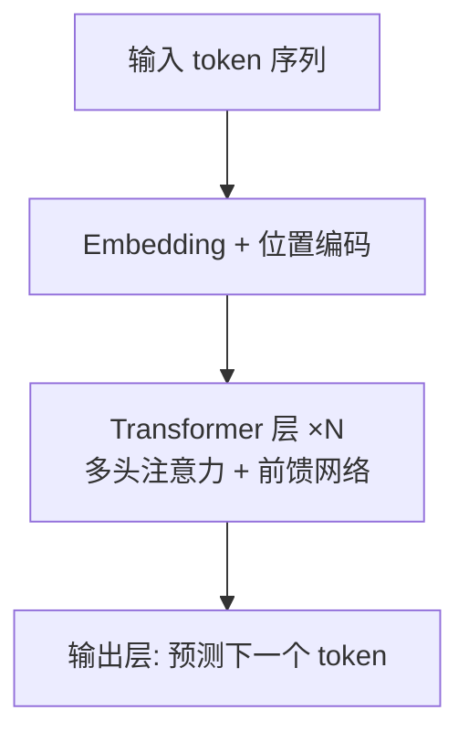

# 🧠 Transformer 与 Attention

> **一句话**：Transformer 用「注意力机制」让每个词直接看到所有其他词，可完全并行训练——这是 LLM 时代的架构基石。
> **难度**：⭐️⭐️ 进阶
> **标签**：`#llm` `#basics`

## 📌 先看结论

- 核心机制 Attention：每个 token 计算「我该关注谁、关注多少」
- 相比 RNN：并行训练（快）、长程依赖（远距离词直接相连）
- 三个注意力角色：Q（我在找什么）、K（我是什么）、V（我携带的信息）
- Agent 关心的变体：GQA/MQA（省显存）、MLA（DeepSeek 的多头潜在注意力）、MoE（前馈层稀疏化）

## 🍜 生活类比

读「小明把书给了小红，因为她想预习」——「她」指谁？你的大脑瞬间让「她」对「小红」产生强注意力。Attention 就是把这种「指代消解」变成可计算的加权平均：Q 是「她」发出的查询，K 是每个候选词的标签，V 是词的内容，匹配度决定信息提取比例。

## 🖼️ 图示

## 🧩 一层 Transformer 的组成

| 组件 | 作用 | 一句话理解 |
|---|---|---|
| 多头注意力 | token 间交换信息 | 多组 Q/K/V 从不同角度「看全文」 |
| 前馈网络 FFN | token 内独立加工 | 每个词自己「消化」刚收到的信息，参数大头在这 |
| 残差连接 | 保留原始信息通路 | 高速公路，信息不丢 |
| LayerNorm | 稳定数值 | 防止训练时数值爆炸 |

## 📦 源码案例

- **DeepSeek-V3 的架构创新**（[论文](https://arxiv.org/abs/2412.19437)）：用 **MLA**（Multi-head Latent Attention）把 KV 缓存压到极小——对 Agent 意义重大，因为 Agent 的上下文又长又常驻，KV 缓存直接决定推理成本；FFN 层用 **MoE**，256 个专家每 token 只激活 8 个
- **llama.cpp / vLLM**（[GitHub](https://github.com/ggml-org/llama.cpp) / [GitHub](https://github.com/vllm-project/vllm)）：想看 Attention 的工程实现（PagedAttention 如何管理 KV 缓存），读 vLLM 的论文与源码比读原始论文更贴近生产

## ⚠️ 常见误区

- ❌ Attention = 「注意力权重可视化就能解释模型」：权重只是信息通路的一小部分，解释性有限
- ❌ 上下文窗口 128K 就能「读完整个代码库」：窗口大 ≠ 有效注意力均匀，长上下文中部信息利用率会衰减（「lost in the middle」），这正是 RAG 与压缩仍然必要的架构原因
- ❌ MoE = 多个模型投票：是每个 token 动态选少量专家模块，不是 ensemble

## 🧪 小练习

为什么 Agent 系统普遍「把最重要的指令放上下文头部或尾部」？用 lost-in-the-middle 现象解释。

## 🔗 相关资源

- [Attention Is All You Need](https://arxiv.org/abs/1706.03762)
- [The Illustrated Transformer](https://jalammar.github.io/illustrated-transformer/)

## 📚 相关知识点

- [Token、Embedding、上下文窗口](token-embedding-context.md)
- [推理、量化、蒸馏与部署](inference-quantization-deployment.md)
