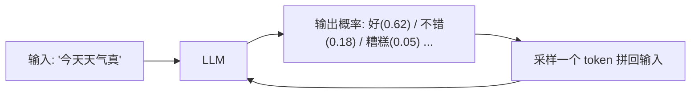

# LLM 是什么

> **一句话**：大语言模型是一个在海量文本上训练出来的「下一个 token 预测器」，规模大到一定程度后涌现出指令遵循、推理、工具使用等能力。

## 先看结论

- 核心任务只有一件事：给定前文，预测下一个 token 的概率分布
- 生成过程是「自回归」的：把预测出的 token 拼回输入，再预测下一个
- 「智能」是规模 + 数据 + 训练方法的结果，不是被显式编程的
- LLM 三个先天特性直接塑造 Agent 设计：**会忘**（有限窗口）、**会错**（概率生成）、**会编**（幻觉）
- 模型没有状态：每次调用都是无状态的，「记忆」全靠把历史重新喂回去

## 核心机制

### 1. 自回归分解

语言模型学的是「给定前文，下一个 token 的条件概率」。对整个序列，它把联合概率分解成逐步条件的乘积：

$$
P(x_1,x_2,\dots,x_T)=\prod_{t=1}^{T}P_\theta\big(x_t\mid x_{<t}\big)
$$

这就是为什么生成必须**一个 token 一个 token 地来**：第 $t$ 步的输入包含了前 $t-1$ 步的全部输出。每一步的分布由最后一层 logits 经 softmax 得到：

$$
P_\theta(x_t=v\mid x_{<t})=\frac{\exp(z_v/\tau)}{\sum_{v'}\exp(z_{v'}/\tau)}
$$

$\tau$ 是**温度**：$\tau\to 0$ 趋向确定性的「选最大」（greedy），$\tau$ 变大则分布更平坦、输出更多样。工程上还常用 top-k / top-p 截断，把低概率的长尾裁掉，避免采样到离谱的 token。

### 2. 训练目标

预训练就是最小化交叉熵（等价于最大化训练语料的似然）：

$$
\mathcal{L}(\theta)=-\frac{1}{N}\sum_{t=1}^{N}\log P_\theta\big(x_t\mid x_{<t}\big)
$$

要压低这个损失，模型必须把语法、事实与推理模式**压缩进参数**。所以模型参数里存的是统计规律，不是原文——这直接解释了「为什么模型不能逐字复述」和「为什么会一本正经地编」（见 [幻觉问题](../10-evaluation-safety/hallucination.md)）。详见 [预训练、微调与指令微调](pretraining-finetuning.md)。

### 3. 「能力涌现」是怎么回事

规模上去后，模型表现出训练目标里没显式要求的能力（指令遵循、多步推理、工具调用）。通常归因于**缩放律**：损失随参数量、数据量、算力呈幂律下降，能力在某个规模后变得可用。

> **注意**：对「涌现」要保留态度。有研究指出部分「突变式涌现」可能是指标本身不连续造成的错觉（例如精确匹配分数在连续能力提升下呈阶跃）。工程结论不变：**能力随规模提升，但不是魔法，且需要实测验证**。

## 图示

生成 = 不断把预测出的 token 拼回输入再预测，循环直到结束符。

## 关键特性与 Agent 设计的对应

| LLM 特性 | 后果 | Agent 侧对策 |
|---|---|---|
| 有限上下文窗口 | 长任务记不全 | 上下文工程、压缩、RAG |
| 概率性输出 | 同样输入不同输出 | 温度控制、结构化输出、校验 |
| 幻觉 | 会一本正经编造 | 要求引用工具结果、外部验证 |
| 无状态 | 服务端不记上一句 | 客户端维护消息列表（见 [状态管理](../02-agent-basics/state-management.md)） |
| 训练截止日期 | 不知道新知识 | 联网工具、RAG |
| 不可逐字记忆 | 复述长文本会失真 | 需要原文时用检索、不要靠模型「背」 |

## 工程含义

- **成本与延迟都由 token 决定**：输入输出都按 token 计价，且生成是串行的——每多一个输出 token 都直接加时间。这是 Agent 循环「越少轮次越省钱」的根本原因。
- **无状态是设计选择，不是缺陷**：正因服务端不保存会话，才能水平扩展、按请求计费。代价是「记忆」必须由客户端管理（见 [部署与扩缩容](../11-engineering/deployment-scaling.md)）。
- **选型看任务而非榜单**：Agent 场景真正要的是多轮工具调用的稳定性与长上下文质量，而不是单轮问答分数。

## 源码案例

- **DeepSeek-V3**（[论文](https://arxiv.org/abs/2412.19437) / [GitHub](https://github.com/deepseek-ai/DeepSeek-V3)）：公开了 14.8 万亿 token 预训练、MoE 架构（每 token 激活约 37B / 总参数 671B）、FP8 训练等细节，是透明度最高的旗舰级开源模型之一
- **Pi 的多模型适配**（[仓库](https://github.com/earendil-works/pi)）：其 `pi-ai` 包把 OpenAI / Anthropic / Google / 本地模型统一成一个接口——工程上「换大脑不换身体」，也说明各家 API 的差异（工具调用格式、思考字段）都收敛在适配层

## 常见误区

- ❌ LLM「查询数据库」：它不存原文，参数里是统计规律，无法保证逐字复述
- ❌ 模型知道自己不知道：幻觉的可怕正在于语气笃定（见 [幻觉问题](../10-evaluation-safety/hallucination.md)）
- ❌ 参数量决定一切：数据质量、训练配方、后训练同样关键，小模型在特定任务上胜过大模型很常见
- ❌ 温度越高越有创造力、越低越准：温度只是采样分布的锐化程度，任务正确性靠的是提示与验证，不是调温度

## 小练习

为什么「模型 API 是无状态的」？如果服务端记住了你的历史对话，会带来哪两个工程问题？再解释：为什么「让模型复述一段 5000 字原文」不可靠，而 RAG 可以。

## 参考资料

- [Attention Is All You Need](https://arxiv.org/abs/1706.03762)（Vaswani et al., 2017，架构基础）
- [Language Models are Few-Shot Learners](https://arxiv.org/abs/2005.14165)（Brown et al., 2020，GPT-3）
- [Scaling Laws for Neural Language Models](https://arxiv.org/abs/2001.08361)（Kaplan et al., 2020）
- [Are Emergent Abilities of Large Language Models a Mirage?](https://arxiv.org/abs/2304.15004)（Schaeffer et al., 2023，对「涌现」的质疑）
- [DeepSeek-V3 Technical Report](https://arxiv.org/abs/2412.19437)

## 相关知识点

- [Token、Embedding、上下文窗口](token-embedding-context.md)
- [Transformer 与 Attention](transformer-attention.md)
- [什么是 AI Agent](../02-agent-basics/what-is-agent.md)
