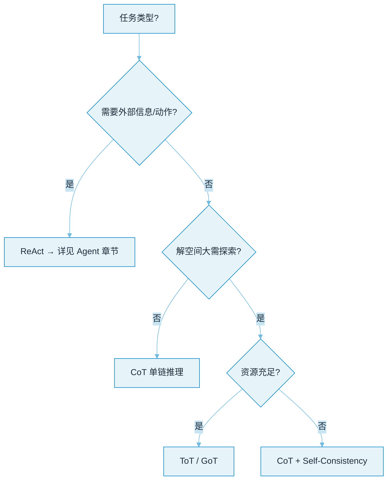

# 04 Prompt 与推理


**一句话**：本章讲「怎么把 LLM 用聪明」：从 prompt 工程的基本功，到 CoT/ToT 等推理模式，再到 Agent 循环的灵魂 ReAct 与自我改进三兄弟。


## 你将学到

- Prompt Engineering 的工程化写法（角色、约束、示例、输出格式）
- 结构化输出：JSON Mode / Schema 约束，Agent 稳定性的基石
- 推理增强光谱：CoT（线性）→ ToT（树状探索）→ GoT（图状协同）
- ReAct：思考与行动交替，Agent 循环的 prompt 层实现
- Reflexion / Self-Refine：让模型自我批评、迭代改进

## 一张图选模式

## 本站页面

- [Prompt Engineering](prompt-engineering.md)
- [结构化输出](structured-output.md)
- [Chain of Thought](chain-of-thought.md)
- [Tree of Thoughts](tree-of-thoughts.md)
- [Graph of Thoughts](graph-of-thoughts.md)
- [ReAct](react.md)
- [Reflexion](reflexion.md)
- [Self-Refine](self-refine.md)

## 读完能做到

- [ ] 把「帮我写周报」改写成角色/任务/约束/示例/格式五要素齐全的 prompt，并指出哪条约束该下沉成代码校验而非写在 prompt 里
- [ ] 说清 JSON Mode、Structured Outputs、约束解码三者的合法率与适用差异，并解释约束解码为什么要保留「我需要更多信息」的逃生口
- [ ] 写一段 ReAct 轨迹（Thought→Action→Observation），并说明把 Observation 换成模型自猜的结果会退化成什么
- [ ] 用一张表讲清 CoT / ToT / GoT 的结构、要不要评估器、token 成本量级，各适合什么任务
- [ ] 为「自动修复 lint 错误」设计 Reflexion 循环：Evaluator 用什么信号、复盘模板长什么样、最大重试几次

## 章末自测

1. **回忆**：CoT 在哪类任务上收益很小？什么时候才值得上自一致性（k=3~5）换稳定性？（提示：见 chain-of-thought.md）
2. **应用**：「分析三份竞品报告输出结论」怎么切成 map→聚合→精炼的 GoT 流程？每步大致几个节点、成本主导项是什么？（提示：见 graph-of-thoughts.md）
3. **判断**：ToT 里让模型自己给自己的思路打分靠谱吗？给出至少一个降低自评偏差的办法。（提示：见 tree-of-thoughts.md、self-refine.md）

## 本章术语速查

这些模式名听着都像武功招式，实际各治一种具体的病——对照表看谁治什么。

| 英文术语 | 中文 | 白话一句话 |
|---|---|---|
| Prompt Engineering | 提示工程 | 不是念咒，是指定条件分布：prompt 是给定的条件，输出在它下面采样，给例子比堆技巧管用 |
| Zero-shot | 零样本 | 只下指令不给例题，让模型凭常识直接上 |
| Few-shot | 少样本 | 给 2–5 个「输入→输出」示例，最稳的杠杆；示例没覆盖到的分支，模型会模仿出错误规律 |
| Structured Output | 结构化输出 | 把回答钉死在 JSON Schema 里，下游代码接得住，Agent 稳定性基石 |
| Constrained Decoding | 约束解码 | 每一步只允许采合法 token，格式 100% 不跑偏——但格式合法不等于内容正确 |
| Chain of Thought (CoT) | 思维链 | 先写中间步骤再下结论，用多吐的 token 换更多串行计算，并不引入新知识 |
| Self-Consistency | 自一致性 | 采样几条推理链、对答案投多数票，花 k 倍钱买一份稳 |
| Tree of Thoughts (ToT) | 思维树 | 思路分叉成树、逐节点打分剪枝还能回头，解空间大的题才值这个钱 |
| Graph of Thoughts (GoT) | 思维图 | 想法切成小块并行处理再聚合精炼，织成图来算，最贵也最能打 |
| ReAct | 推理行动交替 | Thought→Action→Observation 一步一回头，真实工具结果把幻觉链拉回正轨 |
| Reflexion | 反思 | 失败后让 Reflector 写一份文字检讨存进记忆再来一局：不动权重，用上下文当梯度 |
| Self-Refine | 自我精修 | 初稿→自审→修订三步循环，软肋是模型自己给自己改作文的偏见 |

