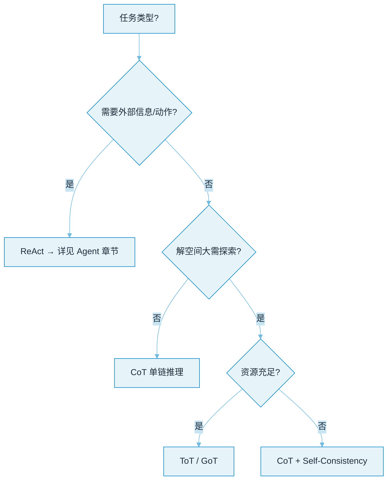

# 04 Prompt 与推理


**一句话**：本章讲「怎么把 LLM 用聪明」：从 prompt 工程的基本功，到 CoT/ToT 等推理模式，再到 Agent 循环的灵魂 ReAct 与自我改进三兄弟。


## 你将学到

- Prompt Engineering 的工程化写法（角色、约束、示例、输出格式）
- 结构化输出：JSON Mode / Schema 约束，Agent 稳定性的基石
- 推理增强光谱：CoT（线性）→ ToT（树状探索）→ GoT（图状协同）
- ReAct：思考与行动交替，Agent 循环的 prompt 层实现
- Reflexion / Self-Refine：让模型自我批评、迭代改进

## 一张图选模式

## 本站页面

- [Prompt Engineering](prompt-engineering.md)
- [结构化输出](structured-output.md)
- [Chain of Thought](chain-of-thought.md)
- [Tree of Thoughts](tree-of-thoughts.md)
- [Graph of Thoughts](graph-of-thoughts.md)
- [ReAct](react.md)
- [Reflexion](reflexion.md)
- [Self-Refine](self-refine.md)

## 读完能做到

- [ ] 把「帮我写周报」改写成角色/任务/约束/示例/格式五要素齐全的 prompt，并指出哪条约束该下沉成代码校验而非写在 prompt 里
- [ ] 说清 JSON Mode、Structured Outputs、约束解码三者的合法率与适用差异，并解释约束解码为什么要保留「我需要更多信息」的逃生口
- [ ] 写一段 ReAct 轨迹（Thought→Action→Observation），并说明把 Observation 换成模型自猜的结果会退化成什么
- [ ] 用一张表讲清 CoT / ToT / GoT 的结构、要不要评估器、token 成本量级，各适合什么任务
- [ ] 为「自动修复 lint 错误」设计 Reflexion 循环：Evaluator 用什么信号、复盘模板长什么样、最大重试几次

## 章末自测

1. **回忆**：CoT 在哪类任务上收益很小？什么时候才值得上自一致性（k=3~5）换稳定性？（提示：见 chain-of-thought.md）
2. **应用**：「分析三份竞品报告输出结论」怎么切成 map→聚合→精炼的 GoT 流程？每步大致几个节点、成本主导项是什么？（提示：见 graph-of-thoughts.md）
3. **判断**：ToT 里让模型自己给自己的思路打分靠谱吗？给出至少一个降低自评偏差的办法。（提示：见 tree-of-thoughts.md、self-refine.md）

