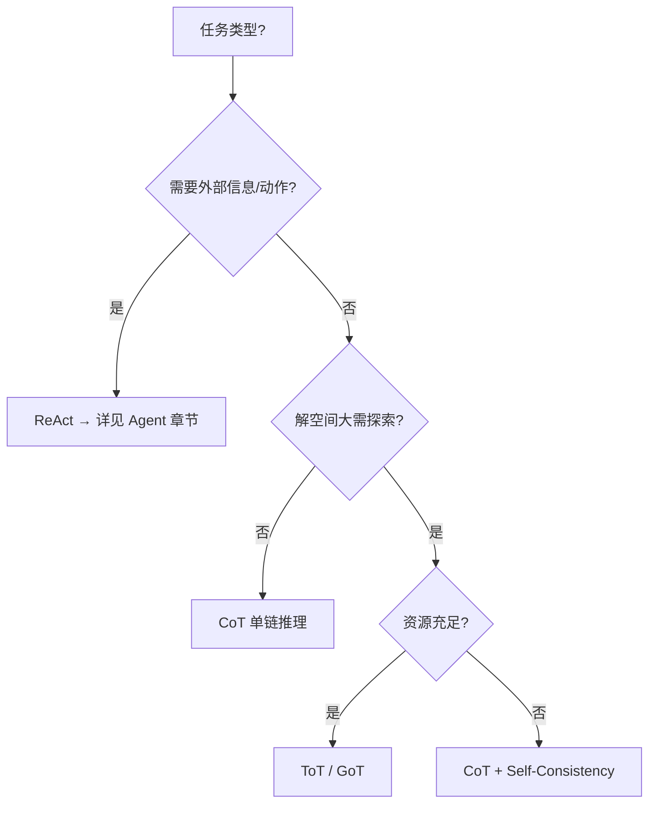

# 04 Prompt 与推理

> **一句话**：本章讲「怎么把 LLM 用聪明」：从 prompt 工程的基本功，到 CoT/ToT 等推理模式，再到 Agent 循环的灵魂 ReAct 与自我改进三兄弟。

## 你将学到

- Prompt Engineering 的工程化写法（角色、约束、示例、输出格式）
- 结构化输出：JSON Mode / Schema 约束，Agent 稳定性的基石
- 推理增强光谱：CoT（线性）→ ToT（树状探索）→ GoT（图状协同）
- ReAct：思考与行动交替，Agent 循环的 prompt 层实现
- Reflexion / Self-Refine：让模型自我批评、迭代改进

## 一张图选模式

## 本站页面

- [Prompt Engineering](prompt-engineering.md)
- [结构化输出](structured-output.md)
- [Chain of Thought](chain-of-thought.md)
- [Tree of Thoughts](tree-of-thoughts.md)
- [Graph of Thoughts](graph-of-thoughts.md)
- [ReAct](react.md)
- [Reflexion](reflexion.md)
- [Self-Refine](self-refine.md)
