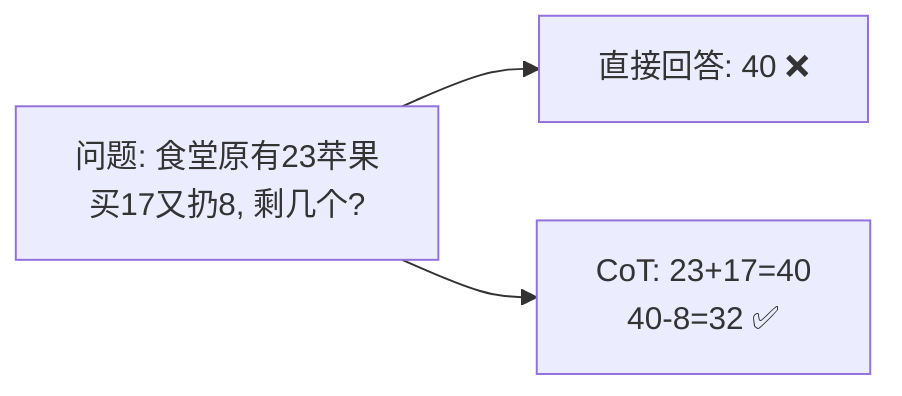

# Chain of Thought

> **一句话**：让模型「把思考过程写出来」再给答案——中间步骤给模型更多计算空间，显著提升推理任务准确率。
> **难度**：入门
> **标签**：`#prompt`

## 先看结论

- 原理：Transformer 每层计算量固定，CoT 用「多生成 token」换取更多串行计算步骤
- 两种触发：zero-shot（"一步步思考"）与 few-shot（给带推理过程的示例，效果更稳）
- 推理模型（o1、DeepSeek-R1）= CoT 的内化版：思考过程由 RL 训练出来，不再依赖提示词
- 代价：输出 token 变多 → 更贵、更慢；简单任务别滥用

## 图示

## 源码案例

- **DeepSeek-R1 的思考 token**（[论文](https://arxiv.org/abs/2501.12948) / [在线体验](https://chat.deepseek.com)）：API 返回 `reasoning_content`（思考链）与 `content`（最终答案）两个字段。Agent 工程要点：思考链可以用于展示与调试，但**不要**把它无脑塞回上下文——又长又贵
- **Claude Code 的思考块**（社区逆向，[架构深拆](https://gist.github.com/yanchuk/0c47dd351c2805236e44ec3935e9095d)）：流式事件区分 `thinking_delta` 与 `text_delta`，UI 分开展示「思考中」与「回答」；扩展思考模式下模型在动手前显式规划——这是 CoT 在产品级 Agent 的形态
- **Pi**：思考预算可配置，默认轻量——简单编码任务直接出手，复杂任务才展开思考，按需分配「思考成本」

## 最佳实践

- 数学、多条件判断、逻辑题上开 CoT；分类、抽取、格式转换等任务收益小
- few-shot CoT 的示例要覆盖典型分支，否则模型模仿的「格式」对、「逻辑」错
- 用「先写计划再执行」的变体做 Agent 的任务分解（→ [Plan-and-Execute](../07-planning/plan-and-execute.md)）

## 常见误区

- ❌ CoT 让模型「更聪明」：它不会引入新知识，只是重新分配计算量；知识错了推理再对也没用
- ❌ 思考链 = 可信解释：模型的解释可能是事后合理化（post-hoc rationalization），不能当审计依据（→ [可解释性](../10-evaluation-safety/explainability.md)）
- ❌ 步骤越多越好：冗长思考会稀释上下文预算、放大偏题风险

## 小练习

用 few-shot CoT 改写一个「判断工单优先级」的 prompt：给 2 个带推理过程的示例，对比无 CoT 版本的准确率。

## 相关资源

- [Chain-of-Thought Prompting 论文](https://arxiv.org/abs/2201.11903)

## 相关知识点

- [Tree of Thoughts](tree-of-thoughts.md)
- [ReAct](react.md)
