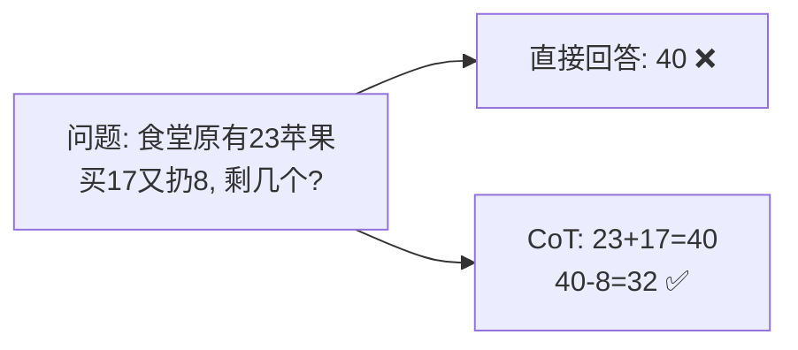

# Chain of Thought

> **一句话**：让模型「把思考过程写出来」再给答案——中间步骤给模型更多计算空间，显著提升推理任务准确率。

## 问题动机

对多步算术、逻辑与多条件判断，直接要答案时模型的准确率会明显下降：它必须在一次前向传播里「心算」完所有步骤。CoT 的做法是让模型先输出中间推理，再给结论——用更多的生成 token 换取更多的串行计算步骤。

## 核心机制

### 1. 为什么多写几步就变准：串行计算量

Transformer 的层数 $$L$$ 是固定的，每生成一个 token 都要过一遍这 $$L$$ 层。若只输出答案，模型可用于「思考」的串行深度只有一次前向；若先写出 $$T_r$$ 个推理 token、再输出 $$T_a$$ 个答案 token，则总串行计算量近似：

$$
\text{serial compute}\;\approx\;L\times(T_r+T_a)\;\gg\;L\times T_a
$$

也就是说，CoT 并没有让模型「更聪明」或引入新知识，它只是**把计算预算从「一次算完」改成「分步算」**。这解释了它的收益边界：需要多步组合的任务收益大，单步检索型任务（分类、抽取、格式转换）几乎没有收益。

### 2. 两种触发方式

- **Zero-shot CoT**：在提示里加一句「Let's think step by step」，无需示例即可激活（Kojima et al., 2022）
- **Few-shot CoT**：给出若干条带完整推理过程的示例，模型模仿其推理格式，效果通常更稳（Wei et al., 2022）

### 3. 自一致性：把 CoT 变成「多次采样 + 投票」

单条推理链可能在某一步走错。自一致性（Self-Consistency）采样 $$k$$ 条独立的推理链，把答案中出现次数最多者作为最终答案：

$$
a^*=\operatorname*{arg\,max}_{a}\;\sum_{i=1}^{k}\mathbb{1}\big[\,a_i=a\,\big]
$$

它对**推理路径**采样、对**答案**投票，因此比贪心解码单链更稳；代价是 token 消耗约 $$k$$ 倍。

## 图示

## 工程含义

- **推理模型 = CoT 的内化**：o1、DeepSeek-R1 类模型把思考过程用 RL 训练出来，不再依赖提示词，且思考长度可按预算调节。
- **思考链不要无脑回填上下文**：它又长又贵，通常只在调试与展示时使用；回填多轮会迅速吃掉上下文预算。
- **成本随思考增长**：输出 token 直接进成本公式（见 [Token、Embedding、上下文窗口](../03-llm/token-embedding-context.md)），简单任务开 CoT 是净损失。

## 源码案例

- **DeepSeek-R1 的思考 token**（[论文](https://arxiv.org/abs/2501.12948) / [在线体验](https://chat.deepseek.com)）：API 返回 `reasoning_content`（思考链）与 `content`（最终答案）两个字段。Agent 工程要点：思考链可用于展示与调试，但**不要**把它无脑塞回上下文
- **Claude Code 的思考块**（社区逆向，[架构深拆](https://gist.github.com/yanchuk/0c47dd351c2805236e44ec3935e9095d)）：流式事件区分 `thinking_delta` 与 `text_delta`，UI 分开展示「思考中」与「回答」；扩展思考模式下模型在动手前显式规划
- **Pi**：思考预算可配置，默认轻量——简单编码任务直接出手，复杂任务才展开思考

## 最佳实践

- 数学、多条件判断、逻辑题上开 CoT；分类、抽取、格式转换等任务收益小
- few-shot CoT 的示例要覆盖典型分支，否则模型模仿的「格式」对、「逻辑」错
- 高准确率要求的场景用自一致性（$$k=3\sim5$$）换稳定性，但要接受成倍成本
- 用「先写计划再执行」的变体做 Agent 的任务分解（→ [Plan-and-Execute](../07-planning/plan-and-execute.md)）

## 常见误区

- ❌ CoT 让模型「更聪明」：它不引入新知识，只是重新分配计算量；知识错了推理再对也没用
- ❌ 思考链 = 可信解释：模型的解释可能是事后合理化（post-hoc rationalization），不能当审计依据（→ [可解释性](../10-evaluation-safety/explainability.md)）
- ❌ 步骤越多越好：冗长思考会稀释上下文预算、放大偏题风险
- ❌ 自一致性一定值得：$$k$$ 倍成本换来的稳定性，在低价值任务上是浪费

## 参考资料

- [Chain-of-Thought Prompting Elicits Reasoning in Large Language Models](https://arxiv.org/abs/2201.11903)（Wei et al., 2022）
- [Large Language Models are Zero-Shot Reasoners](https://arxiv.org/abs/2205.11916)（Kojima et al., 2022，zero-shot CoT）
- [Self-Consistency Improves Chain of Thought Reasoning in Language Models](https://arxiv.org/abs/2203.11171)（Wang et al., 2022）
- [DeepSeek-R1](https://arxiv.org/abs/2501.12948)（推理模型与内生思考链）

## 相关知识点

- [Tree of Thoughts](tree-of-thoughts.md)
- [ReAct](react.md)
