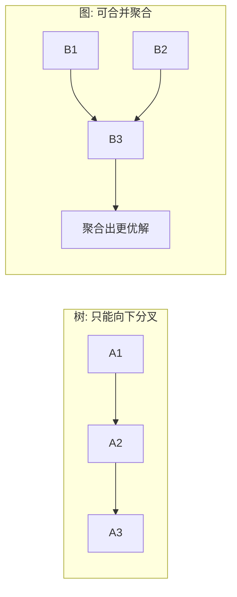

# 💬 Graph of Thoughts

> **一句话**：GoT 把 ToT 的树推广成图：思路可以合并、聚合成新思路，形成任意拓扑的推理网络。
> **难度**：⭐️⭐️⭐️ 高级
> **标签**：`#prompt`

## 📌 先看结论

- 树的边只能「父 → 子」，图允许「多父 → 一子」：多个局部解可以**合并**成一个更好的解
- 三种基本操作：生成（新思路）、聚合（合并多思路）、精炼（自我改进迭代）
- 论文报告：排序任务上比 ToT 质量提升 62%、成本降低 31% 以上
- 工程上 GoT 形态少见，更多出现在「多 Agent 汇总」「Map-Reduce 式分析」里

## 🖼️ ToT vs GoT

## 🍜 生活类比

ToT 是一个人尝试三条路、走不通退回来；GoT 是三个人各走一条路，回来后**把三张地图拼成一张**——合并本身就是一次创造。

## 📦 源码案例

- **GoT 论文官方实现**（[spcl/graph-of-thoughts](https://github.com/spcl/graph-of-thoughts)）：ETH 组的开源库，用「Controller + 思考图」的架构实现排序、集合运算、关键词抽取等任务，是理解 GoT 操作语义的最好材料
- **工程近似：Map-Reduce 汇总**（[LlamaIndex 文档](https://docs.llamaindex.ai/)）：超长文档先分块并行总结（map，多条思路），再合并成总纲（reduce，聚合）——这正是 GoT「聚合」操作的生产化形态；LangGraph 的 reducer 模式同理
- **多 Agent 辩论**（[AutoGen](https://github.com/microsoft/autogen)）：多个 Agent 各自给方案再互相批评合并，本质是 GoT 的「精炼 + 聚合」在多 Agent 场景的映射（→ [辩论、共识与投票](../08-multi-agent/debate-consensus-voting.md)）

## ⚠️ 常见误区

- ❌ GoT = 万能升级：论文验证的任务有限（排序/集合运算等有明确合并语义的问题），开放域创作任务「合并思路」未必优于人挑最优
- ❌ 图越大越好：思路图膨胀后评估成本主导总成本，控制节点数是第一工程约束
- ❌ 把多 Agent 系统硬说成 GoT：概念可类比，但多 Agent 还有通信、角色等额外维度

## 🧪 小练习

「分析三份竞品报告输出结论」任务：如何切分成 map（三路阅读）→ 聚合（合并洞察）→ 精炼（自我批评一轮）的 GoT 流程？画出来。

## 🔗 相关资源

- [Graph of Thoughts 论文](https://arxiv.org/abs/2308.09687)

## 📚 相关知识点

- [Tree of Thoughts](tree-of-thoughts.md)
- [多 Agent 编排](../08-multi-agent/multi-agent-orchestration.md)
