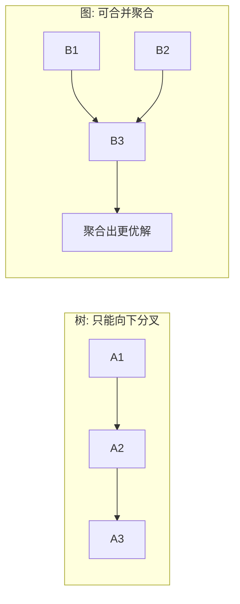

# Graph of Thoughts

> **一句话**：GoT 把 ToT 的树推广成图：思路可以合并、聚合成新思路，形成任意拓扑的推理网络。

## 问题动机

ToT 的树结构有一个隐含限制：每个节点只有一个父节点，信息只能向下分叉，**不同分支上得到的局部结论无法相互融合**。但很多任务天然需要「合并」——把三份文档的摘要整合成一份总纲、把多个子问题的答案拼成一个结论。GoT 把「想法」建模为图中的节点，允许「多父 → 一子」，从而支持聚合。

## 核心机制

把一个想法记为节点 $v$，想法之间的依赖记为有向边，整个推理过程就是一张思考图 $G=(V,E)$。GoT 定义三类基本操作：

**生成（Generate）**：新增一个想法节点

$$
G'=G\cup\{v\},\qquad v\sim p_\theta(\cdot\mid \text{context})
$$

**聚合（Aggregate）**：把多个想法合并成一个新想法（关键区别所在）

$$
v_{\text{agg}}=f\big(\{v_1,\dots,v_m\}\big),\qquad (v_i, v_{\text{agg}})\in E
$$

**精炼（Refine）**：对已有想法迭代改进

$$
v'=\mathrm{refine}(v),\qquad v\leftarrow v'
$$

再配合打分 $s(v)$ 与选择 $v^*=\arg\max_v s(v)$，就构成了对思考图的搜索。与 ToT 的对比可以写成探索规模上：

$$
\underbrace{b^{d}}_{\text{ToT: }b\text{ 叉 }d\text{ 层，叶子互不相通}}
\qquad\text{vs}\qquad
\underbrace{|V|}_{\text{GoT: 图可合并、可复用中间节点}}
$$

GoT 的核心收益来自**聚合**：它把「各自探索」变成「节点复用 + 合并」，因此论文在排序等有明确合并语义的任务上，报告了相对 ToT 的质量提升与成本下降（[Besta et al., 2023](https://arxiv.org/abs/2308.09687)）。

## ToT vs GoT

## 直觉解释

ToT 是一个人尝试三条路、走不通退回来；GoT 是三个人各走一条路，回来后**把三张地图拼成一张**——合并本身就是一次创造。

## 工程含义

- **什么时候值得用**：任务存在明确的「合并语义」（排序、集合运算、多文档汇总）时才用；开放域创作里「合并两篇文案」未必优于人选其一。
- **成本主导项是评估**：图越大，打分调用越多；控制节点数 $|V|$ 是第一约束，而不是把图铺大。
- **图论不必显式实现**：生产里最接近 GoT 的是 Map-Reduce 式汇总与多 Agent 合并——它们本质上就是「聚合」操作。

## 源码案例

- **GoT 论文官方实现**（[spcl/graph-of-thoughts](https://github.com/spcl/graph-of-thoughts)）：ETH 组的开源库，用「Controller + 思考图」的架构实现排序、集合运算、关键词抽取等任务，是理解聚合操作语义的最好材料
- **Map-Reduce 汇总**（[LlamaIndex 文档](https://docs.llamaindex.ai/)）：超长文档先分块并行总结（map，多条思路），再合并成总纲（reduce，聚合）——GoT「聚合」的生产化形态；LangGraph 的 reducer 模式同理
- **多 Agent 辩论**（[AutoGen](https://github.com/microsoft/autogen)）：多个 Agent 各自给方案再互相批评合并，本质是 GoT「精炼 + 聚合」在多 Agent 场景的映射（→ [辩论、共识与投票](../08-multi-agent/debate-consensus-voting.md)）

## 常见误区

- ❌ GoT = 万能升级：论文验证的任务有限（排序/集合运算等有明确合并语义的问题），开放域创作任务「合并思路」未必优于人挑最优
- ❌ 图越大越好：思路图膨胀后评估成本主导总成本，控制节点数是第一工程约束
- ❌ 把多 Agent 系统硬说成 GoT：概念可类比，但多 Agent 还有通信、角色等额外维度

## 小练习

「分析三份竞品报告输出结论」任务：如何切分成 map（三路阅读）→ 聚合（合并洞察）→ 精炼（自我批评一轮）的 GoT 流程？画出来，并标出每步的节点数。

## 参考资料

- [Graph of Thoughts: Solving Elaborate Problems with Large Language Models](https://arxiv.org/abs/2308.09687)（Besta et al., 2023）
- [Tree of Thoughts: Deliberate Problem Solving with Large Language Models](https://arxiv.org/abs/2305.10601)（Yao et al., 2023）

## 相关知识点

- [Tree of Thoughts](tree-of-thoughts.md)
- [多 Agent 编排](../08-multi-agent/multi-agent-orchestration.md)
