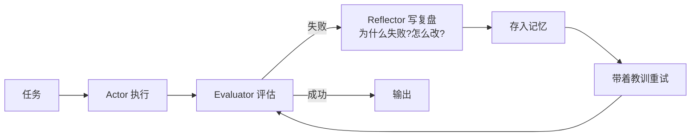

# 💬 Reflexion

> **一句话**：Reflexion 让 Agent 失败后「写复盘」：把失败原因总结成语言化的经验存进记忆，下次尝试带着教训上路。
> **难度**：⭐️⭐️ 进阶
> **标签**：`#prompt` `#agent`

## 📌 先看结论

- 三件套：行动者（Actor）执行任务 + 评估器（Evaluator）判断成败 + 反思模型（Reflector）生成语言化复盘
- 复盘存入 episodic 记忆，作为下次尝试的附加上下文——「语言 RL」：不更新参数，只更新记忆
- 论文数据：HumanEval 上 Reflexion 把 GPT-4 从 80.1% 提到 91%，ALFWorld 决策任务提升 22%
- 关键约束：复盘要具体可执行（"测试没跑就提交了" ✅，"下次小心" ❌）

## 🖼️ 循环图

## 📦 源码案例

- **Reflexion 官方实现**（[noahshinn/reflexion](https://github.com/noahshinn/reflexion)）：约百行核心代码——HumanEval 上跑「写代码 → 跑测试 → 失败写复盘 → 重试」，是最适合精读的 Agent 自我改进参考实现
- **SWE-agent / OpenHands 的教训注入**（[GitHub](https://github.com/SWE-agent/SWE-agent) / [GitHub](https://github.com/All-Hands-AI/OpenHands)）：编程 Agent 的错误恢复普遍带 Reflexion 色彩——工具报错信息原文回填 + 「上一个 patch 没通过测试」的显式反馈，让下一轮 patch 避开同样的坑；区别是不跨任务持久化复盘
- **DeepSeek-R1 的内生反思**（[论文](https://arxiv.org/abs/2501.12948)）：RL 训练出的推理模型在思考链里自发出现「等一下，我错了，重新算」——Reflexion 被内化成模型能力，不再需要外部循环。但注意：这只在单次响应内有效，**跨轮次、跨任务的经验仍需要外部记忆**

## ✅ 最佳实践

- Evaluator 要客观：用测试通过/编译成功等可验证信号，不要让模型自评「我觉得对了」
- 复盘存档要限额：只保留最近 N 条、去重合并，防止记忆膨胀（→ [记忆压缩](../06-memory-rag/memory-compression-forgetting.md)）
- 设最大尝试次数（如 3 次），避免在死路上无限复盘

## ⚠️ 常见误区

- ❌ 复盘越多越好：错误的归因会强化错误——「这次失败是因为模型笨」这类复盘毫无价值且误导后续
- ❌ Reflexion 等于微调：它不改模型参数，效果上限受限于「提示能改变的行为范围」
- ❌ 每次失败都触发复盘：偶发环境错误（网络超时）直接重试即可，见 [错误恢复与重试](../07-planning/error-recovery-retry.md)

## 🧪 小练习

给一个「自动修复 lint 错误」的 Agent 设计 Reflexion 循环：Evaluator 用什么信号？复盘模板长什么样？最大重试几次？

## 🔗 相关资源

- [Reflexion 论文](../13-resources/papers/reflexion.md)

## 📚 相关知识点

- [Self-Refine](self-refine.md)
- [错误恢复与重试](../07-planning/error-recovery-retry.md)
- [记忆类型](../06-memory-rag/memory-types.md)
