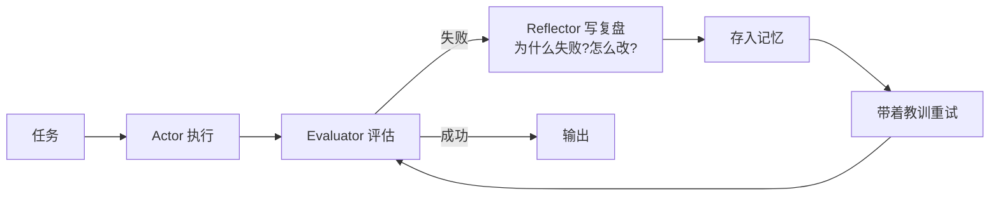

# Reflexion

> **一句话**：Reflexion 让 Agent 失败后「写复盘」：把失败原因总结成语言化的经验存进记忆，下次尝试带着教训上路。

## 问题动机

强化学习靠梯度更新参数来改进策略，但部署后的 Agent 无法改模型参数。Reflexion 的思路是：**把「改进」从参数层挪到记忆层**——不改权重，而是把失败教训写成自然语言，作为下一次尝试的附加上下文。这样无需训练就能在一次会话内实现「试错—学习—重试」。

## 核心机制

Reflexion 由三个角色组成：

- **行动者（Actor）**：按策略执行任务，$\pi_\theta(a\mid s,\,m)$，其中 $m$ 是已积累的复盘记忆
- **评估器（Evaluator）**：给出成败信号 $r\in\{0,1\}$（或分数），来源应是可验证的外部信号（测试是否通过）
- **反思器（Reflector）**：把这一轮的轨迹与结果转成文字复盘

一轮失败后的更新是**记忆更新而非参数更新**：

$$
m_{t+1}=m_t\cup\big\{\,\mathrm{reflect}\big(\text{traj}_t,\; r_t\big)\big\}
$$

下一轮行动变为：

$$
a\sim\pi_\theta\big(a\mid s,\; m_{t+1}\big)
$$

因为 $\theta$ 从未改变，Reflexion 常被称为「语言化强化学习」：它用**上下文**替代**梯度**做策略改进。这也划定了它的能力边界——只能改进「提示能改变的行为」，无法注入新能力。

论文在 HumanEval 上把 GPT-4 的 pass@1 从 80.1% 提升到 91%，在 ALFWorld 决策任务上提升约 22%（[Shinn et al., 2023](https://arxiv.org/abs/2303.11366)）。

## 循环图

## 工程含义

- **评估器必须客观**：用「测试通过/编译成功」等可验证信号，别让模型自评「我觉得对了」——自评会把错误归因固化进记忆。
- **复盘要限定预算**：只保留最近 $N$ 条、去重合并，否则记忆膨胀反噬上下文（→ [记忆压缩](../06-memory-rag/memory-compression-forgetting.md)）。
- **设置最大尝试次数**：如 $T_{\max}=3$，避免在死路上无限复盘；环境类偶发错误（超时）直接重试更划算。
- **复盘质量决定上限**：具体可执行的复盘（「测试没跑就提交了」）有效，空泛的（「下次小心」）无效，错误的归因（「模型太笨」）有害。

## 源码案例

- **Reflexion 官方实现**（[noahshinn/reflexion](https://github.com/noahshinn/reflexion)）：约百行核心代码——HumanEval 上跑「写代码 → 跑测试 → 失败写复盘 → 重试」，是最适合精读的 Agent 自我改进参考实现
- **SWE-agent / OpenHands 的教训注入**（[SWE-agent](https://github.com/SWE-agent/SWE-agent) / [OpenHands](https://github.com/All-Hands-AI/OpenHands)）：编程 Agent 的错误恢复普遍带 Reflexion 色彩——工具报错原文回填 + 「上一个 patch 没通过测试」的显式反馈，让下一轮避开同样的坑；区别是不跨任务持久化复盘
- **DeepSeek-R1 的内生反思**（[论文](https://arxiv.org/abs/2501.12948)）：RL 训练出的推理模型在思考链里自发出现「等一下，我错了，重新算」——Reflexion 被内化成模型能力，不再需要外部循环。但注意：这只在单次响应内有效，**跨轮次、跨任务的经验仍需要外部记忆**

## 常见误区

- ❌ 复盘越多越好：错误的归因会强化错误——「这次失败是因为模型笨」这类复盘毫无价值且误导后续
- ❌ Reflexion 等于微调：它不改模型参数，效果上限受限于「提示能改变的行为范围」
- ❌ 每次失败都触发复盘：偶发环境错误（网络超时）直接重试即可（→ [错误恢复与重试](../07-planning/error-recovery-retry.md)）
- ❌ 复盘记忆无限增长：不做限额与去重，上下文会被历史教训挤满

## 小练习

给一个「自动修复 lint 错误」的 Agent 设计 Reflexion 循环：Evaluator 用什么信号？复盘模板长什么样？最大重试几次？

## 参考资料

- [Reflexion: Language Agents with Verbal Reinforcement Learning](https://arxiv.org/abs/2303.11366)（Shinn et al., 2023）
- [Self-Refine: Iterative Refinement with Self-Feedback](https://arxiv.org/abs/2303.17651)（Madaan et al., 2023）

## 相关知识点

- [Self-Refine](self-refine.md)
- [错误恢复与重试](../07-planning/error-recovery-retry.md)
- [记忆类型](../06-memory-rag/memory-types.md)
