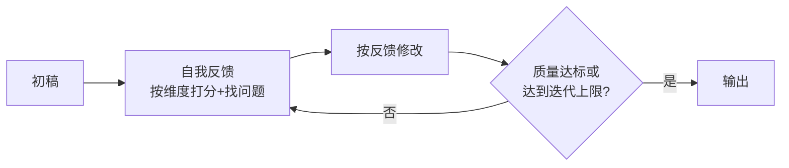

# Self-Refine

> **一句话**：Self-Refine 让同一个模型「生成 → 自我批评 → 修改」循环迭代，不用额外训练就能提升输出质量。

## 问题动机

模型的一次输出往往是「粗糙但可改」的：漏了需求的一角、格式不合规、有事实错误。人类写作者靠反复修改提升质量，Self-Refine 把这套流程自动化——注意，它**不训练新模型**，只用同一个模型轮流扮演三个角色。

## 核心机制

把过程写成迭代式。给定任务 $x$，三角色分别记为生成器 $G$、反馈器 $F$、精炼器 $R$：

$$
y_0=G(x),\qquad f_t=F(x,\,y_t),\qquad y_{t+1}=R(x,\,y_t,\,f_t)
$$

迭代在满足停止条件时结束：

$$
\text{stop when}\quad s(y_t)\ge\tau \;\;\text{或}\;\; t=T_{\max}
$$

其中 $s(\cdot)$ 是质量分、$\tau$ 是阈值、$T_{\max}$ 是迭代上限。三个角色可以是同一个模型（靠不同 prompt 区分），也可以是不同模型。

**为什么它有效，以及为什么收益会迅速衰减**：整个过程没有引入任何外部信息——$y_{t+1}$ 只是 $(x, y_t)$ 的函数。因此迭代本质上是在模型的输出分布里做**不动点搜索**：

$$
y^\* = \lim_{t\to\infty} y_t \quad\text{s.t.}\quad y^\*=R\big(x,\,y^\*,\,F(x,y^\*)\big)
$$

这意味着两点：**能改进**的是模型「本来就会、只是没做对」的部分（格式、完整性、明显笔误）；**不能改进**的是模型压根不知道的知识。而且一旦到达不动点，继续迭代只会在自我评价的偏差里打转——论文与后续研究都观察到第二轮之后收益急剧下降。

**成本**：$T$ 轮迭代约需 $(T+1)$ 次生成 + $T$ 次批评，token 成本近似线性增长。

## 循环图



## Prompt 骨架

```markdown
## 第一步：初稿
{task}

## 第二步：自我审查
对照以下维度逐条检查初稿：
1. 是否遗漏了需求的哪个部分？
2. 是否有事实性错误？
3. 输出格式是否符合要求？
每条给出具体位置和修改建议。

## 第三步：输出修订版
只输出修改后的完整结果。
```

## 工程含义

- **反馈维度必须显式**：列出「正确性/完整性/格式」等具体维度，比笼统的「检查一下」有效得多。
- **优先外部信号**：能跑测试、能验格式就别只靠自评——外部验证器不受模型自我偏好影响。
- **迭代要设上限**：通常 1–3 轮，并给出明确停止条件（分数阈值或轮数）。
- **与 Reflexion 的分工**：Self-Refine 打磨**单次输出**；Reflexion 学习**跨尝试的失败**。前者是任务内精修，后者是跨轮记忆。

## 源码案例

- **Claude Code 的「验证后交付」文化**（逆向分析，[提示词全集](https://github.com/Piebald-AI/claude-code-system-prompts)）：系统提示词反复要求「写完代码必须跑 lint/test 确认」「提交前 review 自己的 diff」——Self-Refine 的工程化：**用外部验证器替代纯自我批评**
- **Self-Refine 论文官方实现**（[madaan/self-refine](https://github.com/madaan/self-refine)）：7 类任务的 reference 实现，可直接对照 prompt 结构
- **Pi + 扩展**：Pi 展示过让 Agent 在会话内自写 lint 扩展并热加载，跑完检查自动修订——「自我批评的工具化」

## 常见误区

- ❌ 自我批评总能纠错：对**推理类**任务，若无外部反馈，模型自纠可能把对的改成错的——这是 Self-Refine 最需要警惕的失效模式
- ❌ 轮数越多越好：超过不动点后迭代只增成本不增质量
- ❌ 反馈维度越笼统越好：给出具体维度与位置，才能产生可执行的修改
- ❌ 混淆 Self-Refine 与微调：它不改参数，效果上限受「提示能改变的行为范围」约束

## 小练习

对「生成周报摘要」任务设计 Self-Refine：写出三个反馈维度、一个停止条件，并指出哪些错误是「自评改得动」、哪些必须靠外部数据源。

## 参考资料

- [Self-Refine: Iterative Refinement with Self-Feedback](https://arxiv.org/abs/2303.17651)（Madaan et al., 2023）
- [Reflexion: Language Agents with Verbal Reinforcement Learning](https://arxiv.org/abs/2303.11366)（Shinn et al., 2023）
- [Large Language Models Cannot Self-Correct Reasoning Yet](https://arxiv.org/abs/2310.01798)（Huang et al., 2023，重要反例）

## 相关知识点

- [Reflexion](reflexion.md)
- [Chain of Thought](chain-of-thought.md)
