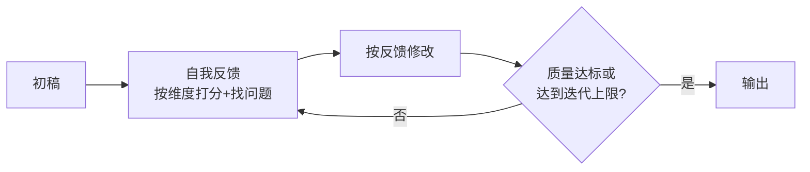

# 💬 Self-Refine

> **一句话**：Self-Refine 让同一个模型「生成 → 自我批评 → 修改」循环迭代，不用额外训练就能显著提升输出质量。
> **难度**：⭐️⭐️ 进阶
> **标签**：`#prompt`

## 📌 先看结论

- 三角色同一模型轮流扮演：生成者、反馈者、精炼者
- 与 Reflexion 的区别：Self-Refine 是**任务内**的单次输出打磨，Reflexion 是**跨尝试**的失败学习
- 论文数据：GPT-4 上平均提升约 20%（对话、代码、数学等 7 类任务）
- 前提：模型必须能发现自己的问题——能力不足时自我批评会引入新错误

## 🖼️ 循环图



## 💻 Prompt 骨架

```markdown
## 第一步：初稿
{task}

## 第二步：自我审查
对照以下维度逐条检查初稿：
1. 是否遗漏了需求的哪个部分？
2. 是否有事实性错误？
3. 输出格式是否符合要求？
每条给出具体位置和修改建议。

## 第三步：输出修订版
只输出修改后的完整结果。
```

## 📦 源码案例

- **Claude Code 的「验证后交付」文化**（逆向分析，[提示词全集](https://github.com/Piebald-AI/claude-code-system-prompts)）：系统提示词反复要求「写完代码必须跑 lint/test 确认」「提交前 review 自己的 diff」——这是 Self-Refine 思想的工程化：**用外部验证器替代纯自我批评**，因为「跑测试」远比「自我感觉良好」可靠
- **DeepSeek Harness 的精炼插件空间**（[仓库](https://github.com/deepseek-ai/deepseek-harness)）：工具执行流水线的「结果改写」环节允许插件对产出做质量检查与二次加工——Self-Refine 的反馈-修改环节可以做成一条 Hook 插件
- **Pi + 扩展**：pi-mono 展示过让 Agent 在会话内自写 lint 扩展并热加载，跑完检查自动修订——「自我批评的工具化」

## ✅ 最佳实践

- 反馈维度显式列出（正确性/完整性/格式），比笼统「检查一下」有效得多
- 优先外部信号：能跑测试就别只靠自评；能用工具验证就用工具
- 限制 1–3 轮，第二轮后收益通常急剧下降；设置停止条件（分数阈值）

## ⚠️ 常见误区

- ❌ 迭代一定更好：模型可能「越改越错」，需要每轮对比新旧版本择优
- ❌ 自我批评客观：同一模型存在系统性盲区，重要场景换一个「评审模型」交叉检查
- ❌ 用于事实性内容：自评无法发现知识性错误（它不知道自己不知道），事实核查要靠检索/工具

## 🧪 小练习

对比实验：同一篇周报 prompt，跑「直接输出」vs「一轮 Self-Refine」，从准确性、结构、冗余三个维度打分，观察收益在哪。

## 🔗 相关资源

- [Self-Refine 论文](https://arxiv.org/abs/2303.17651)

## 📚 相关知识点

- [Reflexion](reflexion.md)
- [Agent 评估指标](../10-evaluation-safety/evaluation-metrics.md)
