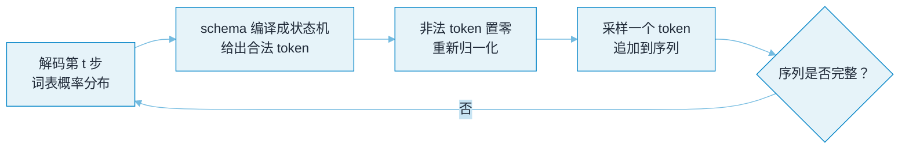
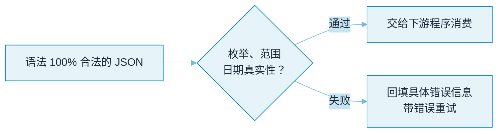
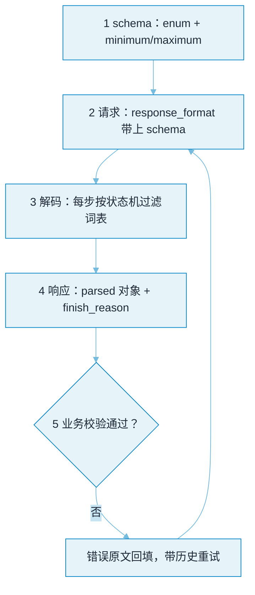

# 结构化输出


**一句话**：强制模型输出合法 JSON（或 XML/表格），是 Agent 把「概率文本」变成「可靠程序输入」的基石。


## 问题动机

模型是按概率逐 token 采样的，你写了「请输出 JSON」，它仍可能加上一段解释、用中文引号、或漏掉逗号——而对下游程序来说，一段无法解析的字符串等于彻底失败。Agent 的工具调用、参数抽取、报告生成全都依赖结构化输出，所以「怎么把合法率从 90% 提到 100%」是个硬工程问题。

## 核心机制

### 1. 约束解码：为什么能做到 100% 合法

普通采样从整个词表 $$V$$ 里按概率取 token：

$$
x_t\sim p(x_t\mid x_{<t})
$$

约束解码（constrained decoding）在每个解码步，只保留那些「加入后仍能通过语法/JSON Schema 前缀校验」的 token，其余概率置零后重新归一化：

$$
p'(x_t\mid x_{<t})=
\frac{p(x_t\mid x_{<t})\cdot\mathbb{1}\big[\,x_{<t}\oplus x_t\ \text{是合法前缀}\,\big]}
{\sum_{v\in V}p(v\mid x_{<t})\cdot\mathbb{1}\big[\,x_{<t}\oplus v\ \text{是合法前缀}\,\big]}
$$

$$\mathbb{1}[\cdot]$$ 是指示函数：当前缀违反了 schema（如该出 `,` 却出了字母），该 token 直接被排除。这样生成的序列**在语法层面必然合法**——这就是 outlines / xgrammar 一类工具能做到「100% 合法 JSON」的原理。

代价是：每步要算一次「哪些 token 允许」，实现上通常把 schema 编译成有限状态机或下推自动机，再对词表建索引加速。

### 2. 合法 ≠ 正确

约束解码保证的是**语法合法**，不保证**语义正确**。字段值可能超出枚举、数字越界、日期格式对但日期不存在。因此完整闭环是：

$$
\underbrace{\text{约束解码}}_{\text{保证语法}}
\;\longrightarrow\;
\underbrace{\text{Schema/业务校验}}_{\text{保证类型与范围}}
\;\longrightarrow\;
\underbrace{\text{拒绝重试}}_{\text{失败时回填错误}}
$$

缺了后两步，「100% 合法」只是把解析错误推迟到了业务层。

### 3. 四种实现方式的强度阶梯

$$
\text{few-shot} \;<\; \text{JSON Mode} \;<\; \text{Structured Outputs} \;<\; \text{约束解码}
$$

越往右，模型自由度越小、合法率越高，但需要的能力（服务端或本地运行时）也越强。

## 约束解码全流程

把「保证语法」与「保证正确」串成一个闭环——单靠约束解码只走完了左半边：



*《图：解码内——schema 编译成状态机，每步把非法 token 概率置零再采样，循环到序列完整，语法因此必然合法》*



*《图：两道关卡——上图保证「语法一定合法」，下图才管「内容对不对」；业务校验失败时，带着错误信息回到上图的解码第 t 步重试》*

## 实现方式对比

| 方式 | 原理 | 合法率 | 适用 |
|---|---|---|---|
| few-shot 示范 | 例子里给 JSON 样式 | 中 | 快速原型 |
| JSON Mode | 服务端保证输出合法 JSON | 高 | 无 schema 需求 |
| Structured Outputs | 按 JSON Schema 约束生成 | 很高 | 生产 API |
| 约束解码 | 逐 token 过滤非法候选 | 100%（语法） | 本地推理（outlines、xgrammar） |

## 一次调用的三份数据

结构化输出落到工程上只有三份数据：**你声明的 schema**、**发出去的请求**、**收回来的响应**。例子是「把一段客服对话归成一张工单」，字段模型叫 `Ticket`：`category` 是三值枚举、`urgency` 限定在 1–5、`summary` 是自由字符串。下面这一页就是这个模型编译出来的全部三份——原代码里的 `Literal[...]` 与 `Field(ge=1, le=5)` 会变成 JSON Schema 的 `enum` 与 `minimum/maximum`。

```json
{
  "schema_Ticket": {
    "type": "object",
    "additionalProperties": false,
    "properties": {
      "category": { "type": "string", "enum": ["billing", "tech", "other"] },
      "urgency": { "type": "integer", "minimum": 1, "maximum": 5 },
      "summary": { "type": "string", "maxLength": 280 }
    },
    "required": ["category", "urgency", "summary"]
  },
  "request": {
    "model": "gpt-4o-mini",
    "messages": [{ "role": "user", "content": "<客服对话原文>" }],
    "response_format": "Ticket",
    "max_tokens": 512
  },
  "response": {
    "choices": [
      {
        "message": {
          "role": "assistant",
          "parsed": { "category": "billing", "urgency": 4, "summary": "重复扣费两个月，要求退款" }
        },
        "finish_reason": "stop"
      }
    ]
  }
}
```

三个写法上的坑，一眼能看出来：**`Literal["billing","tech","other"]` 编译成 `enum`**、**`Field(ge=1, le=5)` 编译成 `minimum/maximum`**（前者管集合、后者管区间，两者都不是「语义正确」）、**`additionalProperties: false` 必须显式写**，否则模型多吐一个 `note` 字段仍算合法 JSON。`summary` 上的 `maxLength: 280` 是示例补的——只写 `str` 时 schema 对长度不设防，一句 800 字的摘要同样合法。请求侧的 `response_format: "Ticket"` 就是把上面那份 schema 交给服务端，走的是 `beta.chat.completions.parse` 而不是普通的 `chat.completions.create`；响应侧的 `choices[0].message.parsed` 是反序列化并校验过的对象——中间没有一次 `json.loads` 需要你手写。

`finish_reason` 是这段契约里最容易被忽略的字段：它是 `"length"` 时说明 `max_tokens` 把 JSON 截断了，此时 `parsed` 必然为 `null`，解析必炸。**先看 `finish_reason` 再取字段**，比写十层 try/except 有效。



*《图：五步闭环——schema 决定解码器能选哪些 token，`finish_reason` 决定响应能不能用，业务校验失败时错误原文要回到第 2 步而不是原地重采样》*

## 分步演示：从 `{` 到 `}` 的逐 token 过滤



#### 第 1 步：schema 先编译成状态机

`Ticket` 的三个字段加定界符，编译后是一个有限状态机：起始态只接受 `{`，接着是「键名态 → 冒号态 → 值态」的三段循环。`category` 的值态挂的是**枚举自动机**，只有 `billing` / `tech` / `other` 三条 accepting 路径；`urgency` 的值态挂整数自动机，`minimum: 1` 与 `maximum: 5` 让它只接受单个数字 1–5（`10` 会先进 `1`，第二位的 `0` 非法，因为会超出 5）。


#### 第 2 步：每一步把非法 token 的概率置零

词表按 10 万量级算，解码第 1 步合法的 token 只有 `{` 及其带空格的变体，候选集从 $$10^5$$ 缩到个位数。到 `category` 的引号内第 2 个 token，模型想输出「扣」也合法吗？不合法——枚举自动机当前前缀是 `b`，只有 `illing"`、`illing ` 这类延续被保留，其余全部置零后重新归一化（就是第 1 节那条公式）。**模型的概率质量被摊到语法可行的候选上，所以合法率是 100%，但选中的那个值未必对**。


#### 第 3 步：整数区间是最容易暴露自由度的地方

`urgency` 只允许 1–5。若模型原本想给「9 分紧急」，它**没有任何办法把 9 写出来**：约束解码下这个 token 不存在。结果是模型只能挑 5，或者反过来把语气塞进 `summary`。这就是「约束越强、语义越失真」的具体形态——区间收窄能防脏数据，也会把分布压扁。


#### 第 4 步：`finish_reason` 决定响应能不能用

序列走完后先看 `finish_reason`。它是 `"length"`（`max_tokens: 512` 用尽）时 JSON 停在半路，`parsed` 为 `null`；它是 `"stop"` 时才算语法完整。这一步是纯机械判断，但很多线上事故就漏在这里：把 `"length"` 的残缺字符串当成解析失败去重试，而真正的原因是配额。


#### 第 5 步：合法只是及格线，业务校验才是判卷

`{"category":"billing","urgency":4,"summary":""}` 语法满分，语义零分——`summary` 是空串；`{"category":"other","urgency":1,"summary":"要求退款"}` 语法合法，但「退款」被判成 `other` 是分类错误。这两类都过不了 schema，只能靠**业务规则 + 标注集**拦住，然后把 `ValidationError` 原文回填重试。缺这一步，「100% 合法」只是把解析错误推迟到了业务层。



## 三条落地路线怎么选（点标签切换）

同一个 `Ticket`，三种接法，代价完全不同。



把 schema 编成状态机挂到采样器上（outlines、xgrammar），或在托管 API 上开 Structured Outputs。语法合法率 100%，重试次数归零。代价：每步要算一次合法 token 集合，首 token 延迟上升；且模型被剥夺了「我不确定」的表达通道——它必须吐一个合语法的 JSON。适合字段封闭、取值可枚举的场景，比如本页的工单分类。



不依赖服务端能力：few-shot 给样式，收到字符串后自己 `json.loads` + 校验，失败就把错误原文连同已生成的部分一起回填重问。合法率停在 90% 上下（这正是本页开头那个「怎么从 90% 提到 100%」的起点），剩下那部分是模型能力决定的。代价是最坏路径的延迟与 token 翻倍，并且要求你的下游真的会重试——没有重试闭环的 JSON Mode 等于自欺。适合模型不支持约束、且能接受偶发失败的场景。



把 `Ticket` 注册成工具（`name: "create_ticket"`, `inputSchema` 就是上面那份 schema），模型输出 `tool_use` 块，参数天然按 schema 约束，且省掉一次「先出 JSON 再解析」的往返。代价：工具调用的训练偏好会让模型在「该问清楚」时也硬填参数；嵌套 schema 越深漏字段越多——生产上更稳的做法是拆成多次调用。适合输出即动作的 Agent 链路（→ [Function Calling](../05-tool-protocol/function-calling.md)）。




**注意**：`minimum: 1, maximum: 5` 与 `enum: ["billing","tech","other"]` 拦得住**格式**，拦不住**判断错误**——`urgency: 1` 配一句「线上全挂，客户要起诉」照样合法。上线前先把两件事分开记：约束解码/重试能把合法率推到接近 100%，字段的**准确率**要靠带标注的评估集去看，两者不是一个指标。


## 源码案例

- **工具调用的本质**（→ [Function Calling](../05-tool-protocol/function-calling.md)）：模型输出的 `tool_use` 块就是结构化 JSON——名字、参数全部对齐你注册的 schema。Claude Code 的逆向分析显示其内置工具都带严格参数 schema，并用「延迟加载」控制 schema 占用的上下文预算
- **DeepSeek Harness 的工具 schema 组装**（[仓库](https://github.com/deepseek-ai/deepseek-harness)）：`core/system-prompt` 在每步 preStep 动态组装工具 schema——工具面变化时模型看到的约束实时更新；其 PTC 模式让模型直接写代码组合多次工具调用，把「结构化」升级为「程序化」
- **outlines**（[GitHub](https://github.com/dottxt-ai/outlines) / [论文](https://arxiv.org/abs/2307.09702)）：把 JSON Schema / 正则编译成状态机做约束解码的开源实现，是理解该机制最直接的参考

## 常见误区

- ❌ 格式合法就放心用：字段值可能超出枚举、数字越界——Schema 校验 + 拒绝重试才是完整闭环
- ❌ 一个大 schema 打天下：嵌套过深模型易漏字段，拆成多次调用更稳
- ❌ 忘记 `max_tokens`：输出被截断的 JSON 解析必炸，要捕获并重试
- ❌ 认为约束解码没有代价：它会让模型无法输出「我需要更多信息」这类自然语言，必要时保留逃生出口

## 参考资料

- [Efficient Guided Generation for Large Language Models](https://arxiv.org/abs/2307.09702)（Willard & Louf, 2023，outlines）
- [Grammar-Constrained Decoding for Structured NLP Tasks without Finetuning](https://arxiv.org/abs/2305.13971)（Geng et al., 2023）
- [JSON Schema 规范](https://json-schema.org/)

## 相关知识点

- [Prompt Engineering](prompt-engineering.md)
- [Function Calling](../05-tool-protocol/function-calling.md)

